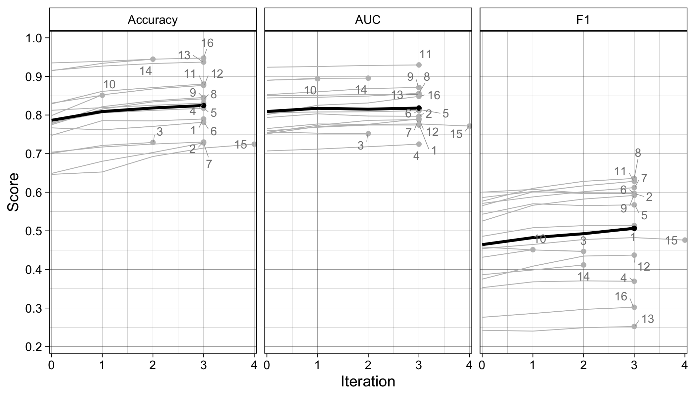

```{r setup, include=FALSE, cache=FALSE, message = FALSE}

library(knitr)
library(citr)
library(dplyr)
library(activemapper)

#opts_knit$set(root.dir=normalizePath('../'))

### Chunk options: see http://yihui.name/knitr/options/ ###

## Text results
opts_chunk$set(echo = TRUE, warning = TRUE, message = TRUE, include = TRUE)

## Code decoration
opts_chunk$set(tidy = TRUE, comment = NA, highlight = TRUE)

## Cache
opts_chunk$set(cache = 2, cache.path = "output/cache/")

## Plots
opts_chunk$set(fig.path = "output/figures/")


```


```{r knitcitations, echo=FALSE, cache = FALSE}
library(knitcitations)
cleanbib()   
cite_options(citation_format = "pandoc")
```


<!-- \singlespace -->

<!-- \vspace{2mm}\hrule -->
<!-- \vspace{-20pt} -->
<!-- <!-- # Abstract --> 


<!-- \vspace{3mm}\hrule -->

<!-- *Keywords*: rmarkdown, reproducible science -->

\doublespace

\bleft

# Introduction
How much cropland is on the planet, and where is it located? How much more will be needed to meet humanity's rapidly growing food demands? The answer to the first question is unclear, as existing estimates tend to vary widely and cropland maps show substantial spatial disagreements [e.g. @FritzHighlightingcontinueduncertainty2011; @Fritzneedimprovedmaps2013], which makes it difficult to answer the second. The first question can't be clearly answered because cropland estimates rely heavily on remote sensing-derived landcover maps, which can be notoriously high in error, particularly over regions such as Africa [@Esteslargeareaspatiallycontinuous2018; @FritzComparisonglobalregional2010], where agricultural changes will be largest and the need for an accurate baseline is thus greatest [@EstesReconcilingagriculturecarbon2016; @SearchingerHighcarbonbiodiversity2015]. *[Fill in more reason why cropland maps are important]*  

<!-- - The problem in general  -->
<!--     - Africa in particular -->
<!--     - Types of analyses that depend on cropland maps -->

Cropland mapping over a region such as Africa is difficult for several reasons. The primary reason relates to the characteristics of the region's smallholder-dominated croplands, where field size averages 1-2 ha [@Debatsgeneralizedcomputervision2016; @FritzMappingglobalcropland2015]. This size is small relative to the 30-250 m resolution of the sensors typically used for most landcover mapping efforts, which results in errors due to mixed pixels and aspects of the modifiable area unit problem [@Openshawmillioncorrelationcoefficients1979], in this case the pixel's shape may be poorly matched to that of cropland, and is too coarse to aggregate to approximate that shape at the characteristic scales of crop fields [@Darkmodifiablearealunit2007; @Esteslargeareaspatiallycontinuous2018]. On top of the matter of scale is 1) high intra-class variability of the cropland class, compounded by the fact that these particular croplands can be heavily intergraded with surrounding vegetation [@Debatsgeneralizedcomputervision2016; @Estesplatformcrowdsourcingcreation2016], and 2) the substantial temporal variability within croplands, both within and between seasons. These latter two aspects pose challenges for the classification algorithms that are applied to the imagery.  

These problems arising from cropland characteristics are increasingly being overcome due to technological advances. Recent advances in satellite technology have increased the coverage of high (<5 m) or near-high (10 m) resolution imagery with weekly to near-daily return intervals [@DruschSentinel2ESAOptical2012; @McCabefutureEarthobservation2017]. This spatial and temporal resolution addresses the sensor-scale mismatch, and more effectively captures the intra-seasonal dynamics of cropland, which helps classifiers distinguish cropland from surrounding cover types [@Debatsgeneralizedcomputervision2016; @Defournyrealtimeagriculturemonitoring2019]. On top of this, advances in cloud computing [@GorelickGoogleEarthEngine2017], the opening of image archives [@WulderglobalLandsatarchive2016], and next generation machine learning approaches [@MaxwellImplementationmachinelearningclassification2018; @ZhuDeeplearningremote2017] are placing large volumes of these moderate to near-high resolution imagery together with the computational and algorithmic resources necessary to classify them at scale. These capabilities are aleady being used to create a new generation of higher resolution (20-30 m) cropland and landcover maps for Africa and other regions [@ChenGloballandcover2015; @ESAESACCILAND; @LesivEvaluationESACCI2017; @XiongNominal30mCropland2017].  

Despite these advances, the highest resolution (<5 m) image sources are still not used to map cropland over very large extents, presumably because they are commercial and relatively high cost to acquire, in addition to the greater computational demands. As such, map accuracy can still be a challenge, particular for user's accuracy, which ranges between 46 and 76% for for the cropland class [e.g. @LesivEvaluationESACCI2017; @XiongNominal30mCropland2017]. 

Accuracy may also suffer due to error-inducing factors that are becoming somewhat more pronounced as a consequence of these technology advances, particularly with respect to algorithms. Advances in machine learning are helping to greatly improve classification skill, but these algorithms generally require large training datasets [@MaxwellImplementationmachinelearningclassification2018], particularly neural network-based "deep-learning" methods (cite). To satisfy this need for more training (and reference) samples, map-makers increasingly rely on visual interpretation of high resolution satellite or aerial imagery to collect training (or validation) samples [e.g. @XiongNominal30mCropland2017; @ChenGloballandcover2015; @StehmanKeyissuesrigorous2019]. Several web-based platforms have been developed to facilitate such efforts, which provide convenient and highly scalable tools for training data collection [e.g. @BeyCollectEarthLand2016; @Estesplatformcrowdsourcingcreation2016; @FritzGeoWikionlineplatform2012]. Visually interpreted training labels present two particular problems. The first is that such labels have inevitable interpretation errors that can vary substantially according to the skill of the interpreter [@Estesplatformcrowdsourcingcreation2016; @WaldnerConflationexpertcrowd2019]. These errors are typically not accounted for in reported accuracy metrics, despite the fact that they can introduce substantial error into the resulting maps and subsequent analyses [@ElmesAccountingtrainingdata2020; @Esteslargeareaspatiallycontinuous2018]. The second problem is that visual interpretation depends on high resolution imagery (<5 m), as lower resolutions make it difficult for a human analyst to discern cropland. Typically the only practical source for such imagery are "virtual globe" basemaps provided by Microsoft and Google, which are composed of mosaics of various high resolution satellite and aerial image sources that typically span 3-5 years of time within a single country [@LesivCharacterizingspatialtemporal2018]. This within-mosaic temporal variation can set up a temporal mismatch between the imagery being interpreted and the imagery being classified, which are usually from a different source (e.g. Landsat, Sentinel; @XiongNominal30mCropland2017) and often represent a different year. If a land change occurs in the interval between the two image sets (e.g. a new field was created), this can introduce error into the training data that is then passed on to the classifier. This source of error may be elevated in smallholder-dominated systems, where swidden practices are common (cite), or in rapidly developing agricultural frontiers [@ZengHighlandcroplandexpansion2018].  
<!-- - Why cropland mapping is hard -->
<!--     - 3 problems -->
<!--         - The target itself and its spectral variability and the spectral variability of its background -->
<!--             - Spectral and spatial resolution of sensors -->
<!--             - Poses a challenge for classification algorithms, which want both high resolution to be smaller than characteristic field size, but temporal contrast also -->


To improve the accuracy of cropland maps over smallholder-dominated systems therefore requires an approach that meets three requirements. First, it should be based on high spatial and temporal resolution imagery, to be able to capture the fine grain and temporal variability of these fields. Second, an algorithm with suitable skill for classifying these images must be selected, and combined with the computational resources needed to process large imagery volumes. Third, a method for collecting large volumes of high quality training and validation data based on image interpretation is essential. This method should quantify and minimize the errors associated with image interpretation. It should also ensure that labels are collected either from the same imagery that is being classified, or from contemporanous imagery, in order to reduce errors introduced by land change processes. 

<!-- - Training data dependence issues -->
<!--     - Also interact with image resolution issues -->
<!--     - Increasingly rely on high amounts of training data -->
<!--     - Human interpretation error (training data quality) -->
<!--       - Temporal mismatch with classification feedstock (Lesiv paper) -->
<!--       - Errors in interpreting these sources of imagery -->
<!-- - Review of who does what to solve the problem (probably integrated with problem statement) -->
<!--   - croplands.org -->


We describe here a cropland mapping system that addresses these requirements on the way to creating an object-based map of individual fields. The first requirement is enabled by the recent availability of cubesat data that provides 3-4 m resolution imagery over large areas at near daily intervals [@McCabefutureEarthobservation2017]. Although these data are of lower spectral depth and quality than Landsat, Sentinel, or Worldview imagery, they enable country-continent scale image mosaics to be created for multiple periods during the crop growing calendars, and this representation of intra-annual variability is more important for cropland classification than spectral depth [@Debatsgeneralizedcomputervision2016]. Additionally, despite this imagery being up to ~16 times coarser than much of Bing or Google imagery, it is sufficiently resolved for humans to discern most fields [e.g. see @Esteslargeareaspatiallycontinuous2018; @FourieBetterCropEstimates2009]. This allows labels to be generated on the same imagery processed by the classifier, thereby addressing one of the two needs related to training data (requirement 3). The second requirement is addressed by a computer vision/machine learning classifer that is effective for classifying smallholder croplands [@Debatsgeneralizedcomputervision2016] and was re-engineered to run on high performance, cloud-based computing clusters. This classifier is tightly coupled to a front-end platform for collecting label data, which includes rigorous accuracy assessment protocols [@Estesplatformcrowdsourcingcreation2016] and a novel approach for merging multiple maps into consensus labels, thereby minimizing image interpretation error. The training and machine learning components are combined within an "active learning" framework, wherein the machine learning process assesses classification uncertainty in unlabelled areas after a training step, and selects sites from areas of highest uncertainty for additional labelling [@DebatsIntegratingactivelearning2017]. Our framework automates and formalizes this interactive approach to label selection, which has been shown to be important for improving accuracy in previous studies [e.g. @XiongNominal30mCropland2017; others add]. Furthermore, it is more efficient than purely randomized or conventionally stratified approaches to label collection, meaning that fewer labels are needed to generate a given level of accuracy [@DebatsIntegratingactivelearning2017]. Finally, an unsupervised  segmentation step is applied to the imagery and merged with the pixel-wise classifications from the machine learning process, **resulting in a further sharpening of accuracy** and resulting in a final vector-based field boundary map.

We demonstrate this approach to map cropland in Ghana, a country where agriculture is predominantly small-scale and comprises a broad mix of agricultural systems, including large areas where shifting agricultural practices predominate [@KansangaTraditionalagriculturetransition2019; @SambergSubnationaldistributionaverage2016]. These factors make Ghana emblematic of the substantial challenges facing cropland classification over the broader region. 

<!-- - Our approach that tries to solve these three problems -->
<!-- - Within a framework that tightly integrates tightly training data collection -->
<!-- - And handles large-scale computation -->
<!-- - Segmented boundaries -->
    
# Methods
## System overview 
The mapping system is centered around four components: 1) an image acquisition and compositing component, 2) a training data collection platform, 3) a machine learning component, and 4) a segmentation component. The first component is applied as a once-off step to generate an image catalog covering the mapping geography, while the second component initiates an interactive image training and classification (component 3) pipeline that results in a pixel-wise posterior probability map of cropland probabilities on its final iteration (Fig. 1). The final segmentation step (component 4) is then initiated and applied to both the pre-processed primary images and the posterior probability maps, resulting in vectorized field boundaries. Each system component comprises an individual software module designed to be implemented on cloud computing architecture, and available on a GitHub repository (see data and software availability section for details).

## System components
### Imagery
**[Note: This will require updating to reflect changes to compositing methods]**
The primary image source used in our system is the PlanetScope Analytic surface reflectance product [@PlanetTeamPlanetApplicationProgram2017], although it can be readily adapted to apply to other images (e.g. Sentinel and Landsat). PlanetScope provides three visual (red, green, blue) and a near-infrared band at 3-4 m resolution at nominal daily frequency. Although these images are already pre-preprocessed and corrected for atmospheric effects, there are residual errors from inter-sensor differences and the radiometric normalization process [@HouborgDailyRetrievalNDVI2018], variation in the orientation of scene footprints, as well as a high frequency of cloud cover over the study region [@WilsonRemotelySensedHighResolution2016]. To correct for these factors, we developed a procedure for creating temporal composites representing the primary growing and non-growing seasons within a single year.  

```{r aois, echo = FALSE, out.width="50%", fig.cap="An overview of the primary system components, the data stores that hold the inputs and outputs from each component, and the direction of connections between them. The dashed line indicates iterative interactions, while solid lines indicate one-time or irregular connections.", fig.align='center'}
knitr::include_graphics('figures/figure1.png')
```

PlanetScope imagery is accessed via the Planet API, and an initial order is placed wherein the imagery representing all available dates in the two compositing periods and within a bounding box covering the mapping geography is collected and transferred directly to the system's cloud storage (Amazon Web Services S3). 

We then transform all images into an "analysis ready data" (ARD) product [@DwyerAnalysisReadyData2018] that is prepared against a tiling grid that is situated within a larger 1 degree resolution grid that covers the entire continent. Each 1 degree cell defines the minimum mapping area of interest (Fig. 2A) is divided into 400 0.05 degree cells (Fig. 2B), which provides the scale for creating image composite tiles. The ARD process simply clips all available imagery to the extent of each 0.05 cell it intersects, regardless of cloud cover. 

<!-- and then applies the usable data mask (UDM) supplied with the imagery to remove low quality and cloudy pixels.  -->

```{r, echo = FALSE, out.width="100%", fig.cap="The reference system used in the mapping platform, including A) numbered areas of interest (AOIs) that define the minimum mapping geography (solid black lines; dotted lines indicate boundaries of 1 degree grid), B) the 0.05 degree tile used for compositing imagery, and C) the 0.005 degree resolution reference grid used for collecting training data and distributed computing.", fig.align='center'}
knitr::include_graphics('figures/figure2.png')
```
The temporal compositing process is applied to the ARD imagery for the time period of interest, which in the case of this study is one of two multi-month seasons, the primary growing and dry seasons for a single agricultural year. Imagery from two seasons helps to improve the performance of cropland classifiers [@Debatsgeneralizedcomputervision2016], while having the seasons in same year helps to minimize differences caused by land change. For each pixel in each image in each ARD temporal stack for a given season, we calculate two weights, with the first being:

<!-- values. The first is based on a simplified formula of the Haze Optimized Transformation (HOT) index [@Zhangimagetransformcharacterize2002; @ZhuObjectbasedcloudcloud2012]:  -->

\begin{equation} \label{eq:cloud}
\mathrm{W1_t} = \frac{1}{\mathrm{blue_t}^2}
\end{equation}

And the second:

<!-- Equation solution from here: https://stackoverflow.com/questions/4027363/two-statements-next-to-curly-brace-in-an-equation -->
 
\begin{equation} \label{eq:shadow}  
\mathrm{W2_t} =\begin{cases}
    1, & \text{if $\mathrm{NIR_t}$ < median\{$\mathrm{NIR_1}$, $\mathrm{NIR_2}$, ..., $\mathrm{NIR_i}$\}}.\\
    \frac{1}{\mathrm{NIR_t}^4}, & \text{otherwise}.
  \end{cases}
\end{equation}

Where *t* is a particular date in near-daily time series of PlanetScope images, which begins at date 1 for the given compositing period and ends on date *i*, *blue* is the blue band, and *NIR* the near infrared band. Equation \ref{eq:cloud} assigns lower weights to hazy and clouded pixels, while equation \ref{eq:shadow} assigns low weights to pixels in cloud shadow. 

Once these two weights were calculated, the final composited pixel value for each of the four PlanetScope bands was calculated as:

\begin{equation}
\mathrm{\bar{B} = \frac{\sum_{t=1}^{T}B_t * W1_t * W2_t}{\sum_{t=1}^{T}W1_t * W2_t}}
\end{equation}

Which is a weighted mean for each pixel for each band *B* for the particular compositing period. The composited tiles were then added to the S3 store (Fig. 1), where they are stored as cloud-optimized geotiffs, and a "slippy map" rendering is created for each composite using RasterFoundry (cite). This web-based rendering of the image is used in the training data platform (see **section X**). 


### Labelling platform
Both training and reference data were collected by a custom crowdsourcing platform, which we refer to here for simplicity's sake as *labeller*. The original version of *labeller* was designed to work with Amazon Web Services' Mechanical Turk job marketplace [@Estesplatformcrowdsourcingcreation2016]. The basic structure of the system remains the same, but we have re-engineered it into a standalone platform that 1) allows us to enroll and pay workers (the human supervisors) directly to conduct digitizing work, and 2) drives and assesses the overall machine learning process. The system runs on a Linux Virtual machine hosted on an AWS EC2 instance and is comprised of a database (PostGIS/Postgres), a mapping interface (OpenLayers 3), an image server (RasterFoundry), and a set of utilities for managing mapping and assessing assignments and converting them to rasterized labels for the machine learning process. Each *labeller* instance is focused on a specific mapping geography (e.g. one to several 1 degree cells in Fig. 2A)

Here we provide an overview of *labeller*'s architecture.

#### Mapping workflow
##### Selecting training and reference sites
The labelling process begins with a python script that randomly selects a subset (e.g. 100) of the 0.005 degree grid (Fig. 2C) cells that intersect the *labeller* instance's specific area of interest (e.g. shaded grey cell in Fig. 2A). These site names are stored in a Postgres table with the PostGIS extension that represents the mapping queue. Another python process converts each site into a mapping *task* that has a specified number of *assignments* (maps drawn by an individual worker) that must be completed before the task is complete.  


##### Mapping assignments
Workers registered in the system log in to the mapping platform (built with Flask) and navigate to the OpenLayers-based field mapping interface (Fig. 3). There the worker is presented with a white target box representing the 0.005 degree cell that was randomly selected to label, a set of digitizing tools, and different image backdrops, which include false and true color "slippy map" renderings (generated by Raster Foundry) of both the growing season and off-growing season PlanetScope images covering that cell, as well as basemap imagery provided by Bing and ESRI. The worker uses the polygon drawing tool to digitize the boundaries in crop fields visible within the PlanetScope overlays that intersect the grid target, following a set of pre-defined digitizing rules. To aid with interpretation, the worker toggles between the various seasonal renderings and the satellite base map to help form a judgement about what constitutes a field within the PlanetScope imagery. The worker assigns each completed polygon a label that describes the field class (e.g. annual cropland, tree crop, fallow), and after completing all visible fields saves the full set of polygons to the server. The worker is then automatically taken to their next assignment at a different randomly selected site. 


```{r, echo = FALSE, out.width="100%", fig.cap="An overview of mapper's interface", fig.align='center'}
knitr::include_graphics('figures/figure3.png')
```

##### Processing completed assignments
Upon submission, the workers' polygons, if there are any--the worker will submit the assignment without mapping if they see no fields in the image--are cleaned to fix any topological irregularities that arose during digitization (see supporting information (SI)) and stored in a PostGIS table. The assignment that was just completed represents one of two possible types of tasks: 1) an accuracy task; 2) a labeling task for training the machine learning algorithm. If it was the former type, an `R` script is called that executes a series of map comparisons between the worker's polygons and the reference polygons, assigning a score based on the following formula:

\begin{equation}
\mathrm{score_i}=\beta0\mathrm{I}+\beta1\mathrm{O}+\beta2\mathrm{F}+\beta3\mathrm{E}+\beta4\mathrm{C}
\end{equation}

Where *i* represents the particular assignment, and $\beta_{0-5}$ represent varying weights that sum to 1. *I* refers to "inside the box" accuracy, *O* is the accuracy of those portions of the worker's polygons extending beyond the target grid boundaries, *F* is fragmentation accuracy, a measure of how many individual polygons the worker delineated relative to the reference, *E* measures how closely each polygon's boundary matched its corresponding reference polygon boundary, and *C* assesses the accuracy of the worker's thematic labels (see SI for individual formulae).

Over time, workers are assessed multiple times across a range of accuracy tasks that are selected to represent the variability of the agricultural system being mapped. Each worker's score history is averaged to provide an overall assessment of accuracy, and this information is used for creating labels, the second task. 

If the worker's completed assignment was a labelling task, their maps remain stored in the database until the remaining assignments needed to complete the task are submitted by other workers. Once complete, a `R`-based routine is invoked, which combines the maps from all workers who undertook the task into a single consensus label using a Bayesian merging approach:

\begin{equation}
P(\theta|\mathrm{D})=\sum_{i=1}^{n}\mathrm{P}(\mathrm{W_i}|\mathrm{D})\mathrm{P}(\mathrm{\theta}|\mathrm{D}, \mathrm{W_i})
\end{equation}

Where $\theta$ represents the true cover type of a pixel (field or not field), *D* is the worker's label of that field, and $W_i$ is an individual worker.  P($\theta$|D) is therefore the probability that the actual cover type is what the workers who labelled it says it is, while P(W$_i$|D) is the worker's average score over the accuracy assessment assignments they have mapped to date, and P(W$\theta$|D, *W$_i$*) is the worker's label for that pixel. This approach therefore uses the overall accuracy of each worker to weight their labels as they are combined with other workers' labels for a given pixel (see SI for further details). As a further measure of confidence in the final consensus label, its average Bayes Risk is calculated (see SI). This measure ranges between 0 and 1, with 0 indicating full agreement between labellers for all pixels (n = 40000) in the label, and 1 indicating complete disagreement.  

Once all training sites are completed, they are randomly partitioned into training and validation sets according to predetermined proportions. 

<!-- - Training and validation data -->
<!-- - Accuracy assessment -->

### Classification pipeline
Upon completion of the labels, *labeller* automatically launches an ephemeral Elastic Map Reduce cluster consisting of tens of instances, depending on the size of the mapping geography. 

#### Feature extraction
The first step is the extraction of additional features from the growing season/non-growing season PlanetScope imagery. Previous work showed that a large number of simple features that summarize the statistical properties of reflectance and vegetatation indices in local neighborhoods are highly effective for classifying smallholder croplands [@Debatsgeneralizedcomputervision2016]. We followed this logic in this study, but opted for a smaller feature space to accomodate the storage and memory requirements of mapping geography that were several orders of magnitude larger. Here, we used a set of 24 features, comprising the eight original composite bands (four from each season), an 11X11 mean of each band, as well as the standard deviation of each band within a 5X5 window (Table 1).


\begin{center}Table 1. List of features.\end{center}

Feature             Window Size  N Features
------------------- ------------ ------------
RGB-NIR                      1X1            8 
Mean                       11X11            8
Standard deviation           5X5            8
------------------ ------------- ------------

Feature extraction and the conversion of image features is handled by a combination of `GeoTrellis`, `GeoPySpark`, `rasterio`, and `RasterFrames`. These collectively extract subsets of imagery from the PlanetScope temporal composites, derive the features (Table 1), and convert these into `RasterFrames`, which are an Apache Spark compatible data object that is designed specifically for raster data. Features are extracted on the fly for each cell in the training and validation sets, a functionality enabled by storing the image composites as Cloud-optimized Geotiffs (COGs), which allows fast windowed reads of image subsets.  

#### Classification
Once the features from the training sites are extracted into `RasterFrames`, these are combined with their corresponding labels and passed to the machine learning classifier, a `SparkMLlib` implementation of RandomForest [@BreimanRandomForests2001]. \textcolor{red}{The model is trained with a balanced sample and a tree depth of 15 and total tree number of 80, which initial testing showed to provide a reasonable balance between computational time and performance.}

After fitting, the model is applied to the features of the model validation set, and a set of performance metrics are calculated, including ordinary binary accuracy, the F1 score (the geometric mean of user's and producer's accuracy), and the area under the curve of the Receiver Operating Characteristic [@Pontiustotaloperatingcharacteristic2014]. 

### The active learning loop
After fitting and model evaluation a second prediction process is undertaken that initiates the active learning process. The feature extraction process is repeated for the rest of the mapping geography that falls outside of the training and validation sets, but applied to a subset of randomly drawn pixels from each cell in order to reduce computational demand. The fitted model is then applied to these features in order to calculate the posterior probability of cropland presence, and an uncertainty criterion [@DebatsIntegratingactivelearning2017] is calculated for each grid cell:

\begin{equation}
\mathrm{Q_I = \sum_{I(x, y) \epsilon I} (p(x, y) - 0.5)^2}
\end{equation}

```{r, echo = FALSE, eval = FALSE}
uncertainty <- function(x) sum((x - 0.5)^2)
a <- runif(10, min = 0.4, max = 0.6)
b <- c(runif(5, min = 0, max = 0.2), runif(5, min = 0.8, max = 1))

# sum(a - 0.5)^2
# 1 - sum(a - 0.5)^2
# 1 - sum(b - 0.5)^2
# ass <- (a - 0.5)^2
# bss <- (b - 0.5)^2
# 1 - sum(ass)
# 1 - sum(bss)
# (1 - sum(b - 0.5)^2)
uncertainty(a)
uncertainty(b)
```
Where Q is the uncertainty for cell I, calculated from the predicted probability *p* of the randomly selected subset of pixels (x, y) drawn from it. Pixels with predicted probabilities closer to 0.5 are least certain as to their classification, thus images having the lowest values of $Q_I$ represent sites posing the most difficulty for the classifier. 

After scoring with the uncertainty criterion, the top *N* most uncertain grid cells are selected and sent back to *mapper*, where workers then digitize new labels. These new consensus labels are then added to *learner*'s initial training pool upon completion, and a new machine learning cluster is launched, resulting in a reassessment of uncertainty for unlabelled sites, a selection from the most uncertain sites, and a labelling of those sites by the workers. This loop repeats until the map accuracy metrics, as assessed against the validation set, show no further gains.  

### Segmentation
After the final iteration, the segmentation algorithm is invoked, which entails several steps. In the first step, the meanshift algorithm [@YizongChengMeanshiftmode1995a] is applied to the original bands of the growing season/off-growing season PlanetScope image pair. 

In the second step, a Sobel filter is then applied to the green, red, and near-infrared mean-shifted bands [**I assume**], and weighted edge image is computed using weights of 1, 1, and 2 to each band for the dry season only [**or growing season?**]. A watershed algorithm (**cite**) is then run on the weighted edge image, with a high level of segmentation specified. In this case, we specified **2400** segments per tile. 

In the third step, a region adjacency graph is constructed for each tile, in which each node represents all pixels within each polygon created in the previous step. The edge between two adjacent regions (polygons) is calculated as the difference between the means of normalized colors of all bands. Hierarchical merging is then applied, in which the most similar pairs of adjacent nodes are merged until there are no edges remaining below a predetermined threshold of **X**.  

In the fourth step, the merged polygons are overlaid with the posterior probabilities resulting from the final active learning loop, and polygons in which the average posterior probability is greater than a predetermined  threshold (typically 0.5, but can vary locally) are retained as field polygons. 

In the final step, the retained polygons are refined by removing holes and smoothing their boundaries using the Douglas-Peucker algorithm (cite). Neighboring polygon that touch along tile boundaries are merged.

To assess the accuracy of the final segmented boundaries, we used a two-step approach. First, we assessed the overall thematic accuracy of the resulting classification against our map reference data. Second, to assess the quality of the segmentation, we compared the mean area and relative frequencies of the segmented polygons within different size classes against the same metrics derived from the digitized fields of the most accurate worker to create the given map. [**Note: the following maybe better for discussion**] We selected this relatively simple procedure, as opposed to more complex measures of object accuracy (**cite**), because, on the one hand, both the automated segmentation algorithm and human interpreter are cueing in on the same features--abrupt, physically detectable breaks within the imagery. On the other hand, no matter how well the intepreted/segmented boundaries align with the boundaries of fields in the imagery, it is logistically difficult and potentially impossible to evaluate performance against the boundaries that farmers use to delineate their fields, as the conception of a "field" may vary between farmers (**cite**) and their field edges may be invisible or span multiple units that appear to a segmentation to have distinct boundaries (**see SI**). 

## Application and evaluation of the system
To create a map of Ghana, we divided the country into 16 distinct mapping zones, or areas of interest (AOIs), which were developed by grouping together each one degree cell (Figure 2A) fully contained with the tiles (Figure 2B) belonging to any adjacent one degree cells that overlapped with neighboring countries. The resulting AOIs ranged from 12,160 to 23,535 km$^2$ in extent (average = 15,457 km$^2$), and each was used to run a separate active learning process and to create a final segmented map. 

Prior to initiating active learning in each AOI, we grouped them into three zones: a northern zone comprising the 6 northernmost AOIs, a central to southeastern zone comprising the 3 middle and 3 southeastern AOIs, and a southwestern zone made up of the AOIs falling in the forest zone (see Figure SX in SI). Within each zone group, we randomly selected 500 points for initial labelling by the mapping team, which were used to train the first iteration of each RandomForest model run for the zone group. At the outset of mapping in each AOI, the mapping team labelled 100 randomly selected points within each AOI that were set aside for model validation, and subsequent iterations targeted new training sites for collection in each AOI based on classification uncertainty. 

To evaluate the results, we undertook a number of analyses. 

### Image quality
```{r, echo=FALSE}
data("image_quality")
tile_quality <- image_quality %>% filter(kml_type == "F") %>% 
  group_by(name, season, worker_id) %>% 
  summarize(tile = min(tile), Score = sum(score) / 12) %>% ungroup() 
tilen <- tile_quality %>% distinct(tile) %>% count() %>% pull(n)
```

We evaluated the overall quality of the resulting seasonal image composites across the region using a random selection of `r tilen`, which we graded according to a four category quality score that evaluated the degree of residual 1) cloud and 2) cloud shadow, 3) the number of visible scene boundary artifacts, and 4) the proportion of the image in which resolution was degraded below the 3-4 m PlanetScope resolution (e.g. because of between-date image mis-registrations). Each category was qualitatively ranked from 0-3, with 0 being the lowest quality, and 3 the highest (see SI for complete protocol), making the highest possible score 12. We rescaled scores to fall between 0 and 1. 

### Map assessment
#### Validation performance
To assess the gain in RandomForest performance due to active learning, we assessed the change in accuracy, F1, and AUC (see 2.2.3.2) between each iteration and between the first and last iterations for each AOI. To assess whether active learning improved the performance relative to a purely random approach to selecting new training sites, we ran an additional test at a subset of AOIs (1, 8, and 15). We first randomly selected and labelled 300-400 sites in each AOI. After initial training of AOIs 1, 8, and 15 with their initial pools of 500 training sites (Cluster 1 for AOI 1 and Cluster 2 for AOIs 8 and 15), we then retrained the model for each AOI by progressively adding 100 of the new randomly selected labels, evaluating model performance against the validation set after each retraining. We repeated this process so that the number of retrainings and training samples matched those from the active learning process for each AOI. We then compared the difference in accuracy, AUC, and F1 between these randomly trained models and those trained with active learning [@DebatsIntegratingactivelearning2017]. 

#### Evaluating the impact of training data error
To quantify the potential impact of training data error on our map results, we compared maps created by training the RandomForest algorithm with three sets of labels: 1) those from the lowest scoring worker to map each training site, 2) those from the most accurate worker, and 3) those trained as usual with the consensus labels. We then quantified the prediction performance against the validation sites, and compared the differences in performance metrics for each variant. This assessment follows recommended Tier 1 (i.e. best practice) standards to account for training data errors in machine learning-based Earth Observation applications [@ElmesAccountingtrainingdata2020].  

```{r, echo=FALSE}
load(system.file("extdata/", "instance_tbls.rda", package = "activemapper"))
kml_types <- instance_tbls$kml_data %>% filter(aoi == "labeller8v2") %>% 
  group_by(kml_type) %>% count() %>% filter(kml_type == "Q") %>% pull(n)
```

As a final test of training data quality on map accuracy, we retrained the model for AOI 8 for 2018 using new labels that were generated against an updated training reference library (n = `r kml_types`), and compared the performance of this model against the previous version of the model.  

#### Accuracy assessment
The accuracy assessment procedure described above was not strictly independent because it was re-used the same validation sites over multiple iterations [@ElmesAccountingtrainingdata2020]. To independently assess the accuracy of final map products, we followed guidelines provided by [@StehmanKeyissuesrigorous2019] to create a separate map reference sample. To develop this sample, we first used the segmented field boundaries to define a cropland and non-cropland stratum for Ghana, and then randomly selected a sample of the centroids of grid cells intersecting each stratum. Next, a primary supervisor examined the image composites in each randomly selected cell, and placed a square polygon of ~0.1 ha on the primary class intersecting the centerpoint of the cell. The square was shifted so that it was contained entirety with the intersected class: cropland or non-cropland. Where the supervisor was uncertain about the class label, one of two additional classes were selected: likely cropland or likely non-cropland. After placing these polygons, the supervisor removed their classes from the polygons and sent them to three separate experts, who labelled the polygons according to their interpretation of the underlying imagery. The four sets of labels were then combined and the overall agreement between them was calculated. This agreement provided the upper bound on knowable map accuracy. See the SI for further details on the creation and analysis of the map reference sample. These points were then intersected with both the RandomForest probability images and the segmented field boundaries, and confusion matrixes between the map reference sample labels and the extracted map classes was constructed to assess the categorical accuracy of each map product.  

To assess the accuracy of the segmented field boundaries, we compared the size class distributions of the segmented field boundaries against those of the  workers' digitized polygons at map validation sites. We selected the field polygons from the most accurate labeller to digitize each of the 100 validation sites in each AOI, and calculated the site-wise average area and number of polygons. We then calculated the same statistics from the segmented boundaries that intersected each validation grid. We compared the distributions and proximity of two measures of central tendency (mean and median) calculated from the two datasets for each AOI, and across all AOIs.  

<!-- Related to this, we evaluated two different versions of the active learning uncertainty criterion to evaluate the impact on performance gain.  -->

<!-- Finally, we evaluated production performance in terms of speed of labelling and accuracy of results by comparing the generation time (label creation, training, and then classification) and accuracy of maps trained by 1) our core team of 10-12 experienced workers, and 2) a team of 100 novice workers from three different countries.  --> 

## Assessing the characteristics of Ghanaian cropland
Using the final mapped results, we calculated the estimated area of arable cropland in Ghana, as well as the characteristics of field sizes through the country. We also used the uncertainty information encoded in the cropland probability images produced by the Random Forest classifier to provide further insight into the characteristics of cropland active-fallow cycles.  

# Results
```{r, echo=FALSE, message=FALSE, warning=FALSE}
tiles <- sf::read_sf(system.file("extdata/ghana_tiles.geojson", 
                                 package = "activemapper"))
km2 <- round(as.numeric(units::set_units(sum(sf::st_area(tiles)), "km2")))
km2 <- format(km2, big.mark = ",", scientific = FALSE)
```
We developed maps for all of Ghana (`r km2` km$^2$). Ghana has several agro-ecologically distinct regions, ranging from the primarily grain and vegetable crop producing regions in the northern savannas to tree crop-dominated system in the forested southwest, where cocoa and oil palm are among the dominant crops. For these latter regions, we did not attempt to classify tree crops, and instead mapped clearings that potentially contain field crops or newly felled or replanted tree crops. We made this decision because the resolution of PlanetScope imagery is insufficient to distinguish tree crops from the surrounding forest, and clear field boundaries are typically not visible in cocoa crops. 

## Image catalog and quality
```{r, echo=FALSE}
data("image_quality")
tqual_mu <- image_quality$tile %>%
  group_by(season, tile) %>% 
  summarize(score = mean(Score)) %>% 
  ungroup()
tqual_sum <- tqual_mu %>% 
  group_by(season) %>% 
  summarize(mu = mean(score), sd = sd(score))
tqmu <- tqual_sum %>% pull(mu) %>% round(2)
names(tqmu) <- tqual_sum %>% pull(season)

tqual_ct <- tqual_mu %>% group_by(season) %>% 
  mutate(gt85 = ifelse(score > 0.85, 1, 0)) %>% 
  summarize(n = n(), n85 = sum(gt85)) %>% 
  mutate(prop = n85 / n)
tqct <- tqual_ct %>% pull(prop) * 100
names(tqct) <- tqual_ct %>% pull(season)
```

We generated a complete image catalog for the `r nrow(tiles)` tiles intersecting Ghana, spanning `r km2` km$^2$. This entailed processing all PlanetScope imagery intersecting the total extent of these tiles for the periods May-September, 2018 (the growing season) and December, 2018 to February, 2019 (the subsequent dry season). The longer period was necessary for the growing season because of the high frequency of cloud cover, which severely limits the number of clear scenes over any given area. For cloudier regions (AOIs 10, 11, 13, 14, 16) we started the dry season window in November. The compositing processes was applied to render the resulting seasonally contrasting image pairs for each tile. We also composited imagery for AOI 8 (Figure \ref{fig:aois}A) for the two seasons of the 2019 agricultural year. All images were converted into Raster Foundry slippy maps for presentation in *labeller*. 

An assessment with two observers (see SI for observer details) found that average quality per growing season composite tile was `r tqmu["gs"]`, with `r tqct["gs"]` percent having scores $\geq$ 0.85, while the average quality of dry season composites was `r tqmu["os"]` (`r tqct["os"]` percent $\geq$ 0.85). Composite quality in both seasons was highest in the northern half of the country and lowest in the southwest (Figure \ref{fig:imqual}A), where the substantially greater cloud cover resulted in a much lower density of available PlanetScope imagery for each time period. 

<!-- Overall, the available image density and quality of composites were closely related (see SI for full details).   -->

```{r imqual, echo = FALSE, out.width="70%", fig.cap="The location and quality scores of 100 randomly selected tiles for the growing (A) and off-growing season (B), and the corresponding distributions of the quality scores for each season, respectively (C and D) [This a hypothetical placeholder figure].", fig.align='center'}

```

## Active learning
### Training data collection
```{r, echo=FALSE, message=FALSE}
initial <- train_val_sites$initial %>% as_tibble %>% group_by(Cluster) %>%
  count()
active <- train_val_sites$active %>% as_tibble %>% filter(usage == "train") %>% 
  group_by(aoi) %>% count()
typicaln <- raster::modal(initial$n) + raster::modal(active$n)
aoi10n <- (initial %>% filter(Cluster %in% 3) %>% pull(n)) + 
  (active %>% filter(aoi == "labeller10") %>% pull(n))
aoi14n <- (initial %>% filter(Cluster %in% 3) %>% pull(n)) + 
  (active %>% filter(aoi == "labeller14") %>% pull(n))
aoi15n <- (initial %>% filter(Cluster %in% 2) %>% pull(n)) + 
  (active %>% filter(aoi == "labeller15") %>% pull(n))
aoi3init <- initial %>% filter(!Cluster %in% 1:3) %>% pull(n)
aoi3n <- aoi3init + (active %>% filter(aoi == "labeller3") %>% pull(n))

initial_total <- train_val_sites$initial %>% as_tibble() %>% distinct(name) %>% 
  count()
active_total <- sum(active$n)
validate_total <- train_val_sites$active %>% as_tibble() %>% 
  filter(usage == "validate") %>% distinct(name) %>% count()
```

After initial training, the active learning process was run for 3 iterations for 12 of the 16 AOIs, resulting in `r typicaln` labels per AOI (Figure S2A). AOIs 10 and 14 stopped after one and two iterations, respectively, as they started with high initial validation accuracies (>83%) and showed little subsequent improvement, thus were trained with `r aoi10n` -  `r aoi14n` samples. AOI 15 was run for 4 iterations and had a training sample size of `r aoi15n`, while AOI 3 underwent a second active learning cycle because the model produced during the first cycle was inaccurate (see SI). In this second run, `r aoi3init`  initial training sites randomly selected within the AOI were used (Figure S2A), followed by 2 subsequent active learning subsequent iterations, resulting in a training sample of `r aoi3n`. The total number of unique training and validation sites across the country were `r initial_total + active_total` and `r validate_total`, respectively.   

```{r, echo=FALSE, message=FALSE, warning=FALSE}
data("label_summary")  
toofew <- label_summary$nlabels %>% filter(n < 10) %>% pull(ID)
tsites <- label_summary$nlabels %>% filter(!ID %in% toofew) %>% 
  group_by(kml_type) %>% 
  summarize(tot = sum(n), mu = round(mean(n)), med = round(median(n)), 
            stdev = round(sd(n)), lower = min(n), upper = max(n))

# training rate
train_rate <- label_summary$nlabels %>% 
  tidyr::pivot_wider(names_from = kml_type, values_from = n) %>% 
  rename_all(funs(c("ID", "tr", "tref"))) %>% 
  mutate(trate = tref / tr) %>% filter(tr > 10)
```

The distribution of training and validation sample collection effort was divided across `r nrow(label_summary$score_stats)` labellers, with a core team of `r label_summary$nlabels %>% filter(kml_type == "Training" & n > 1000) %>% nrow()` who mapped more than 1,000 sites each. As each training site was mapped by 4 separate labellers, `r tsites$tot[1]` sets of vector labels were made. Each labeller digitized an average of `r tsites$mu[1]` (see Figure S3A for more details on labelling effort). 

This accuracy of the labellers was assessed `r tsites$tot[2]` times against `r length(unique(label_summary$scores$name))` unique training reference sites (Figure S3A), with each labeller assessed an average of `r tsites$mu[2]` times at a rate of 1 training reference site for every `r round(1 / (tsites$mu[2] / tsites$mu[1]), 2)` training site mapped. The average of each labeller's average accuracy score was `r round(mean(label_summary$score_stats$Mean), 2)` (range `r round(min(label_summary$score_stats$Mean), 2)` to `r round(max(label_summary$score_stats$Mean), 2)`; see Figure S3B for detailed score distributions). 

```{r, echo=FALSE, message=FALSE, warning=FALSE}
data("label_risk")
murisk <- label_risk$stats %>% group_by(usage) %>% 
  summarize(Risk = round(mean(Risk), 3)) %>% 
  tidyr::pivot_wider(names_from = usage, values_from = Risk)
mintrainrisk <- label_risk$stats %>% filter(usage == "Train") %>% 
  filter(Risk == min(Risk))
maxtrainrisk <- label_risk$stats %>% filter(usage == "Train") %>% 
  filter(Risk == max(Risk))
minvalrisk <- label_risk$stats %>% filter(usage == "Validate") %>% 
  filter(Risk == min(Risk))
maxvalrisk <- label_risk$stats %>% filter(usage == "Validate") %>% 
  filter(Risk == max(Risk))

# label clusters
cl1 <- label_risk$stats %>% filter(aoi %in% 1:6) %>% group_by(usage) %>% 
  summarize(Risk = round(mean(Risk), 3))
cl2 <- label_risk$stats %>% filter(aoi %in% c(7:9, 12, 15)) %>% 
  group_by(usage) %>% summarize(Risk = round(mean(Risk), 3))
cl3 <- label_risk$stats %>% filter(aoi %in% c(10:11, 13:14, 16)) %>% 
  group_by(usage) %>% summarize(Risk = round(mean(Risk), 3))

# training clusters
cl2arisk <- label_risk$stats %>% filter(aoi %in% c("Cl2a")) %>% pull(Risk) %>% 
  round(3)
cl2brisk <- label_risk$stats %>% filter(aoi %in% c("Cl2b")) %>% pull(Risk) %>% 
  round(3)
  


```

After each site was mapped by four labellers, consensus labels were generated. The Bayesian Risk (see SI) of each training and validation label was calculated as an additional measure of label quality. The average risk was `r murisk$Train` for training labels and `r murisk$Validate` for validation labels. Risk was highest in the northern cluster (AOIs 1-6; Figure S5), falling between `r cl1$Risk[1]` for training and `r cl1$Risk[2]` for validation labels (Figure S6), and lowest in the southwestern cluster (AOIs 10, 11, 13, 14, 16; training risk = `r cl3$Risk[1]`; validation risk = `r cl3$Risk[2]`). Label risk in the central/eastern cluster (AOIs 7-9, 12, 15) was slightly lower (training = `r cl2$Risk[1]`; validation = `r cl2$Risk[2]`) than in the north. Greater labeller experience also appeared to reduce risk, as the mean risk for the second mapping of Cluster 2's 500 initial training sites was `r cl2brisk`, compared to `r cl2arisk` for the first mapping.

**[To further evaluate label quality, we assessed the degree of similarity between worker polygons with the field boundaries collected by our ground validation team. Overall, we found that on average a worker's field boundary interpreted from a PlanetScope image had only an *X%* agreement (as determined by area of intersection over union) with the corresponding field-mapped boundary, and the average field size mapped by a worker was on average *X% smaller/larger* than those mapped on the ground.]** 


### Validation performance
```{r, echo=FALSE}
data("iteration_metrics")
delta_func <- function(x, rnd = 4) round((x - lag(x)) / lag(x), rnd)

V1 <- c("Accuracy", "AUC", "F1")

# Difference iteration 0 to 3
imet_mu03 <- iteration_metrics %>% 
  filter(AOI == "All") %>%
  filter(Iteration %in% c(0, 3)) %>%
  filter(!grepl("_change", Metric)) %>% 
  group_by(Metric) %>% 
  mutate(dscore = delta_func(Score)) %>% 
  ungroup() %>% 
  mutate(dscore = round(dscore * 100, 1))

imet_mu0 <- imet_mu03 %>% filter(Iteration == 0) %>% 
  mutate(Score = round(Score, 3))
imet_mu3 <- imet_mu03 %>% filter(Iteration == 3) %>% 
  mutate(Score = round(Score, 3))

# differences per iteration
imet_dmu <- iteration_metrics %>% 
  filter(AOI == "All" & Iteration > 0) %>%
  filter(grepl("_change", Metric)) %>% 
  mutate(Metric = gsub("_change", "", Metric)) %>% 
  mutate(Score = round(Score * 100, 1)) %>% 
  filter(Metric %in% V1)

imet_dmu1 <- imet_dmu %>% filter(Iteration == 1) %>% 
  mutate(dscore = round(Score, 3))
imet_dmu2 <- imet_dmu %>% filter(Iteration == 2) %>% 
  mutate(dscore = round(Score, 3))
imet_dmu3 <- imet_dmu %>% filter(Iteration == 3) %>% 
  mutate(dscore = round(Score, 3))

# AOI score ranges
imin <- iteration_metrics %>% 
  filter(AOI %in% paste0("labeller", 1:16)) %>% group_by(AOI) %>%
  filter(Iteration == max(Iteration) & !grepl("change", Metric)) %>%
  filter(Metric %in% V1) %>% 
  ungroup() %>% 
  group_by(Metric) %>% 
  filter(Score == min(Score)) %>% 
  mutate(AOI = gsub("labeller", "", AOI), Score = round(Score, 3))

imax <- iteration_metrics %>% 
  filter(AOI %in% paste0("labeller", 1:16)) %>% group_by(AOI) %>%
  filter(Iteration == max(Iteration) & !grepl("change", Metric)) %>%
  filter(Metric %in% V1) %>% 
  ungroup() %>% 
  group_by(Metric) %>% 
  filter(Score == max(Score)) %>% 
  mutate(AOI = gsub("labeller", "", AOI), Score = round(Score, 3))

# summarize and condense for easier in line extraction
# iteration 0 and 0-3 metrics
imu0 <- lapply(V1, function(x) {
  imu <- round(imet_mu0 %>% filter(Metric == x) %>% pull(Score), 3)
  idf <- round(imet_mu0 %>% filter(Metric == x) %>% pull(dscore), 3)
  ix <- list("score" = imu, "diff" = idf)
  ix
})
names(imu0) <- V1

imu3 <- lapply(V1, function(x) {
  imu <- round(imet_mu3 %>% filter(Metric == x) %>% pull(Score), 3)
  idf <- round(imet_mu3 %>% filter(Metric == x) %>% pull(dscore), 3)
  ix <- list("score" = imu, "diff" = idf)
  ix
})
names(imu3) <- V1

# iteration-wise diffs
idmu <- lapply(list(imet_dmu1, imet_dmu2, imet_dmu3), function(x) {
  l <- lapply(V1, function(y) {
    imu <- round(x %>% filter(Metric == y) %>% pull(Score), 3)
    idf <- round(x %>% filter(Metric == y) %>% pull(dscore), 3)
    ix <- list("score" = imu, "diff" = idf)
    ix
  })
  names(l) <- V1
  l
})
names(idmu) <- paste0("I", 1:3)
```

The gain in model performance was assessed for each AOI against several accuracy metrics. The average accuracy, AUC, and F1 at iteration 0 were `r imu0$Accuracy$score`, `r imu0$AUC$score`, and `r imu0$F1$score`, respectively, increasing to `r imu3$Accuracy$score`, `r imu3$AUC$score`, and `r imu3$F1$score` by iteration 3 (Figure \ref{fig:alperformance}). These differences represent respective gains of `r imu3$Accuracy$diff`, `r imu3$AUC$diff`, and `r imu3$F1$diff` percent for the three metrics. The largest gains in each metric were registered on iteration 1, averaging `r idmu$I1$Accuracy$score`, `r idmu$I1$AUC$score`, and `r idmu$I1$F1$score` percent for accuracy, AUC, and F1. The lowest gains were received on Iteration 3 for accuracy (`r idmu$I3$Accuracy$score`%) and F1 (`r idmu$I3$F1$score`%), while AUC gains were least on iteration 2 (`r idmu$I2$AUC$score`%). The range in scores varied substantially across AOIs and metrics. Accuracy ranged between `r imin[imin$Metric == "Accuracy", ]$Score` (AOI `r imin[imin$Metric == "Accuracy", ]$AOI`) and `r imax[imax$Metric == "Accuracy", ]$Score` (AOI `r imax[imax$Metric == "Accuracy", ]$AOI`), while AUC varied from `r imin[imin$Metric == "AUC", ]$Score` (AOI `r imin[imin$Metric == "AUC", ]$AOI`) and `r imax[imax$Metric == "AUC", ]$Score` (AOI `r imax[imax$Metric == "AUC", ]$AOI`), and F1 from `r imin[imin$Metric == "F1", ]$Score` (AOI `r imin[imin$Metric == "F1", ]$AOI`) and `r imax[imax$Metric == "F1", ]$Score` (AOI `r imax[imax$Metric == "F1", ]$AOI`).

```{r alperformance, echo = FALSE, out.width="100%", fig.cap="Scores for overall Accuracy, area under the curve of the Receiver Operating Characteristic, and the F1 score resulting for the Random Forest model after each iteration of the active learning loop for each AOI (gray lines), as well as the mean score per iteration across all AOIs (black lines).", fig.align='center', message=FALSE}
knitr::include_graphics('figures/figure5.png')
```

```{r, echo=FALSE}
# random versus active data
data("iteration_metrics")

# process data: remove labeller from AOI and select AOIs 1-16
V1 <- c("Accuracy", "AUC", "F1")
aois <- c(paste0("labeller", c(1, 8, 15, "1r", "8r", "15r")))
imetrics <- iteration_metrics %>% 
  filter(Metric %in% V1 & AOI %in% aois) %>% 
  mutate(AOI = gsub("labeller", "", AOI)) %>% 
  mutate(type = case_when(
    AOI %in% c(1, 8, 15) ~ "active", 
    AOI %in% c("1r", "8r", "15r") ~ "random"
  )) %>% 
  mutate(AOI = gsub("r", "", AOI)) %>% 
  tidyr::pivot_wider(names_from = "type", values_from = "Score") %>% 
  mutate(delta = (active - random) / random * 100) 
imetrics_all <- imetrics %>% 
  filter(Iteration < 4) %>% 
  group_by(Iteration, Metric) %>% 
  summarize(active = mean(active), random = mean(random), 
            delta = mean(delta)) %>%
  ungroup() %>% mutate(AOI = "All") %>% 
  select(AOI, Iteration, Metric, active, random, delta)

ixl <- lapply(1:3, function(x) {
  ix <- imetrics_all %>% filter(Iteration == x) %>% pull(delta)
  ix <- round(ix, 1)
  names(ix) <- V1
  ix
})
names(ixl) <- as.roman(1:3)

i1acc <- imetrics %>% 
  filter(Iteration == 1 & Metric == "Accuracy") %>% 
  pull(delta) %>% round(2)
names(i1acc) <- imetrics %>% distinct(AOI) %>% pull()

u <- function(x) unname(x)
```

The training tests at AOIs 1, 8, and 15 showed that active learning produced higher performance than randomized model training after three iterations, with accuracy, AUC, and F1 being respectively `r u(ixl$III["Accuracy"])`, `r u(ixl$III["AUC"])`, and `r u(ixl$III["F1"])` percent higher after three iterations (Figure S5). However, there was more variability in earlier iterations, with average score differences of `r u(ixl$I["Accuracy"])` (accuracy), `r u(ixl$I["AUC"])` (AUC), and `r u(ixl$I["F1"])` percent (F1) after iteration 1, and `r u(ixl$II["Accuracy"])` (accuracy), `r u(ixl$II["AUC"])` (AUC), and `r u(ixl$II["F1"])` (F1) percent after iteration 2. The lower accuracy under active leaving was caused by results at AOI 15, where accuracy gain was `r abs(u(i1acc["15"]))` percent lower under active training (although accuracy slightly between iterations; see Figure \ref{fig:alperformance}). In comparison, active learning accuracies after iteration 1 were `r u(i1acc["1"])` and `r u(i1acc["8"])` percent higher than random training for AOIs 1 and 8, respectively.

### The impact of training data error
```{r, echo=FALSE, message=FALSE, warning=FALSE}
data("consensus_high_low")
V1 <- c("Accuracy", "AUC", "F1")
delta_func <- function(x, y, rnd = 1) round((x - y) / y * 100, rnd)

# calculate mean across AOIs and join. Convert to factor and reorder for
# plotting
consensus_high_low_mu <- consensus_high_low %>% 
  group_by(Strategy, Metric) %>% 
  summarize(Score = mean(Score)) %>% 
  ungroup()

metdiffs <- lapply(V1, function(x) {  # x <- "F1"
  cn <- consensus_high_low_mu %>% 
    filter(Strategy == "Consensus" & Metric == x) %>% pull(Score)
  h <- consensus_high_low_mu %>% filter(Strategy == "High" & Metric == x) %>% 
    pull(Score)
  l <- consensus_high_low_mu %>% filter(Strategy == "Low" & Metric == x) %>% 
    pull(Score)
  cnh <- delta_func(cn, h)
  cnl <- delta_func(cn, l)
  hl <- delta_func(h, l)
  list(cons = round(cn, 3), high = round(h, 3), low = round(l, 3), 
       chdelt = cnh, cldelt = cnl, hldelt = hl) 
})
names(metdiffs) <- V1
```

The potential impact of training data errors on map quality was assessed in four AOIs (1, 2, 8, and 15). The results of these tests showed that the average accuracy, AUC, and F1 scores for models trained with the consensus labels were respectively `r metdiffs$Accuracy$cons`, `r metdiffs$AUC$cons`, and `r metdiffs$F1$cons` (Figure \ref{fig:trainingimpact}). Models trained with the most accurate worker's labels had scores that were just `r metdiffs$AUC$chdelt` - `r metdiffs$Accuracy$chdelt` percent higher than models trained with the most accurate worker's lablers (accuracy = `r metdiffs$Accuracy$high`'; AUC = `r metdiffs$AUC$high`; F1 = `r metdiffs$F1$high`), but were `r metdiffs$AUC$cldelt` - `r metdiffs$Accuracy$cldelt` higher than models trained with the least accurate worker's labels (accuracy = `r metdiffs$Accuracy$low`; AUC = `r metdiffs$AUC$low`; F1 = `r metdiffs$F1$low`). 

```{r trainingimpact, echo = FALSE, out.width="100%", fig.cap="Scores for overall Accuracy, area under the curve of the Receiver Operating Characteristic, and the F1 score resulting from Random Forest models trained with consensus labels, and labels made by the most and least accurate worker to label each site. Comparisons were made for AOIs 1, 2, 8, and 15, denoted by grey symbols, while the mean scores across these AOIs are shown for each metric.", fig.align='center', message=FALSE}
knitr::include_graphics('figures/figure6.png')
```

A second measure of the impact of training data error can be obtained by comparing the average label risk per AOI against the model performance metrics.... 


## Map accuracy
### Categorical accuracy
To assess the overall accuracy of the final maps, we used our map reference sample to evaluate the accuracy of classifications derived from thresholding the posterior probabilities produced by the RandomForest model, as well as the segmented field boundary maps. First, we evaluated the inter-rater agreement between reference supervisors in labeling reference polygons. The average inter-rater agreement was **X%, with a standard deviation of Y% (see Figure X in SI)**, which provides the upper bound on achievable map accuracy. 

Based on this reference sample, we found that the average accuracy of the pixel-wise classifications was **X, with a range of X-X** (Figure 5). Overall user's accuracy was slightly **lower/higher** at **X, (range X-X)**, while producer's accuracy averaged **X, (range X-X)**. Each accuracy measure was highest in **northern-northeastern 2/3** of the country, and lowest in **southwestern 1/3**, where rainfall and cloud-cover are highest, and where tree crops dominate. The segmentation process **increased/decreased** accuracy slightly, with a mean overall, user's and producer's accuracy of **X (range X-X), Y (range X-X), and Z (range X-X) percent**.

<!-- and an accuracy surface interpolated from the average cell-wise accuracies calculated between the predicted map and validation labels.  -->

```{r, echo = FALSE, out.width="80%", fig.cap="The overall, user's, and producer's accuracies (indicated by fill color) for each of the 16 mapping zones (zones numbers are shown on maps) [This a hypothetical placeholder figure].", fig.align='center'}
knitr::include_graphics('figures/si_mapping_blocks.png')
```

The accuracy patterns generally align with the difficulty of the labelling task, that is, **the southwestern regions were hardest for workers to interpret, as shown by Figure 5.**

### Segmentation accuracy
```{r, echo=FALSE}
# validation statistics
data("top_label_data")
data("field_validation_stats")

human <- top_label_data$stats %>%
  mutate(mu_prop = NA, type = "val") %>%
  select(-contains("id"))
machine <- field_validation_stats %>%
  mutate(type = "seg")
humachine <- bind_rows(human, machine) %>% 
  mutate(aoi = as.numeric(gsub("labeller", "", aoi))) %>% 
  arrange(aoi)

huma_aois <- humachine %>% group_by(aoi, type) %>% 
  summarize(med = median(Mean), mu = mean(Mean)) %>% 
  ungroup()
lrgst <- huma_aois %>% select(-med) %>% filter(aoi %in% c(2, 3, 7, 15)) %>% 
  tidyr::pivot_wider(names_from = type, values_from = "mu") %>% 
  filter(seg %in% range(seg))
lrgstlow <- lrgst %>% filter(seg == min(seg))
lrgsthigh <- lrgst %>% filter(seg == max(seg))

# overall stats
huma_sum <- humachine %>% group_by(type) %>% 
  summarize(med = median(Mean), sd = sd(Mean), min = min(Mean), 
            max = max(Mean), mu = mean(Mean)) %>% 
  select(type, mu, med, sd, min, max)
segha <- huma_sum %>% filter(type == "seg") %>% pull(mu) %>% round(2)
valha <- huma_sum %>% filter(type == "val") %>% pull(mu) %>% round(2)
seghamed <- huma_sum %>% filter(type == "seg") %>% pull(med) %>% round(2)
valhamed <- huma_sum %>% filter(type == "val") %>% pull(med) %>% round(2)
seghasd <- huma_sum %>% filter(type == "seg") %>% pull(sd) %>% round(2)
valhasd <- huma_sum %>% filter(type == "val") %>% pull(sd) %>% round(2)

huma_sumn <- humachine %>% group_by(type) %>% 
  summarize(med = median(n), sd = sd(n), min = min(n), max = max(n), 
            mu = mean(n)) %>% 
  select(type, mu, med, sd, min, max)
segn <- huma_sumn %>% filter(type == "seg") %>% pull(mu) %>% round(2)
valn <- huma_sumn %>% filter(type == "val") %>% pull(mu) %>% round(2)
segnmed <- huma_sumn %>% filter(type == "seg") %>% pull(med) %>% round(2)
valnmed <- huma_sumn %>% filter(type == "val") %>% pull(med) %>% round(2)
segnsd <- huma_sumn %>% filter(type == "seg") %>% pull(sd) %>% round(2)
valnsd <- huma_sumn %>% filter(type == "val") %>% pull(sd) %>% round(2)
```
The comparisons of digitized versus segmented field boundaries showed that the mean field size across all 1600 validation sites averaged `r round(segha, 2)` ha (StDev = `r round(seghasd, 2)`), which was `r round((segha - valha) / valha * 100) / 100` times larger than the `r round(valha, 2)` ha (StDev = `r round(valhasd, 2)`) mean area of labeller-digitized polygons. This discrepancy was primarily caused by segmentation results in four AOIs (2, 3, 7, and 15; Figure S5), where segments averaged between `r round(lrgstlow$seg, 2)` and `r round(lrgsthigh$seg, 2)` ha, compared to `r round(lrgstlow$val, 2)` - `r round(lrgsthigh$val, 2)` for the corresponding hand-digitized polygons. In contrast, the median segmented field area was closer to that of digitized polygons (`r seghamed` for segments versus `r valhamed` for labeller polygons). The number of segmented fields per validation site averaged `r segn` (median = `r segnmed`; StDev = `r segnsd`) compared to `r valn` (median = `r valnmed`; StDev = `r valnsd`) for digitized polygons (Figure S6). 

### Label quality and map accuracy
```{r, echo = FALSE, out.width="100%", fig.cap="Difference in overall, user's, and producer's accuracy between maps made with consensus labels, the least accurate worker's, and most accurate worker's labels.", fig.align='center', message=FALSE}
knitr::include_graphics('figures/figure6.png')
# library(tidyverse)
# library(cowplot)
# set.seed(1)
# acc_tb <- tibble(aoi = c(1:9, 12, 15), 
#                  Consensus = runif(11, min = 0.75, max = 0.85),
#                  Highest = runif(11, min = 0.72, max = 0.8),
#                  Least = runif(11, min = 0.65, max = 0.75))
# acc_tb <- gather(acc_tb, key = "type", value = "score", -aoi)
# ggplot(acc_tb) + 
#   geom_boxplot(aes(x = type, y = score), fill = "grey") + 
#   xlab("Labelling strategy") + ylab("Accuracy") + 
#   theme(panel.grid.major.y = element_line(colour = "grey80", linetype = 3))
```


## Ghana's croplands
- Average field size
- Cropland percentage
- Comparison against other products (croplands.org; Sentinel Landcover)

# Discussion
- Label quality
  - Accuracy asssessment at training reference sites maybe over-inflated. Each worker saw training reference site multiple times. Need larger number of reference samples
  - Training reference to training ratio was artificially inflated. Workers not always notified when training labels complete, and thus only served training reference sites. 
  - Image-interpreted versus ground labels: **However, these discrepancies are not necessarily an indication of how far workers were from the "truth", but may instead be at least partially an indication of how different the perspectives are as to what constitutes a field when looking at an image versus seeing it from the ground (which in many cases was based on the field team's judgement, rather than farmer guidance).** 
  

- The impact of training data error on map quality:
  - Label quality makes a large difference. 
  - Although these comparisons were assessed against consensus-generated validation labels, a visual assessment of probability images generated from each labelling strategy shows markedly greater uncertainty between consensus and most accurate individual labels maps relative to those generated with the lowest quality labels are clearly less certain (Figure S6). 
  

- Left unquantified is how much training on base maps matters
- Image quality:
    - why mean-weighting not median composite (artifacts) (maybe methods)
    - impact on accuracy
- Assessment of segmentation quality
- Next steps: 
    - Annually updated cropland maps
    - Improvement with deep learning approaches, even with simpler labelling methods [@WangWeaklySupervisedDeep2020]
- Relevant literature: 
    - [@Tongforgottenlanduse2020] discuss Sentinel-based mapping in Sahel, to detect fallows (reference to our intermediate probability values). Semi-automated approach to generating reference data from imagery (based on phenology)
    - [@BeyMappingsmallholderlargescale2020] use CollectEarth to train an algorithm. Multi-stage. No reporting of training or reference data accuracy. 
    - [@LuoDevelopingclearskycloud2008] relevant compositing method to cite, which sounds similar to ours. 
    

# Acknowledgements


# References
\singlespace

<!-- ```{r write_citations, cache=FALSE, include=FALSE} -->
<!-- write.bibtex(file="knitcitations.bib") -->
<!-- ``` -->

<div id = "refs"></div>


\eleft

\clearpage


<!-- \listoftables -->


\newpage

<!-- ```{r Table1, results='asis', echo=FALSE, cache=FALSE} -->
<!-- kable(head(iris), caption = "A glimpse of the famous *Iris* dataset.") -->
<!-- ``` -->


\newpage

<!-- ```{r Table2, results='asis', echo=FALSE, cache=FALSE} -->
<!-- kable(mtcars[10:16, ], caption = "Now a subset of mtcars dataset.") -->
<!-- ``` -->


\clearpage

<!-- \listoffigures -->


\newpage

<!-- ```{r Fig1, echo=FALSE, fig.cap="Just my first figure with a very fantastic caption.", cache=FALSE} -->
<!-- x <- rnorm(100) -->
<!-- y <- jitter(x, 1000) -->
<!-- plot(x, y) -->
<!-- ``` -->

\newpage

\blandscape

<!-- ```{r Fig2, echo=FALSE, fig.cap="Second figure in landscape format.", cache=FALSE} -->
<!-- a <- sort(rnorm(100)) -->
<!-- b <- c(rep("Group Small", 35), rep("Group Big", 65)) -->
<!-- boxplot(a ~ b) -->
<!-- ``` -->

\elandscape

\clearpage


```{r sessioninfo, echo = FALSE, eval = FALSE}
# set eval = FALSE if you don't want this info (useful for reproducibility) to appear 
sessionInfo()
```

