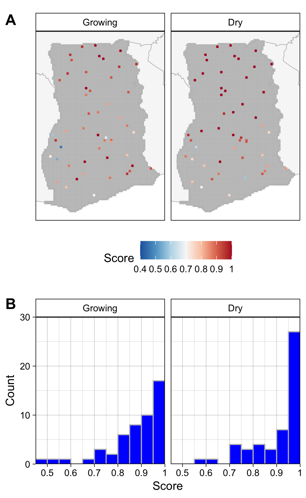

```{r setup, include=FALSE, cache=FALSE, message = FALSE}
library(knitr)
library(citr)
library(dplyr)
library(activemapper)
library(kableExtra)

fmt <- function(x) format(x, big.mark = ",")
#opts_knit$set(root.dir=normalizePath('../'))

### Chunk options: see http://yihui.name/knitr/options/ ###

## Text results
opts_chunk$set(echo = TRUE, warning = TRUE, message = TRUE, include = TRUE)

## Code decoration
opts_chunk$set(tidy = TRUE, comment = NA, highlight = TRUE)

## Cache
opts_chunk$set(cache = 2, cache.path = "output/cache/")

## Plots
opts_chunk$set(fig.path = "output/figures/")


```


```{r knitcitations, echo=FALSE, cache = FALSE}
library(knitcitations)
cleanbib()   
cite_options(citation_format = "pandoc")
```


<!-- \singlespace -->

<!-- \vspace{2mm}\hrule -->
<!-- \vspace{-20pt} -->
<!-- <!-- # Abstract --> 


<!-- \vspace{3mm}\hrule -->

<!-- *Keywords*: rmarkdown, reproducible science -->

\singlespace

\bleft

# Introduction
Amidst all the challenges posed by global change, a particular concern is how agricultural systems will adapt to meet humanity's growing food demands, and the impacts that transforming and expanding food systems will have on societies, economies, and the environment [@searchingerCreatingSustainableFood2019]. Significant efforts are being made to address the various aspects of this challenge, including work on diagnosing and closing yield gaps [e.g. @LickerMindgaphow2010; @lobellCropYieldGaps2009; @muellerClosingYieldGaps2012], expanding and commercializing production [@morrisAwakeningAfricaSleeping2009], and to understand [@davisTropicalForestLoss2020; @kehoeNatureRiskFuture2017; @RulliFoodappropriationlarge2014] and mitigate [@EstesReconcilingagriculturecarbon2016] agriculture's ecological impacts. Answering many of the questions these efforts seek to address depends on reliable data that describes the location and characteristics of cropland [@FritzMappingglobalcropland2015], and how these are changing over time. Unfortunately, the data that do exist are in many places inaccurate. Existing estimates of how much global cropland there is tend to vary widely, and they often disagree about where cropland is located [e.g. @FritzHighlightingcontinueduncertainty2011; @Fritzneedimprovedmaps2013]. Such errors can propagate in subsequent analyses that rely on cropland data as inputs, resulting in potentially misleading answers [@Esteslargeareaspatiallycontinuous2018]. Beyond cropland distributions, few data are available on key cropland characteristics such as field size, an important variable needed to estimate yield and other key food security variables [@CarlettoGuesstimatesGPStimatesLand2015], and as an indicator of farm size [@SambergSubnationaldistributionaverage2016;@levinFarmSizeLandscape2006], a critical component of rural livelihoods given increasing population densities and longstanding debates about the relationship between farm size and productivity [@CarlettoFactartifactimpact2013; @desiereLandProductivityPlot2018; @federRelationFarmSize1985].

These informational inadequacies are due to the fact that cropland data in much of the world are derived from remotely sensed landcover maps, which can be notoriously high in error, particularly over regions such as Africa [@Esteslargeareaspatiallycontinuous2018; @FritzComparisonglobalregional2010], where agricultural changes will be largest and the need for accurate baseline data is thus greatest [@EstesReconcilingagriculturecarbon2016; @SearchingerHighcarbonbiodiversity2015; @bullockThreeDecadesLand2021]. Cropland mapping over Africa is difficult for several reasons. The primary reason relates to the characteristics of the continent's smallholder-dominated croplands, where half of all fields are smaller than 1 ha [@lesivEstimatingGlobalDistribution2019]. This size is small relative to the 30-250 m resolution of the sensors typically used in many landcover mapping efforts [e.g. @ChenGloballandcover2015; @sulla-menasheHierarchicalMappingAnnual2019], which results in errors due to mixed pixels and aspects of the modifiable area unit problem [@Openshawmillioncorrelationcoefficients1979]. In the latter case, the pixel's shape may be poorly matched to that of cropland, and is too coarse to aggregate to approximate that shape at the characteristic scales of crop fields [@Darkmodifiablearealunit2007; @Esteslargeareaspatiallycontinuous2018]. On top of the matter of scale is 1) high intra-class variability of the cropland class, compounded by the fact that these particular croplands can be heavily intergraded with surrounding vegetation [@Debatsgeneralizedcomputervision2016; @Estesplatformcrowdsourcingcreation2016], and 2) the substantial temporal variability within croplands, both within and between seasons. These latter two aspects pose challenges for the classification algorithms that are applied to the imagery.  

These problems arising from cropland characteristics are increasingly being addressed due to technological advances. Recent advances in satellite technology have increased the coverage of high (<5 m) or near-high (10 m) resolution imagery with weekly to near-daily return intervals [@DruschSentinel2ESAOptical2012; @McCabefutureEarthobservation2017]. This high spatial *and* temporal resolution addresses the sensor-field scale mismatch, and more effectively captures the intra-seasonal dynamics of cropland, which helps classifiers distinguish cropland from surrounding cover types [@Debatsgeneralizedcomputervision2016; @Defournyrealtimeagriculturemonitoring2019]. On top of this, advances in cloud computing [@GorelickGoogleEarthEngine2017], the opening of image archives [@WulderglobalLandsatarchive2016], and next generation machine learning approaches [@MaxwellImplementationmachinelearningclassification2018; @ZhuDeeplearningremote2017] are placing large volumes of these moderate to near-high resolution imagery together with the computational and algorithmic resources necessary to classify them at scale. These capabilities are aleady being used to create a new generation of higher resolution (10-30 m) cropland and landcover maps for Africa and other regions [@ESAESACCILAND; @LesivEvaluationESACCI2017; @XiongNominal30mCropland2017].  

Despite these advances, the highest resolution (<5 m) image sources are still not used to map cropland over very large extents, presumably because they are commercial and relatively high cost to acquire, in addition to the greater computational demands. As such, map accuracy can still be a challenge, particular for User's accuracy, which ranges between 46 and 76% for the cropland class [e.g. @LesivEvaluationESACCI2017; @XiongNominal30mCropland2017]. 

Accuracy may also suffer due to error-inducing factors that are becoming somewhat more pronounced as a consequence of these technology advances, particularly with respect to algorithms. Advances in machine learning are helping to greatly improve classification skill, but these algorithms generally require large, high-quality training datasets [@ElmesAccountingtrainingdata2020; @maDeepLearningRemote2019; @MaxwellImplementationmachinelearningclassification2018]. To satisfy this need for more training (and reference) samples, map-makers increasingly rely on visual interpretation of high resolution satellite or aerial imagery to collect training (or validation) samples [e.g. @XiongNominal30mCropland2017; @ChenGloballandcover2015; @StehmanKeyissuesrigorous2019]. Several web-based platforms have been developed to facilitate such efforts, which provide convenient and highly scalable tools for training data collection [e.g. @BeyCollectEarthLand2016; @Estesplatformcrowdsourcingcreation2016; @FritzGeoWikionlineplatform2012]. Visually interpreted training labels present two particular problems. The first is that such labels have inevitable interpretation errors that can vary substantially according to the skill of the interpreter [@Estesplatformcrowdsourcingcreation2016; @WaldnerConflationexpertcrowd2019]. These errors are typically not accounted for in reported accuracy metrics, despite the fact that they can introduce substantial error into the resulting maps and subsequent analyses [@ElmesAccountingtrainingdata2020; @Esteslargeareaspatiallycontinuous2018]. The second problem is that visual interpretation depends on high resolution imagery (<5 m), as lower resolutions make it difficult for a human analyst to discern cropland. Typically the only practical source for such imagery are "virtual globe" basemaps provided by Microsoft and Google, which are composed of mosaics of various high resolution satellite and aerial images that typically span 3-5 years of time within a single country [@LesivCharacterizingspatialtemporal2018]. This within-mosaic temporal variation can set up a temporal mismatch between the imagery being interpreted and the imagery being classified, which is usually from a different source (e.g. Landsat, Sentinel; @XiongNominal30mCropland2017). If a land change occurs in the interval between the two image sets (e.g. a new field was created), this can introduce error into the training data that is then passed on to the classifier. This source of error may be elevated in smallholder-dominated systems in the tropics, where swidden practices are common [@vanvlietThereContinuingRationale2013], or in rapidly developing agricultural frontiers [@ZengHighlandcroplandexpansion2018].  

Improving the accuracy of cropland maps over smallholder-dominated systems thus requires an approach that meets three requirements. First, it should be based on high spatial and temporal resolution imagery, to be able to capture the fine grain and temporal variability of smallholders' fields. Second, an algorithm with suitable skill for classifying these images must be selected, and combined with the computational resources needed to process large imagery volumes. Third, a method for collecting large volumes of high quality training and validation data based on image interpretation is essential. This method should quantify and minimize the errors associated with image interpretation. It should also ensure that labels are collected either from the same imagery that is being classified, or from contemporanous imagery, in order to reduce errors introduced by land change processes. 

We describe here a cropland mapping system that follows these requirements, with an emphasis on delineating field boundaries. The first requirement is enabled by the recent availability of CubeSat data that provides 3-4 m resolution imagery over large areas at near daily intervals [@McCabefutureEarthobservation2017]. Although these data, currently collected by Planet's CubeSat fleet, are of lower spectral depth and quality than Landsat, Sentinel, or Worldview imagery, they enable country to continental scale image mosaics to be created for multiple periods during the crop growing calendars, and capturing the intra-annual variability can be more important for classifying cropland than spectral depth [@Debatsgeneralizedcomputervision2016]. This daily revisit capacity is also important for developing seasonal composites in cloudy regions, where satellites with longer return intervals may fail. Lastly, although this imagery being up to ~16 times coarser than much of Bing or Google imagery, it is sufficiently resolved for humans to discern most fields [e.g. see @Esteslargeareaspatiallycontinuous2018; @FourieBetterCropEstimates2009]. This allows labels to be generated on the same imagery processed by the classifier, thereby addressing one of the two needs related to training data (requirement 3). 

The second requirement is addressed by a computer vision/machine learning classifer that is effective for classifying smallholder croplands [@Debatsgeneralizedcomputervision2016], re-engineered to run on high performance, cloud-based computing clusters with a simplified feature set, and following recommended practices for controlling for and measuring the errors that occur when training machine learning models for remote sensing applications [@ElmesAccountingtrainingdata2020]. The classifier is tightly coupled to a front-end platform for collecting label data, which includes rigorous accuracy assessment protocols and a novel approach for merging multiple maps into consensus labels, thereby minimizing image interpretation error [@Estesplatformcrowdsourcingcreation2016; @ElmesAccountingtrainingdata2020]. The training and machine learning components are combined within an active learning framework, wherein the machine learning process assesses classification uncertainty in unlabelled areas after a training step, and selects sites from areas of highest uncertainty for additional labelling [@cohnImprovingGeneralizationActive1994; @tuiaSurveyActiveLearning2011]. Our framework automates this interactive approach to label selection, which is effective in boosting the performance of classification models while reducing the overall number of training samples required to achieve a given level of performance [e.g. @hamrouniLocalGlobalTransfer2021; @DebatsIntegratingactivelearning2017]. Finally, an unsupervised segmentation step is applied to the imagery and merged with the pixel-wise classifications from the machine learning process, resulting in a vectorized field boundary map that provides important information on field geometry. 

We demonstrate this approach to map cropland in Ghana, a country where smallholder farming predominates, and which has a broad mix of climates and agricultural systems, including large areas where shifting agriculture is practiced [@KansangaTraditionalagriculturetransition2019; @SambergSubnationaldistributionaverage2016].  

# Methods
## System overview 
The mapping system design has four primary components focused on 1) image acquisition and compositing, 2) training and validation data collection, 3) image classification, and 4) segmentation. The first component is applied as a once-off step to generate an image catalog covering the mapping geography. The second component provides tools for labelling imagery, and controls an interactive model training and classification (component 3) pipeline that produces a map of cropland probabilities for each image pixel (Figure \ref{fig:systemoverview}). The final segmentation step (component 4) is then initiated and applied to both the input image catalog and the posterior probability maps, resulting in vectorized field boundaries. Each system component comprises an individual software module designed to be implemented on cloud computing architecture, and available on a GitHub repository (see data and software availability section for details).

```{r systemoverview, echo = FALSE, out.width="50%", fig.cap="An overview of the primary system components, the data stores that hold the inputs and outputs from each component, and the direction of connections between them. The dashed line indicates iterative interactions, while solid lines indicate one-time or irregular connections.", fig.align='center'}
knitr::include_graphics('figures/figure1.png')
```

## System components
### Image compositing
The image processing components of our system were designed to work with PlanetScope Analytic surface reflectance data [@planetteamPlanetApplicationProgram2018]. PlanetScope provides three visual (red, green, blue) and a near-infrared band at 3-4 m resolution at nominal daily frequency. Although these images are already pre-preprocessed and corrected for atmospheric effects, there are residual errors from inter-sensor differences and the radiometric normalization process [@HouborgDailyRetrievalNDVI2018], variation in the orientation of scene footprints, as well as a high frequency of cloud cover over the study region [@WilsonRemotelySensedHighResolution2016]. To correct for these factors, we developed a procedure for creating temporal composites representing the primary growing and non-growing seasons within a single year.  

PlanetScope imagery is accessed via the Planet API [@planetteamPlanetApplicationProgram2018], and an initial order is placed for all imagery falling within the mapping geography and the date ranges for the two compositing periods. The imagery is collected and transferred directly to a cloud storage platform (Amazon Web Services [AWS] S3). 

Individual images are then transformed into analysis ready data (ARD) [@DwyerAnalysisReadyData2018], by subsetting each downloaded image into 0.05 degree tiles, regardless of cloud cover. Tiles are organized within a larger 1 degree resolution grid that covers the entire continent, which defines the minimum mapping area of interest (AOI; Figure \ref{fig:aois}). 

<!-- and then applies the usable data mask (UDM) supplied with the imagery to remove low quality and cloudy pixels.  -->

```{r aois, echo = FALSE, out.width="100%", fig.cap="The reference system used in the mapping platform, including A) numbered areas of interest (AOIs) that define the minimum mapping geography (solid black lines; dotted lines indicate boundaries of 1 degree grid), B) the 0.05 degree tile used for compositing imagery, and C) the 0.005 degree resolution reference grid used for collecting training data and distributed computing.", fig.align='center'}
knitr::include_graphics('figures/figure2.png')
```
The temporal compositing process is applied to the tiled daily images for the time period of interest, which in this case was one of two multi-month seasons, the primary growing and dry seasons for a single agricultural year. Imagery from two seasons helps to improve the performance of cropland classifiers [@Debatsgeneralizedcomputervision2016], while having the seasons in the same year helps to minimize differences caused by land change. For each pixel in each image in each ARD temporal stack for a given season, two weights are calculated:

<!-- values. The first is based on a simplified formula of the Haze Optimized Transformation (HOT) index [√; @ZhuObjectbasedcloudcloud2012]:  -->

\begin{equation} \label{eq:cloud}
\mathrm{W1_t} = \frac{1}{\mathrm{blue_t}^2}
\end{equation}

<!-- Equation solution from here: https://stackoverflow.com/questions/4027363/two-statements-next-to-curly-brace-in-an-equation -->
 
\begin{equation} \label{eq:shadow}  
\mathrm{W2_t} =\begin{cases}
    \frac{1}{\mathrm{NIR_t}^4}, & \text{if $\mathrm{NIR_t}$ < median\{$\mathrm{NIR_{t1}}$, $\mathrm{NIR_{t2}}$, ..., $\mathrm{NIR_{ti}}$\}}.\\
    1, & \text{otherwise}.
  \end{cases}
\end{equation}

Where *t* is a particular date in near-daily time series of PlanetScope images, which begins at date 1 for the given compositing period and ends on date *i*, *blue* is the blue band, and *NIR* the near infrared band. Equation \ref{eq:cloud} assigns lower weights to hazy and clouded pixels as the blue band is sensitive to haze and cloud pixels [@Zhangimagetransformcharacterize2002], while Equation \ref{eq:shadow} assigns low weights to pixels in cloud shadow considering the significant darkening effect of the cloud shadows in the Near Infrared band [@ZhuObjectbasedcloudcloud2012; @qiuCirrusCloudsThat2020]

Once these two weights are calculated, the final composited pixel value for each of the four PlanetScope bands is:

\begin{equation}
\mathrm{\bar{B} = \frac{\sum_{t=1}^{T}B_t * W1_t * W2_t}{\sum_{t=1}^{T}W1_t * W2_t}}
\end{equation}

Which is a weighted mean for each pixel for each band *B* for the particular compositing period. The composited tiles were then added to the S3 store (Figure \ref{fig:systemoverview} 1), where they are stored as cloud-optimized geotiffs, and a "slippy map\footnote{https://wiki.openstreetmap.org/wiki/Slippy_Map}" rendering is created for each composite using Raster Foundry$\footnote{https://github.com/raster-foundry/raster-foundry}$. The web-rendered imagery is presented within the training data platform (next section). 


### Labelling platform
Training and reference data are collected by a custom labelling platform, which was originally designed for AWS's Mechanical Turk job marketplace [@Estesplatformcrowdsourcingcreation2016]. The basic structure of the system remains the same, but we converted it into a standalone platform that allows us to enroll and pay people directly for their labelling, and is designed to control and supervise the machine learning process. The platform runs on a Linux virtual machine hosted on an AWS EC2 instance and is comprised of a database (PostGIS/Postgres), a mapping interface (OpenLayers 3), an image server (RasterFoundry), and a set of utilities for managing, assessing, and converting digitization work into rasterized labels for training a machine learning algorithm. Each instance of the platform focuses on a specific AOI (Figure \ref{fig:aois}A)

The following sections provide an overview of the labelling platform's architecture.

#### Mapping workflow
##### Selecting training and reference sites
The labelling process begins with the random selection of a subset (e.g. 500) of cells from a 0.005 degree grid, with the selection itself potentially split into a training and validation sample, according to predetermined proportions. The grid, which is nested within the tiling and larger 1 degree grids (Figure \ref{fig:aois}C) defines the spatial unit for a labelling job. The selected cells are placed into a queue within the platform's database, and then converted into a mapping *task* that has a specified number of *assignments* (boundaries drawn by an individual labeller) that must be completed before the task is complete.  

##### Mapping assignments
Labellers registered in the system log in to the mapping platform (built with Flask) and navigate to the OpenLayers-based field mapping interface (Figure \ref{fig:labeller}), where they are presented with a white target box representing the randomly selected grid cell, a set of digitizing tools, and different image backdrops, including true and false color renderings of the growing season and off-growing season PlanetScope composites, and several virtual globe basemaps. Following a set of pre-defined digitizing rules (see SI), the labeller uses the polygon drawing tool to digitize the boundaries of all crop fields intersecting the target grid cell that are visible within the PlanetScope overlays. To aid with interpretation, the labeller can toggle between the PlanetScope renderings and the basemaps to help form a judgement about what constitutes a field. The labeller assigns each polygon a class category (e.g. annual cropland), and upon completing all fields submits the assignment to the database. In cases where the target grid cell does not contain any fields, the labeller simply submits the assignment to mark it complete. The labeller is then directed to the next available assignment from a different labelling task. 


```{r labeller, echo = FALSE, out.width="100%", fig.cap="An overview of the labelling platform's interface", fig.align='center'}

```

##### Processing completed assignments
All submitted polygons are cleaned to fix topological irregularities that arose during digitization (see supporting information [SI]) and stored in a PostGIS table. Each completed assignment represents one of two types of tasks: 1) accuracy assessment, or 2) model training or validation. For the former type, an accuracy assessment routine is invoked that executes a series of comparisons between the labeller's results and a training reference dataset, resulting in a assignment score:

\begin{equation} \label{eq:qaqc}
\mathrm{score_i}=\beta_0\mathrm{I}+\beta_1\mathrm{O}+\beta_2\mathrm{F}+\beta_3\mathrm{E}+\beta_4\mathrm{C}
\end{equation}

Where *i* indicates the particular assignment, and $\beta_{0-4}$ represent varying weights that sum to 1. *I* refers to "inside the box" accuracy, *O* is the accuracy of those portions of the labeller's polygons extending beyond the target grid boundaries, *F* is fragmentation accuracy, a measure of how many individual polygons the labeller delineated relative to the reference, *E* measures how closely each polygon's boundary matched its corresponding reference polygon boundary, and *C* assesses the accuracy of the labeller's thematic labels (see SI for individual formulae). Equation \ref{eq:qaqc} is an extension of the approach described by Estes et al. (2016).  

Over time, labellers are assessed multiple times across a range of accuracy tasks, which are selected to represent the variability of the agricultural system being mapped. Each labeller's score history is averaged to provide an overall accuracy measure, and this information is used for creating labels, the second task. 

If the labeller's completed assignment was a training/validation task, their maps remain stored in the database until the task's outstanding assignments are completed by other labellers. Once complete, another routine is invoked, which combines the task's completed assignments into a single consensus label using a Bayesian merging approach:

\begin{equation}
P(\theta|\mathrm{D})=\sum_{i=1}^{n}\mathrm{P}(\mathrm{W_i}|\mathrm{D})\mathrm{P}(\mathrm{\theta}|\mathrm{D}, \mathrm{W_i})
\end{equation}

Where $\theta$ represents the true cover type of a pixel (field or not field), *D* is the label assigned to that pixel by a labeller, and $W_i$ is an individual labeller. P($\theta$|D) is therefore the probability that the actual cover type is what the labellers who mapped it says it is, while P(W$_i$|D) is an individual labeller's average score over all the accuracy assessment assignments they have completed, and P(W$\theta$|D, *W$_i$*) is the labeller's label for that pixel. This approach therefore uses the overall accuracy of each labeller to weight their labels when combined with those made by other labellers' for the same pixel (see SI for further details). As a further measure of confidence in the final consensus label, its average Bayesian Risk can be calculated (see SI). This measure ranges between 0 and 1, with 0 indicating full agreement between labellers for all pixels (n = 40000) in the label, and 1 indicating complete disagreement.  

<!-- - Training and validation data -->
<!-- - Accuracy assessment -->

### Classification pipeline
Upon completion of a batch of labels, the platform automatically launches an ephemeral Elastic Map Reduce\footnote{https://docs.aws.amazon.com/emr/latest/APIReference/emr-api.pdf} cluster consisting of tens of instances, depending on the size of the AOI. 

#### Feature extraction
The first step is the extraction of additional features from each seasonal image composite. Previous work showed that a large number of simple features that summarize the statistical properties of reflectance and vegetation indices in local neighborhoods are highly effective for classifying smallholder croplands [@Debatsgeneralizedcomputervision2016]. We followed this logic in this study, but were constrained to use a smaller feature space because the storage and memory requirements for our mapping geographies in this case were several orders of magnitude larger. For this implemention, we thus extract a set of 16 features, which are the mean and standard deviations calculated within an 11X11 and 5X5 moving window, respectively (initial tests revealed these two window sizes to be most effective), resulting in 24 overall features, including the original bands (Table 1). 

\begin{center}Table 1. List of features.\end{center}

Feature             Window Size  N Features
------------------- ------------ ------------
RGB-NIR                      1X1            8 
Mean                       11X11            8
Standard deviation           5X5            8
------------------ ------------- ------------

Feature extraction and the conversion of image features is handled by a combination of `GeoTrellis`\footnote{https://github.com/locationtech/geotrellis}, `rasterio`\footnote{https://rasterio.readthedocs.io/en/latest/}, and `RasterFrames`\footnote{https://www.cogeo.org/}. These collectively extract subsets of imagery from the PlanetScope temporal composites, derive the features, and convert these into `RasterFrames`, a data structure designed for handling raster data within Apache Spark. Features are extracted on the fly for each cell in the training and validation sets, a functionality enabled by storing the image composites as Cloud-optimized Geotiffs\footnote{https://www.cogeo.org/} (COGs), which allows rapid reading of image subsets.  

#### Classification

Once the features from the training sites are extracted into `RasterFrames`, these are combined with their corresponding labels and passed to the machine learning classifier, a `SparkMLlib` implementation of Random Forests [@BreimanRandomForests2001]. For this study, the model was trained with a balanced sample and a tree depth of 15 and total tree number of 60, which initial testing showed to provide a reasonable balance between computational time and performance.

After fitting, the model is applied to the features of the model validation set, and a set of performance metrics is calculated, including binary accuracy, the F1 score (the geometric mean of precision and recall), and the area under the curve of the Receiver Operating Characteristic [@Pontiustotaloperatingcharacteristic2014]. 


### The active learning loop
After fitting and model evaluation a second prediction is undertaken to enable active learning. The feature extraction process is repeated for the rest of the mapping geography that falls outside of the training and validation sample, but applied to a subset of randomly drawn pixels from each cell in order to reduce computational demand. The fitted model is applied to predict the cropland probability for these selected pixels, and an uncertainty criterion [@DebatsIntegratingactivelearning2017] is calculated for each grid cell:

\begin{equation}
\mathrm{Q_I = \sum_{I(x, y) \epsilon I} (p(x, y) - 0.5)^2}
\end{equation}

```{r, echo = FALSE, eval = FALSE}
uncertainty <- function(x) sum((x - 0.5)^2)
a <- runif(10, min = 0.4, max = 0.6)
b <- c(runif(5, min = 0, max = 0.2), runif(5, min = 0.8, max = 1))

# sum(a - 0.5)^2
# 1 - sum(a - 0.5)^2
# 1 - sum(b - 0.5)^2
# ass <- (a - 0.5)^2
# bss <- (b - 0.5)^2
# 1 - sum(ass)
# 1 - sum(bss)
# (1 - sum(b - 0.5)^2)
uncertainty(a)
uncertainty(b)
```
Where Q is the uncertainty for grid cell I, calculated from the predicted probability *p* of the randomly selected subset of pixels (x, y) drawn from it. Pixels with predicted probabilities closer to 0.5 are least certain as to their classification, thus images with the lowest values of $Q$ represent sites posing the most difficulty for the classifier. 

After scoring with the uncertainty criterion, the top *N* most uncertain grid cells are selected and sent back to the labelling platform, which are then digitized by the labellers. The resulting consensus labels from the actively selected sample are added to the initial randomly selected sample, and a new cluster is launched. The model is retrained, assesses uncertainty across the remaining unlabelled sites, and selects the next most uncertain sites for labelling. This loop repeats until model performance gains against the validation set show diminishing returns.  

### Segmentation
After the final iteration, the segmentation algorithm is invoked, which entails several steps. In the first step, the meanshift algorithm [@YizongChengMeanshiftmode1995a] is applied to the original bands of the dry season composite. A Sobel filter is then applied to the green, red, and near-infrared mean-shifted bands and the probability map, and a combined edge image is computed using the sum of these four edge images for the dry season only. A compact watershed algorithm [@neubertCompactWatershedPreemptive2014] is then run on the weighted edge image, with a high level of segmentation specified. In this case, we specified **6400** segments per tile. 

Third, a region adjacency graph is constructed for each image tile, in which each node represents all pixels within each polygon created in the previous step. The edge between two adjacent regions (polygons) is calculated as the norm of the difference between the means of normalized colors of all bands. Hierarchical merging is then applied, in which the most similar pairs of adjacent nodes are merged until there are no edges remaining below a predetermined threshold of 0.05.  

In the fourth step, the merged polygons are overlaid with the posterior probabilities resulting from the final active learning loop, and polygons in which the average posterior probability is greater than a predetermined  threshold (here 0.5, but could vary locally) are retained as field polygons. 

In the final step, the retained polygons are refined by removing holes and smoothing their boundaries using the Visvalingam algorithm [@visvalingamLineGeneralisationRepeated1993]. Neighboring polygons that overlap along tile boundaries are then merged.

To assess the accuracy of the final segmented boundaries, we used a two-step approach. First, we assessed the overall thematic accuracy of the resulting classification against our map reference data. Second, to assess the quality of the segmentation, we compared the mean area and relative frequencies of the segmented polygons within different size classes against the same metrics derived from the digitized fields of the most accurate worker to create the given map. We selected this relatively simple procedure, as opposed to more complex measures of object accuracy [@yeReviewAccuracyAssessment2018], because, on the one hand, both the automated segmentation algorithm and labellers are cueing in on the same features--abrupt, physically detectable breaks within the imagery. On the other hand, no matter how well the intepreted/segmented boundaries align with the boundaries of fields in the imagery, it is logistically difficult to evaluate performance against real-world boundaries as the spectral distinction of field boundaries will vary across different crop types and land use arrangements. 

## Applying the system to map Ghana
We applied the system to map Ghana's croplands, excluding areas primarily cultivated with tree crops. Ghana has several distinct agricultural regions, ranging from the primarily grain and vegetable crop producing regions in the northern savannas to tree crop-dominated system in the forested southwest, where cocoa and oil palm are among the dominant crops. For these latter regions, we did not attempt to classify tree crops, and instead mapped clearings that potentially contain field crops or newly felled or recently replanted tree crops. We made this decision because PlanetScope's resolution is not high enough for labellers to distinguish many tree crops from surrounding forest, and the boundaries of many tree crops (e.g. cocoa) are often not visible. 

To create the cropland maps, we divided the country into 16 distinct AOIs, which were developed by grouping together each one degree cell fully contained within Ghana with the tiles belonging to any adjacent degree cell that overlapped neighboring countries (Figure \ref{fig:aois}A). The exception was AOI 16, which consisted of the four degree cells intersecting Ghana's southern coast. The resulting AOIs ranged from 12,160 to 23,535 km$^2$ in extent (average = 15,457 km$^2$), A separate active learning and segmentation process was run for each of these AOIs.

To collect the initial randomized samples for model training, we grouped the AOIs into three clusters: a northern cluster comprising the 6 northernmost AOIs (Cluster 1), a central to southeastern cluster (Cluster 2) consisting of the 3 middle (AOIs 7-9) and 2 southeastern AOIs (12 and 15), and a southwestern cluster (Cluster 3) made up of the forest zone AOIs (10, 11, 13, 14, 16). Within each cluster, we randomly selected and labelled 500 grid cells, which provided relatively large initial training samples for these agro-ecologically similar regions, while helping to minimize the overall amount of labelling effort. In addition to these samples, we randomly selected and labelled 100 grid cells within each AOI to provide a validation sample. 

After collecting the initial training and validation samples, we trained a starter model for each cluster and applied it to each of the block's AOI. For each iteration, 100 samples were actively selected within each AOI, and added to the training pool. 

During the collection of training and validation samples, labellers were tasked to only digitize active or recently active crop fields, avoiding tree crops, and fallow or potentially abandoned fields (see SI for the digitizing rules).  

To evaluate the performance of the system, we performed several analyses described in sections 2.3.1-4. 

### Image quality
```{r, echo=FALSE, message=FALSE, warning=FALSE}
data("image_quality")
tile_quality <- image_quality$img %>% filter(kml_type == "F") %>% 
  group_by(name, season, worker_id) %>% 
  summarize(tile = min(tile), Score = sum(score) / 12) %>% ungroup() 
tilen <- tile_quality %>% distinct(tile) %>% count() %>% pull(n)
```

We evaluated the overall quality of the resulting seasonal image composites by assessing a random selection of `r tilen` tiles. We graded both seasonal composites for each tile using a four category quality score, which evaluated the degree of 1) residual cloud and 2) cloud shadow, 3) the number of visible scene boundary artifacts, and 4) the proportion of the image that had its resolution degraded below the typical 3-4 m PlanetScope resolution (e.g. because of between-date image mis-registrations). Each category was qualitatively ranked from 0-3, with 0 being the lowest quality, and 3 the highest (see SI for complete protocol), making the highest possible score 12. We rescaled scores to fall between 0 and 1. 

### Model gains per iteration
To assess the gain in model performance due to active learning, we measured the change in accuracy, F1, and AUC (see 2.2.3.2) between each iteration and between the first and last iterations for each AOI. 

To evaluate whether active learning improved model performance relative to a purely random approach to selecting new training sites, we ran additional tests within a subset of AOIs (1, 8, and 15). We first randomly selected and labelled 300-400 sites in each AOI. We then progressively added 100 of the randomly selected samples to the relevant training pool and retrained the model,  repeating the process so that the number of iterations and samples matched those from the active learning process. We then compared the difference in accuracy, AUC, and F1 between the randomly trained models and those trained with active learning [@DebatsIntegratingactivelearning2017]. 

### Accounting for label error
To quantify the potential impact of label error on classification results, we evaluated the performance differences between models trained with three different sets of labels: 1) those from the lowest scoring labeller to map each training site, 2) those from the highest scoring labeller, and 3) the consensus labels. This assessment follows recommended Tier 1 (i.e. best practice) standards to account for training data errors [@ElmesAccountingtrainingdata2020].  

```{r, echo=FALSE}
load(system.file("extdata/", "instance_tbls.rda", package = "activemapper"))
kml_types <- instance_tbls$kml_data %>% filter(aoi == "labeller8v2") %>% 
  group_by(kml_type) %>% count() %>% filter(kml_type == "Q") %>% pull(n)
```

### Accuracy assessment
The model performance assessments described above (2.3.2-3) were not fully independent because they used the same validation sites over multiple iterations [@ElmesAccountingtrainingdata2020]. To independently assess the accuracy of our final map products, we followed recommended guidelines [@StehmanKeyissuesrigorous2019] to create a separate map reference sample. We used a stratified design, randomly assigning square polygons of ~0.1 ha extent into cropland and non-cropland strata, developed the map of segmented field boundaries. Four classes were used for the map reference sample: cropland; non-cropland; unsure but likely cropland; unsure but likely non-cropland. The latter two classes were used to provide insight into the degree of uncertainty in the map reference sample. For efficiency, two separate supervisors evaluated separate portions of the reference sample, but both jointly assessed a small subset of the sample. We calculated their level of agreement on this subset to provide an additional assessment of uncertainty in the map reference sample [@StehmanKeyissuesrigorous2019]. The SI contains further details on the design and collection of the map reference sample. 

The map reference polygons were then intersected with both the probability images and the segmented field boundaries, and confusion matrixes between the map reference labels and the extracted map classes were constructed to assess the categorical accuracy of each map product. We calculated the overall accuracy for each map, as well as the class-wise User's and Producer's accuracy, as well as the 95% confidence intervals for each accuracy measure [@OlofssonGoodpracticesestimating2014; @OlofssonMakingbetteruse2013; @StehmanKeyissuesrigorous2019]. 

To assess the accuracy of the segmented field boundaries, we compared the size class distributions of the segmented field boundaries against those of the  workers' digitized polygons at map validation sites. We chose this approach because of existing uncertainties in polygon-based accuracy assessment methods [@yeReviewAccuracyAssessment2018], and because the map's ability to represent field sizes was of greatest interest. To undertake this comparison, we selected the field polygons from the most accurate labeller to digitize each of the 100 validation sites in each AOI, and calculated the site-wise average area and number of polygons. We then calculated the same statistics from the segmented boundaries that intersected each validation grid. We compared the distributions and proximity of two measures of central tendency (mean and median) calculated from the two datasets for each AOI, and across all AOIs. 

<!-- Related to this, we evaluated two different versions of the active learning uncertainty criterion to evaluate the impact on performance gain.  -->

<!-- Finally, we evaluated production performance in terms of speed of labelling and accuracy of results by comparing the generation time (label creation, training, and then classification) and accuracy of maps trained by 1) our core team of 10-12 experienced workers, and 2) a team of 100 novice workers from three different countries.  --> 

## Assessing the characteristics of Ghanaian cropland
Using the final mapped results, we calculated the estimated area of cropland in Ghana, as well as the average size and total number of fields in the different AOIs. We used the map reference sample to calculate adjusted area estimates and confidence intervals for each map class, and used the differences between labellers' polygons and segmented boundaries at validation sites to calculate bias-adjusted estimates of mean field sizes and the total number of fields. 

# Results
```{r, echo=FALSE, message=FALSE, warning=FALSE}
tiles <- sf::read_sf(system.file("extdata/ghana_tiles.geojson", 
                                 package = "activemapper"))
km2 <- round(as.numeric(units::set_units(sum(sf::st_area(tiles)), "km2")))
km2 <- fmt(km2)
```
We developed maps of Ghana's cultivated croplands within an area of `r km2` km$^2$, which included portions of neighboring countries overlapped by images tiles. 

## Image catalog and quality
```{r, echo=FALSE, message=FALSE, warning=FALSE}
data("image_quality")
tqual_mu <- image_quality$tile %>%
  group_by(season, tile) %>% 
  summarize(score = mean(Score)) %>% 
  ungroup()
tqual_sum <- tqual_mu %>% 
  group_by(season) %>% 
  summarize(mu = mean(score), sd = sd(score))
tqmu <- tqual_sum %>% pull(mu) %>% round(2)
names(tqmu) <- tqual_sum %>% pull(season)

tqual_ct <- tqual_mu %>% group_by(season) %>% 
  mutate(gt85 = ifelse(score > 0.85, 1, 0)) %>% 
  summarize(n = n(), n85 = sum(gt85)) %>% 
  mutate(prop = n85 / n)
tqct <- tqual_ct %>% pull(prop) * 100
names(tqct) <- tqual_ct %>% pull(season)

nt <- fmt(nrow(tiles))
```

To develop the maps, we first generated an image catalog for the `r nt` tiles covering Ghana. This entailed processing all PlanetScope imagery intersecting these tiles between May-September, 2018 (the growing season) and December, 2018 to February, 2019 (the subsequent dry season). The longer period was necessary for the growing season because of the frequent cloud cover, which severely limits the number of clear scenes for any tile. For the cloudiest regions (AOIs 10, 11, 13, 14, 16) we started the dry season window in November. 

An assessment with two observers (see SI for observer details) found that average quality per growing season composite tile was `r tqmu["Growing"]`, with `r tqct["Growing"]` percent having scores $\geq$ 0.85, while the average quality of dry season composites was `r tqmu["Dry"]` (`r tqct["Dry"]` percent $\geq$ 0.85). Composite quality in both seasons was highest in the northern half of the country and lowest in the southwest (Figure \ref{fig:imqual}A), where the substantially greater cloud cover resulted in a much lower density of available PlanetScope imagery for each time period. 

<!-- Overall, the available image density and quality of composites were closely related (see SI for full details).   -->

```{r imqual, echo = FALSE, out.width="70%", fig.cap="The location and quality scores of 100 randomly selected tiles for the growing (A) and off-growing season (B), and the corresponding distributions of the quality scores for each season, respectively (C and D).", fig.align='center'}
knitr::include_graphics('figures/figure4.png')
```

## Active learning
### Training data collection
```{r, echo=FALSE, message=FALSE, warning=FALSE}
initial <- train_val_sites$initial %>% as_tibble %>% group_by(Cluster) %>%
  count()
active <- train_val_sites$active %>% as_tibble %>% filter(usage == "train") %>% 
  group_by(aoi) %>% count()
typicaln <- raster::modal(initial$n) + raster::modal(active$n)
aoi10n <- (initial %>% filter(Cluster %in% 3) %>% pull(n)) + 
  (active %>% filter(aoi == "labeller10") %>% pull(n))
aoi14n <- (initial %>% filter(Cluster %in% 3) %>% pull(n)) + 
  (active %>% filter(aoi == "labeller14") %>% pull(n))
aoi15n <- (initial %>% filter(Cluster %in% 2) %>% pull(n)) + 
  (active %>% filter(aoi == "labeller15") %>% pull(n))
aoi3init <- initial %>% filter(!Cluster %in% 1:3) %>% pull(n)
aoi3n <- aoi3init + (active %>% filter(aoi == "labeller3") %>% pull(n))

initial_total <- train_val_sites$initial %>% as_tibble() %>% distinct(name) %>% 
  count()
active_total <- sum(active$n)
validate_total <- train_val_sites$active %>% as_tibble() %>% 
  filter(usage == "validate") %>% distinct(name) %>% count()

ttrain <- fmt(initial_total + active_total)
tval <- fmt(validate_total$n)
```

After training of models with the initial randomly selected label sets, the active learning process was run for 3 iterations for 12 of the 16 AOIs, resulting in `r typicaln` labels per AOI. AOIs 10 and 14 stopped after one and two iterations, respectively, as they started with high initial validation accuracies (>83%) and showed little subsequent improvement. The models for these two AOIs were thus trained with `r aoi10n` -  `r aoi14n` samples. AOI 15 was run for 4 iterations (`r aoi15n` samples), while AOI 3 underwent a second active learning cycle because the model produced during the first cycle was inaccurate (see SI). In this second run, `r aoi3init` initial training sites randomly selected within the AOI were used (Figure S3A), followed by 2 subsequent active learning iterations, resulting in a training sample of `r aoi3n`. Labels collected during the active learning iterations showed distinct patterns in several AOIs, which often fell along ecotones, such as the boundaries between agroecozones (see Figure S3A). The total number of unique training and validation sites across the country were `r ttrain` and `r tval`, respectively.   

```{r, echo=FALSE, message=FALSE, warning=FALSE}
data("label_summary")  
toofew <- label_summary$nlabels %>% filter(n < 10) %>% pull(ID)
tsites <- label_summary$nlabels %>% filter(!ID %in% toofew) %>% 
  group_by(kml_type) %>% 
  summarize(tot = sum(n), mu = round(mean(n)), med = round(median(n)), 
            stdev = round(sd(n)), lower = min(n), upper = max(n))

# training rate
train_rate <- label_summary$nlabels %>% 
  tidyr::pivot_wider(names_from = kml_type, values_from = n) %>% 
  rename_all(funs(c("ID", "tr", "tref"))) %>% 
  mutate(trate = tref / tr) %>% filter(tr > 10)

tsitesc <- tsites %>% mutate(across(where(is.numeric), fmt))
# nvecs <- tsites$tot[1])
# muvecs <- fmt(tsites$mu[1])

```

The distribution of training and validation sample collection effort was divided across `r nrow(label_summary$score_stats)` labellers, with a core group of `r label_summary$nlabels %>% filter(kml_type == "Training" & n > 1000) %>% nrow()` who mapped more than 1,000 sites each. As each training site was mapped by 4 separate labellers, `r tsitesc$tot[1]` sets of vector labels were made. Each labeller digitized an average of `r tsitesc$mu[1]` (see Figure S4A for more details on labelling effort). Labeller accuracy was scored `r tsitesc$tot[2]` times against `r length(unique(label_summary$scores$name))` unique training reference sites (Figure S3A), with each labeller assessed an average of `r tsites$mu[2]` times at a rate of 1 training reference site for every `r round(1 / (tsites$mu[2] / tsites$mu[1]), 2)` training site mapped. The mean of each labeller's average accuracy score was `r round(mean(label_summary$score_stats$Mean), 2)` (range `r round(min(label_summary$score_stats$Mean), 2)` to `r round(max(label_summary$score_stats$Mean), 2)`; see Figure S4B for detailed score distributions). 

```{r, echo=FALSE, message=FALSE, warning=FALSE}
data("label_risk")
murisk <- label_risk$stats %>% group_by(usage) %>% 
  summarize(Risk = round(mean(Risk), 3)) %>% 
  tidyr::pivot_wider(names_from = usage, values_from = Risk)
mintrainrisk <- label_risk$stats %>% filter(usage == "Train") %>% 
  filter(Risk == min(Risk))
maxtrainrisk <- label_risk$stats %>% filter(usage == "Train") %>% 
  filter(Risk == max(Risk))
minvalrisk <- label_risk$stats %>% filter(usage == "Validate") %>% 
  filter(Risk == min(Risk))
maxvalrisk <- label_risk$stats %>% filter(usage == "Validate") %>% 
  filter(Risk == max(Risk))

# label clusters
cl1 <- label_risk$stats %>% filter(aoi %in% 1:6) %>% group_by(usage) %>% 
  summarize(Risk = round(mean(Risk), 3))
cl2 <- label_risk$stats %>% filter(aoi %in% c(7:9, 12, 15)) %>% 
  group_by(usage) %>% summarize(Risk = round(mean(Risk), 3))
cl3 <- label_risk$stats %>% filter(aoi %in% c(10:11, 13:14, 16)) %>% 
  group_by(usage) %>% summarize(Risk = round(mean(Risk), 3))

# training clusters
cl2arisk <- label_risk$stats %>% filter(aoi %in% c("Cl2a")) %>% pull(Risk) %>% 
  round(3)
cl2brisk <- label_risk$stats %>% filter(aoi %in% c("Cl2b")) %>% pull(Risk) %>% 
  round(3)

```

After each site was mapped by four labellers, consensus labels were generated. The Bayesian Risk (see SI) of each training and validation label was calculated as an additional measure of label quality. The average risk was `r murisk$Train` for training labels and `r murisk$Validate` for validation labels. Risk was highest in the northen AOIs (AOIs 1-6; Figures S5-6), falling between `r cl1$Risk[1]` for training and `r cl1$Risk[2]` for validation labels (Figures S5-6), and lowest in the southwestern AOIs (AOIs 10, 11, 13, 14, 16; training risk = `r cl3$Risk[1]`; validation risk = `r cl3$Risk[2]`). Label risk in the central-southeastern AOIs (AOIs 7-9, 12, 15) was slightly lower (training = `r cl2$Risk[1]`; validation = `r cl2$Risk[2]`) than in the north. Labeller experience also appeared to reduce risk, which we observed during a relabelling of the 500 initial random site in this cluster (see SI); the mean risk of the updated labels was `r cl2brisk`, compared to `r cl2arisk` for original labels.

### Performance gains during active learning
```{r, echo=FALSE, warning=FALSE, message=FALSE}
data("iteration_metrics")
delta_func <- function(x, rnd = 4) round((x - lag(x)) / lag(x), rnd)

V1 <- c("Accuracy", "AUC", "F1")

# Difference iteration 0 to 3
imet_mu03 <- iteration_metrics %>% 
  filter(AOI == "All") %>%
  filter(Iteration %in% c(0, 3)) %>%
  filter(!grepl("_change", Metric)) %>% 
  group_by(Metric) %>% 
  mutate(dscore = delta_func(Score)) %>% 
  ungroup() %>% 
  mutate(dscore = round(dscore * 100, 1))

imet_mu0 <- imet_mu03 %>% filter(Iteration == 0) %>% 
  mutate(Score = round(Score, 3))
imet_mu3 <- imet_mu03 %>% filter(Iteration == 3) %>% 
  mutate(Score = round(Score, 3))

# differences per iteration
imet_dmu <- iteration_metrics %>% 
  filter(AOI == "All" & Iteration > 0) %>%
  filter(grepl("_change", Metric)) %>% 
  mutate(Metric = gsub("_change", "", Metric)) %>% 
  mutate(Score = round(Score * 100, 1)) %>% 
  filter(Metric %in% V1)

imet_dmu1 <- imet_dmu %>% filter(Iteration == 1) %>% 
  mutate(dscore = round(Score, 3))
imet_dmu2 <- imet_dmu %>% filter(Iteration == 2) %>% 
  mutate(dscore = round(Score, 3))
imet_dmu3 <- imet_dmu %>% filter(Iteration == 3) %>% 
  mutate(dscore = round(Score, 3))

# AOI score ranges
imin <- iteration_metrics %>% 
  filter(AOI %in% paste0("labeller", 1:16)) %>% group_by(AOI) %>%
  filter(Iteration == max(Iteration) & !grepl("change", Metric)) %>%
  filter(Metric %in% V1) %>% 
  ungroup() %>% 
  group_by(Metric) %>% 
  filter(Score == min(Score)) %>% 
  mutate(AOI = gsub("labeller", "", AOI), Score = round(Score, 3))

imax <- iteration_metrics %>% 
  filter(AOI %in% paste0("labeller", 1:16)) %>% group_by(AOI) %>%
  filter(Iteration == max(Iteration) & !grepl("change", Metric)) %>%
  filter(Metric %in% V1) %>% 
  ungroup() %>% 
  group_by(Metric) %>% 
  filter(Score == max(Score)) %>% 
  mutate(AOI = gsub("labeller", "", AOI), Score = round(Score, 3))

# summarize and condense for easier in line extraction
# iteration 0 and 0-3 metrics
imu0 <- lapply(V1, function(x) {
  imu <- round(imet_mu0 %>% filter(Metric == x) %>% pull(Score), 3)
  idf <- round(imet_mu0 %>% filter(Metric == x) %>% pull(dscore), 3)
  ix <- list("score" = imu, "diff" = idf)
  ix
})
names(imu0) <- V1

imu3 <- lapply(V1, function(x) {
  imu <- round(imet_mu3 %>% filter(Metric == x) %>% pull(Score), 3)
  idf <- round(imet_mu3 %>% filter(Metric == x) %>% pull(dscore), 3)
  ix <- list("score" = imu, "diff" = idf)
  ix
})
names(imu3) <- V1

# iteration-wise diffs
idmu <- lapply(list(imet_dmu1, imet_dmu2, imet_dmu3), function(x) {
  l <- lapply(V1, function(y) {
    imu <- round(x %>% filter(Metric == y) %>% pull(Score), 3)
    idf <- round(x %>% filter(Metric == y) %>% pull(dscore), 3)
    ix <- list("score" = imu, "diff" = idf)
    ix
  })
  names(l) <- V1
  l
})
names(idmu) <- paste0("I", 1:3)
```

Model performance was calculated for each iteration within each AOI. The average accuracy, AUC, and F1 at iteration 0 were `r imu0$Accuracy$score`, `r imu0$AUC$score`, and `r imu0$F1$score`, respectively, increasing to `r imu3$Accuracy$score`, `r imu3$AUC$score`, and `r imu3$F1$score` by iteration 3 (Figure \ref{fig:alperformance}). These differences represent respective gains of `r imu3$Accuracy$diff`, `r imu3$AUC$diff`, and `r imu3$F1$diff` percent for the three metrics. The largest gains for each metric occurred on iteration 1, averaging `r idmu$I1$Accuracy$score`, `r idmu$I1$AUC$score`, and `r idmu$I1$F1$score` percent for accuracy, AUC, and F1, while the lowest gains were realized on iteration 3, with accuracy, F1, and AUC respectively increasing by just `r idmu$I3$Accuracy$score`%, `r idmu$I3$F1$score`%, and `r idmu$I2$AUC$score`%. The scores achieved on the final iteration varied substantially across AOIs and metrics. Accuracy ranged between `r imin[imin$Metric == "Accuracy", ]$Score` (AOI `r imin[imin$Metric == "Accuracy", ]$AOI`) and `r imax[imax$Metric == "Accuracy", ]$Score` (AOI `r imax[imax$Metric == "Accuracy", ]$AOI`), while AUC varied from `r imin[imin$Metric == "AUC", ]$Score` (AOI `r imin[imin$Metric == "AUC", ]$AOI`) and `r imax[imax$Metric == "AUC", ]$Score` (AOI `r imax[imax$Metric == "AUC", ]$AOI`), and F1 from `r imin[imin$Metric == "F1", ]$Score` (AOI `r imin[imin$Metric == "F1", ]$AOI`) and `r imax[imax$Metric == "F1", ]$Score` (AOI `r imax[imax$Metric == "F1", ]$AOI`).

```{r alperformance, echo = FALSE, out.width="100%", fig.cap="Scores for overall Accuracy, area under the curve of the Receiver Operating Characteristic, and the F1 scores for the Random Forests model results after each iteration of the active learning loop for each AOI (gray lines), as well as the mean score per iteration across all AOIs (black lines).", fig.align='center', message=FALSE}
knitr::include_graphics('figures/figure5.png')
```

```{r, echo=FALSE, message=FALSE, warning=FALSE}
# random versus active data
data("iteration_metrics")

# process data: remove labeller from AOI and select AOIs 1-16
V1 <- c("Accuracy", "AUC", "F1")
aois <- c(paste0("labeller", c(1, 8, 15, "1r", "8r", "15r")))
imetrics <- iteration_metrics %>% 
  filter(Metric %in% V1 & AOI %in% aois) %>% 
  mutate(AOI = gsub("labeller", "", AOI)) %>% 
  mutate(type = case_when(
    AOI %in% c(1, 8, 15) ~ "active", 
    AOI %in% c("1r", "8r", "15r") ~ "random"
  )) %>% 
  mutate(AOI = gsub("r", "", AOI)) %>% 
  tidyr::pivot_wider(names_from = "type", values_from = "Score") %>% 
  mutate(delta = (active - random) / random * 100) 
imetrics_all <- imetrics %>% 
  filter(Iteration < 4) %>% 
  group_by(Iteration, Metric) %>% 
  summarize(active = mean(active), random = mean(random), 
            delta = mean(delta)) %>%
  ungroup() %>% mutate(AOI = "All") %>% 
  select(AOI, Iteration, Metric, active, random, delta)

ixl <- lapply(1:3, function(x) {
  ix <- imetrics_all %>% filter(Iteration == x) %>% pull(delta)
  ix <- round(ix, 1)
  names(ix) <- V1
  ix
})
names(ixl) <- as.roman(1:3)

i1acc <- imetrics %>% 
  filter(Iteration == 1 & Metric == "Accuracy") %>% 
  pull(delta) %>% round(2)
names(i1acc) <- imetrics %>% distinct(AOI) %>% pull()

u <- function(x) unname(x)
```

The comparison of active versus randomized training sample collection (in AOIs 1, 8, and 15) showed that the former approach outperformed the latter. After three iterations, the accuracy, AUC, and F1 scores resulting from active learning were respectively `r u(ixl$III["Accuracy"])`, `r u(ixl$III["AUC"])`, and `r u(ixl$III["F1"])` percent higher than the scores from a randomly trained model (Figure S7). However, there was more variability in earlier iterations, with average score differences of `r u(ixl$I["Accuracy"])` (accuracy), `r u(ixl$I["AUC"])` (AUC), and `r u(ixl$I["F1"])` percent (F1) after iteration 1, and `r u(ixl$II["Accuracy"])` (accuracy), `r u(ixl$II["AUC"])` (AUC), and `r u(ixl$II["F1"])` (F1) percent after iteration 2. The negative results for accuracy was caused by results at AOI 15, where active learning accuracy was `r abs(u(i1acc["15"]))` percent lower than random training after iteration 1 (see Figure \ref{fig:alperformance}). In comparison, iteration 1 active learning accuracies were `r u(i1acc["1"])` and `r u(i1acc["8"])` percent higher than random training for AOIs 1 and 8, respectively. Accuracy under active learning for AOI 15 exceeded randomized training after 4 iterations. 

### The impact of training data error
```{r, echo=FALSE, message=FALSE, warning=FALSE}
data("consensus_high_low")
V1 <- c("Accuracy", "AUC", "F1")
delta_func <- function(x, y, rnd = 1) round((x - y) / y * 100, rnd)

# calculate mean across AOIs and join. Convert to factor and reorder for
# plotting
consensus_high_low_mu <- consensus_high_low %>% 
  group_by(Strategy, Metric) %>% 
  summarize(Score = mean(Score)) %>% 
  ungroup()

metdiffs <- lapply(V1, function(x) {  # x <- "F1"
  cn <- consensus_high_low_mu %>% 
    filter(Strategy == "Consensus" & Metric == x) %>% pull(Score)
  h <- consensus_high_low_mu %>% filter(Strategy == "High" & Metric == x) %>% 
    pull(Score)
  l <- consensus_high_low_mu %>% filter(Strategy == "Low" & Metric == x) %>% 
    pull(Score)
  cnh <- delta_func(cn, h)
  cnl <- delta_func(cn, l)
  hl <- delta_func(h, l)
  list(cons = round(cn, 3), high = round(h, 3), low = round(l, 3), 
       chdelt = cnh, cldelt = cnl, hldelt = hl) 
})
names(metdiffs) <- V1
```

The potential impact of label errors on map quality was assessed in four AOIs (1, 2, 8, and 15). The results of these tests showed that the average accuracy, AUC, and F1 scores for models trained with the consensus labels were respectively `r metdiffs$Accuracy$cons`, `r metdiffs$AUC$cons`, and `r metdiffs$F1$cons` (Figure \ref{fig:trainingimpact}). Performance metrics from consensus-trained models were just `r metdiffs$AUC$chdelt` - `r metdiffs$Accuracy$chdelt` percent higher than those models trained with the most accurate individuals' labels (accuracy = `r metdiffs$Accuracy$high`; AUC = `r metdiffs$AUC$high`; F1 = `r metdiffs$F1$high`), but were `r metdiffs$AUC$cldelt` - `r metdiffs$Accuracy$cldelt` higher than models trained with the least accurate individual labels (accuracy = `r metdiffs$Accuracy$low`; AUC = `r metdiffs$AUC$low`; F1 = `r metdiffs$F1$low`). 

```{r trainingimpact, echo = FALSE, out.width="100%", fig.cap="Scores for overall accuracy, area under the curve of the Receiver Operating Characteristic, and the F1 score resulting from models trained with consensus labels, and labels made by the most and least accurate labellers to map each site. Comparisons were made for AOIs 1, 2, 8, and 15, denoted by grey symbols, while the mean scores across these AOIs are shown for each metric.", fig.align='center', message=FALSE}

```

```{r, echo=FALSE, message=FALSE, warning=FALSE}
data("label_risk_metrics")

cor_fun <- function(df) {
  cor.test(df$Risk, df$Score, method = "spearman") %>% broom::tidy()
}

lr_mets <- unique(label_risk_metrics$Metric)
risk_corr <- lapply(lr_mets[lr_mets != "TSS"], function(x) {
  dat <- label_risk_metrics %>% filter(Metric == x)
  cor_fun(dat) %>% mutate(Metric = x)
}) %>% do.call(rbind, .) %>% 
  select(estimate, Metric) %>% 
  rename(r = estimate)
nms <- risk_corr$Metric
risk_corr <- round(t(risk_corr[, 1]), 3)
colnames(risk_corr) <- nms
```

A second measure of the impact of label error is found within the correlations between the mean label risk per AOI and the model performance metrics (Table S3). Accuracy and AUC had strong (Spearman's Rank Correlation =  `r risk_corr[, "Accuracy"]` to moderate (r = `r risk_corr[, "AUC"]`) negative correlations with label risk, while F1 had a weaker but moderate positive association (r = `r risk_corr[, "F1"]`). The positive sign of the latter relationship is counter-intuitive, but is explained by risk's association with precision, one of two inputs to F1, which was moderately positive (`r risk_corr[, "Precision"]`), whereas risk had a negligible correlation with recall (`r risk_corr[, "Recall"]`), F1's other component. The correlation between risk and the false positive rate (`r risk_corr[, "FPR"]`), another important performance metric, shows that labelling uncertainty may increase model commission error.  

## Map accuracy
### Categorical accuracy
```{r, echo=FALSE, message=FALSE, warning=FALSE}
# reference labels, for total count and uncertainty of class categories
ref_labels <- st_read(
  system.file("extdata/map_reference_labels.geojson", 
              package = "activemapper"), quiet = TRUE
)
class_ct <- as_tibble(ref_labels) %>% group_by(category) %>% count()
ref_ct <- as_tibble(ref_labels) %>% group_by(worker_id) %>% count() %>% pull(n)

crp_ct <- class_ct %>% filter(category %in% c("annualcropland", "unsure1"))
noncrp_ct <- class_ct %>% filter(category %in% c("noncropland", "unsure2"))

# observer agreement/correlation
ref_labels_joint <- st_read(
  system.file("extdata/map_reference_labels_joint.geojson", 
              package = "activemapper"), quiet = TRUE
)
joint_classes <- ref_labels_joint %>% as_tibble() %>% 
  select(name, category, worker_id) %>% 
  arrange(name) %>% 
  mutate(class = case_when(
    category == "annualcropland" | category == "unsure1" ~ 1, 
    category == "noncropland" | category == "unsure2" ~ 0 
  ))
class_mat <- joint_classes %>% dplyr::select(name, class, worker_id) %>% 
  tidyr::pivot_wider(names_from = worker_id, values_from = class) %>% 
  dplyr::select(-name) %>% as.matrix()

usertab <- table("User1" = class_mat[, 1], "User2" = class_mat[, 2])

agreement <- round(sum(diag(usertab)) / sum(usertab) * 100, 1)
observer_r <- cor.test(class_mat[, 1], class_mat[, 2], method = "spearman")

```

We used a map reference sample of `r sum(ref_ct)` sites (`r sum(crp_ct$n)` cropland; `r sum(noncrp_ct$n)` non-cropland) to evaluate the accuracy of the per-pixel classifications (resulting from thresholding the Random Forests probability), as well as the segmented field boundary maps. We first evaluated the uncertainty in the map reference classes by assessing 1) the overall agreement between map reference labels collected by two separate supervisors at `r sum(usertab)` sites, and 2) the confidence of the labels assigned by the supervisors (see SI for details). The first measure showed that the two individual supervisors' labels agreed at `r agreement`% of common sites, while the second showed that `r round(sum(crp_ct$n[2], noncrp_ct$n[2]) / sum(ref_ct) * 100, 1)` of sites were labelled with the two classes that indicated a level of uncertainty.  

We found that the overall accuracy of the pixel-wise classifications was 88% against this map reference sample (Table \ref{tab:mapaccuracy}). Confining the map reference sample to four distinct zones (Figure S9A) shows that overall accuracy ranged from 83.3% in Zone 1 (AOIs 1-3) to 93.6% in Zone 3 (AOIs 10, 11, 13, 15, and 16). The Producer's accuracy of the cropland class was 61.7% across Ghana, ranging from 45.6% in Zone 3 to 67.9% in Zone 1, while the User's accuracy for was 67.3% overall, ranging from 59.8% in Zone 4 to 71.2% in Zone 1. Both measures of accuracy were substantially higher for the non-cropland class across all zones, typically exceeding 90%. The lowest accuracies for the non-cropland class was in Zone 1 (Producer's = 89.3%; User's = 87.7%). 

The overall accuracies obtained from the segmented maps were generally 1-2 percentage points lower than those of the per-pixel maps, while User's accuracies tended to be 8-10 percentage points less (Table \ref{tab:mapaccuracy}). In contrast, Producer's accuracies were 15-20 points higher than in the per-pixel map. The segmentation step therefore helped to reduce omission error while substantially increasing commission error.  

<!-- and an accuracy surface interpolated from the average cell-wise accuracies calculated between the predicted map and validation labels.  -->

<!-- ```{r, echo = FALSE, out.width="80%", fig.cap="The overall, user's, and producer's accuracies (indicated by fill color) for each of the 16 mapping zones (zones numbers are shown on maps) [This a hypothetical placeholder figure].", fig.align='center'} -->
<!-- knitr::include_graphics('figures/si_mapping_blocks.png') -->
<!-- ``` -->

\begin{table}
\caption{Map accuracies and adjusted area estimates for the ~3 m pixel-wise classifications (based on Random Forests predictions; top 5 rows) and the segmented map (bottom 5 rows). Results are provided for 4 zones (Zone 1 = AOIs 1-3; Zone 2 = AOIs 4-9; Zone 3 = AOIs 10, 11, 13, 14, 16; Zone 4 = AOIs 12, 15) plus the entire country. The error matrix (with reference values in columns) provides the areal percentage for each cell, and the Producer's (P), User's (U), and overall (O) map accuracies and their margins of error (in parenthesis) are provided, as well as the sample-adjusted area estimates (in km$^{2}$) and margins of error. }
\includegraphics[width = 18cm]{figures/table2.png}
\label{tab:mapaccuracy}
\end{table}

### Segmentation accuracy
```{r, echo=FALSE}
# validation statistics
data("segment_quality_stats")

datnms <- c("top_label_data", "field_validation_stats")#,
            # "tile_aoi_validation_stats")
for(i in datnms) {
  load(system.file(glue::glue("extdata/{i}.rda"), package = "activemapper"))
}

# extract distributions
human <- top_label_data$stats %>%
  mutate(mu_prop = NA, type = "Validation") %>%
  select(-contains("id"))
machine <- field_validation_stats %>%
  mutate(type = "Segmentation")

# calculate SDs
humac_sds <- bind_rows(
  human %>% summarize(value = sd(Mean)) %>% 
    mutate(type = "v", stat = "sd_ha_mu"), 
  human %>% summarize(value = sd(Median)) %>% 
    mutate(type = "v", stat = "sd_ha_med"), 
  human %>% summarize(value = sd(n)) %>% 
    mutate(type = "v", stat = "sd_n_mu"), 
  machine %>% summarize(value = sd(Mean)) %>% 
    mutate(type = "s", stat = "sd_ha_mu"), 
  machine %>% summarize(value = sd(Median)) %>% 
    mutate(type = "s", stat = "sd_ha_med"), 
  machine %>% summarize(value = sd(n)) %>% 
    mutate(type = "s", stat = "sd_n_mu") 
)

# extract distributions

# human <- top_label_data$stats %>%
#   mutate(mu_prop = NA, type = "val") %>%
#   select(-contains("id"))
# machine <- field_validation_stats %>%
#   mutate(type = "seg")
# humachine <- bind_rows(human, machine) %>% 
#   mutate(aoi = as.numeric(gsub("labeller", "", aoi))) %>% 
#   arrange(aoi)

# huma_aois <- humachine %>% group_by(aoi, type) %>% 
#   summarize(med = median(Mean), mu = mean(Mean)) %>% 
#   ungroup()
# lrgst <- huma_aois %>% select(-med) %>% filter(aoi %in% c(2, 3, 7, 15)) %>% 
#   tidyr::pivot_wider(names_from = type, values_from = "mu") %>% 
#   filter(seg %in% range(seg))
seg_stats_grid <- segment_quality_stats %>% filter(scale == "grid")
lrgst <- seg_stats_grid %>% 
  filter(aoi %in% c(2, 3, 7, 15)) %>% 
  tidyr::pivot_wider(names_from = type, values_from = value) %>%
  filter(Stat == "Mean" & measure == "area")

lrgst_seg <- lrgst %>% summarize(rng = range(Segmentation))
lrgst_val <- lrgst %>% summarize(rng = range(Validation))

# # overall stats
# huma_sum <- humachine %>% group_by(type) %>% 
#   summarize(med = median(Mean), sd = sd(Mean), min = min(Mean), 
#             max = max(Mean), mu = mean(Mean)) %>% 
#   select(type, mu, med, sd, min, max)

segha <- seg_stats_grid %>% 
  filter(aoi == "All" & measure == "area") %>% 
  filter(type == "Segmentation" & Stat == "Mean") %>% pull(value) %>% round(2)
# segha <- huma_sum %>% filter(type == "seg") %>% pull(mu) %>% round(2)
valha <- seg_stats_grid %>% 
  filter(aoi == "All" & measure == "area") %>% 
  filter(type == "Validation" & Stat == "Mean") %>% pull(value) %>% round(2)
# valha <- huma_sum %>% filter(type == "val") %>% pull(mu) %>% round(2)

# seghamed <- huma_sum %>% filter(type == "seg") %>% pull(med) %>% round(2)
# valhamed <- huma_sum %>% filter(type == "val") %>% pull(med) %>% round(2)
seghamed <- seg_stats_grid %>% 
  filter(aoi == "All" & measure == "area") %>% 
  filter(type == "Segmentation" & Stat == "Median") %>% pull(value) %>% round(2)
# segha <- huma_sum %>% filter(type == "seg") %>% pull(mu) %>% round(2)
valhamed <- seg_stats_grid %>% 
  filter(aoi == "All" & measure == "area") %>% 
  filter(type == "Validation" & Stat == "Median") %>% pull(value) %>% round(2)


# seghasd <- huma_sum %>% filter(type == "seg") %>% pull(sd) %>% round(2)
seghasd <- humac_sds %>% filter(type == "s" & stat == "sd_ha_mu") %>% 
  pull(value) %>% round(2)
# valhasd <- huma_sum %>% filter(type == "val") %>% pull(sd) %>% round(2)
valhasd <- humac_sds %>% filter(type == "v" & stat == "sd_ha_mu") %>% 
  pull(value) %>% round(2)

segnsd <- humac_sds %>% filter(type == "s" & stat == "sd_n_mu") %>% 
  pull(value) %>% round(2)
valnsd <- humac_sds %>% filter(type == "v" & stat == "sd_n_mu") %>% 
  pull(value) %>% round(2)

# huma_sumn <- humachine %>% group_by(type) %>% 
#   summarize(med = median(n), sd = sd(n), min = min(n), max = max(n), 
#             mu = mean(n)) %>% 
#   select(type, mu, med, sd, min, max)
# segn <- huma_sumn %>% filter(type == "seg") %>% pull(mu) %>% round(2)
# valn <- huma_sumn %>% filter(type == "val") %>% pull(mu) %>% round(2)
# segnmed <- huma_sumn %>% filter(type == "seg") %>% pull(med) %>% round(2)
# valnmed <- huma_sumn %>% filter(type == "val") %>% pull(med) %>% round(2)
# segnsd <- huma_sumn %>% filter(type == "seg") %>% pull(sd) %>% round(2)
# valnsd <- huma_sumn %>% filter(type == "val") %>% pull(sd) %>% round(2)

segn <- seg_stats_grid %>% 
  filter(aoi == "All" & measure == "n") %>% 
  filter(type == "Segmentation" & Stat == "Mean") %>% pull(value) %>% round(2)
valn <- seg_stats_grid %>% 
  filter(aoi == "All" & measure == "n") %>% 
  filter(type == "Validation" & Stat == "Mean") %>% pull(value) %>% round(2)

segnmed <- seg_stats_grid %>% 
  filter(aoi == "All" & measure == "n") %>% 
  filter(type == "Segmentation" & Stat == "Median") %>% pull(value) %>% round(2)
valnmed <- seg_stats_grid %>% 
  filter(aoi == "All" & measure == "n") %>% 
  filter(type == "Validation" & Stat == "Median") %>% pull(value) %>% round(2)


```
The comparisons of digitized versus segmented field boundaries showed that the mean field size across all validation sites averaged `r round(segha, 2)` ha (Median = `r round(seghamed, 2)`; StDev = `r round(seghasd, 2)`), which was `r round((segha - valha) / valha * 100) / 100` times larger than the `r round(valha, 2)` ha (Median = `r round(valhamed, 2)`; StDev = `r round(valhasd, 2)`) mean area of labeller-digitized polygons. This discrepancy was primarily caused by results in four AOIs (2, 3, 7, and 15; Figure S10), where segments averaged between `r round(lrgst_seg$rng[1], 2)` and `r round(lrgst_seg$rng[2], 2)` ha, compared to `r round(lrgst_val$rng[1], 2)` - `r round(lrgst_val$rng[2], 2)` ha for the corresponding hand-digitized polygons. The number of segmented fields per validation site averaged `r segn` (median = `r segnmed`; StDev = `r segnsd`) compared to `r valn` (median = `r valnmed`; StDev = `r valnsd`) for digitized polygons (Figure S11). 

<!-- ### Label quality and map accuracy -->
<!-- ```{r, echo = FALSE, out.width="100%", fig.cap="Difference in overall, user's, and producer's accuracy between maps made with consensus labels, the least accurate worker's, and most accurate worker's labels.", fig.align='center', message=FALSE} -->
<!--  -->
<!-- # library(tidyverse) -->
<!-- # library(cowplot) -->
<!-- # set.seed(1) -->
<!-- # acc_tb <- tibble(aoi = c(1:9, 12, 15),  -->
<!-- #                  Consensus = runif(11, min = 0.75, max = 0.85), -->
<!-- #                  Highest = runif(11, min = 0.72, max = 0.8), -->
<!-- #                  Least = runif(11, min = 0.65, max = 0.75)) -->
<!-- # acc_tb <- gather(acc_tb, key = "type", value = "score", -aoi) -->
<!-- # ggplot(acc_tb) +  -->
<!-- #   geom_boxplot(aes(x = type, y = score), fill = "grey") +  -->
<!-- #   xlab("Labelling strategy") + ylab("Accuracy") +  -->
<!-- #   theme(panel.grid.major.y = element_line(colour = "grey80", linetype = 3)) -->
<!-- ``` -->

## Ghana's croplands
Two separate maps of cropland were produced for each AOI, a per-pixel map derived from the cropland probabilities, and the vectorized map of field boundaries (Figure \ref{fig:mainmap}). The former provides the more accurate picture of cropland distributions in Ghana, which are most concentrated in the Southeastern corner (AOI 15), the central-western region (AOI 7, the northeastern and northwestern corners of AOIs 10 and 11, and the south of AOI 8), and the northeastern quadrant stretching from AOI 9 through AOIs 5 and 6 and up to AOIs 2 and 3. The northern third of AOI 1 also has noticeable densities of cropland. Several notable areas of low cropland density are also apparent, indicating the presence of large protected areas, such as Mole National Park in the southeastern corner of AOI 1 and Digya National Park in the northwestern corner of AOI 12. In contrast, the relative absence of cropland in AOIs 13, 14, and 16 does not reflect the scarcity of agriculture in these areas, but rather the predominance of tree crops, which we did not map. 

```{r mainmap, echo = FALSE, out.width="90%", fig.cap="The distribution of croplands in Ghana. The main map shows the percentage of croplands in each 0.005 degree grid cell, derived from the predicted cropland probabilities. The insets  on the margins illustrate predicted probabilities (top map in each couplet) at original image resolution (0.000025 degrees) and segmented field boundaries overlaid on the dry season PlanetScope composite, for four separate tiles. Each tile's position is shown on the main map, and is color-coded to the boundary lines around its corresponding inset.", fig.align='center', message=FALSE}
knitr::include_graphics('figures/figure7.png')
```

```{r, echo=FALSE}
data("accuracy_reports")

# Adjusted areas
rfa <- accuracy_reports$ghana$rf[, "Area"]
rfa <- rfa[nchar(rfa) > 0]
rfas <- as.numeric(gsub("\\(.*", "", rfa[nchar(rfa) > 0]))
rfma <- as.numeric(stringr::str_match(rfa[1], "\\(\\s*(.*?)\\s*\\)")[, 2])
cipct <- function(x, moe) {
  apct <- x[2] / sum(x)
  moepct <- moe / sum(x)
  round(c(apct, apct - moepct, apct + moepct) * 100, 1)
}
sega <- accuracy_reports$ghana$seg[, "Area"]
sega <- sega[nchar(sega) > 0]
segas <- as.numeric(gsub("\\(.*", "", sega[nchar(sega) > 0]))
segma <- as.numeric(stringr::str_match(sega[1], "\\(\\s*(.*?)\\s*\\)")[, 2])

rfcipct <- cipct(rfas, rfma)
segcipct <- cipct(segas, segma)

```

Both the per-pixel and vectorized maps, when combined with the map reference sample, enable separate estimates of the total extent of croplands in Ghana. The cropland extent estimated from the vectorized map is `r fmt(segas[2])` km$^2$ (with a margin of error of `r fmt(segma[1])` km$^2$), or `r segcipct[1]` (`r paste(segcipct[2:3], collapse = "-")`%) of the mapped area. The estimate based on the per pixel map is `r fmt(rfas[2])` km$^2$ (margin of error = `r fmt(rfma[1])` km$^2$), or `r rfcipct[1]` (`r paste(rfcipct[2:3], collapse = "-")`%) of area. 


The vectorized map provides additional information on how the characteristics of croplands can vary geographically, ranging from narrow, strip-like fields in parts of AOI 15 (Figure \ref{fig:mainmap}'s lower right inset) to more densely packed, less distinctly shaped fields in AOI 5 (upper right inset in Figure \ref{fig:mainmap}). To explore how field characteristics varied geographically, we mapped the average field size and total number of fields within each 0.05 degree tile (Figure S12). These patterns generally correspond to those seen in the cropland density map (Figure \ref{fig:mainmap}), with larger sizes and field counts generally occurring in areas of higher field density, although the biases inherent in both measures (Figures S10-11) complicate the interpretation of those variations. However, we can use the estimated biases to develop adjusted estimates of field sizes and counts for each AOI, and for Ghana overall (Table \ref{tab:sizentab}). These adjusted estimates show that the typical field size in Ghana is 1.73 ha, ranging from 0.96 in AOI 4 to 2.82 ha in AOI 4, with fields in the forest zone AOIs (10, 11, 13, 14, 16) generally smaller than those in the northern half of the country (Table \ref{tab:sizentab}). The total number of fields was estimated to be 1,662,281 overall, or 205 fields per tile on average, ranging from 108/tile in AOI 4 to 399/tile in AOI 6. 

```{r sizentab, echo=FALSE, warning=FALSE, message=FALSE}
fsizes_n_05 <- st_read(
  system.file("extdata/field_size_n_05.geojson", package = "activemapper"),
  quiet = TRUE
) %>% mutate(
  muarea = ifelse(is.na(muarea), 0, muarea),
  nflds = ifelse(is.na(nflds), 0, nflds),
  aoi = as.character(aoi)
)

# calculate bias factors for adjustment
data("segment_quality_stats")
# segment_quality_stats %>% filter(measure == "n")
biases <- segment_quality_stats %>%
  filter(Stat == "Mean" & scale == "grid") %>% 
  pivot_wider(names_from = type, values_from = value) %>% 
  mutate(biasfactor = Validation / Segmentation)
biases <- tile_key %>% group_by(aoi) %>% 
  count() %>% ungroup() %>% rename(ntiles = n) %>% 
  mutate(aoi = as.character(aoi)) %>% 
  left_join(biases, .) %>% 
  select(-scale, -Stat)

fsizes_05_adj <- biases %>% filter(measure == "area" & aoi != "All") %>% 
  select(aoi, biasfactor) %>% 
  rename(fbias = biasfactor) %>% 
  left_join(as_tibble(fsizes_n_05), .) %>% 
  mutate(muarea_adj = muarea * fbias) %>% select(-geometry) %>% 
  group_by(aoi) %>% 
  summarize(fsize = mean(muarea), fsizeadj = mean(muarea_adj))

# then field count
n_05_adj <- biases %>% filter(measure == "n" & aoi != "All") %>% 
  select(aoi, biasfactor, ntiles) %>% 
  rename(nbias = biasfactor) %>% 
  left_join(as_tibble(fsizes_n_05), .) %>% 
  mutate(nfldsadj = nflds * nbias) %>%
  group_by(aoi) %>% 
  summarize(N = sum(nflds), Nadj = sum(nfldsadj))

aoi_sizes_n <- left_join(fsizes_05_adj, n_05_adj) %>% 
  left_join(., biases %>% filter(measure == "area") %>% select(aoi, ntiles))

ghana_sizes_n <- aoi_sizes_n %>% 
  summarize(fsize = weighted.mean(fsize, ntiles), 
            fsizeadj = weighted.mean(fsizeadj, ntiles), 
            N = sum(N), Nadj = sum(Nadj), 
            ntiles = round(sum(ntiles)))

size_n_tab <- bind_rows(aoi_sizes_n, ghana_sizes_n) %>% 
  mutate(aoi = as.numeric(ifelse(is.na(aoi), 17, aoi))) %>% 
  arrange(aoi) %>% mutate(aoi = as.character(aoi)) %>% 
  mutate(aoi = ifelse(aoi == "17", "Ghana", aoi), 
         N_tile = round(N / ntiles),
         Nadj_tile = round(Nadj / ntiles)) %>% 
  select(aoi, ntiles, fsize, fsizeadj, N, N_tile, Nadj, Nadj_tile) %>% 
  mutate(
    ntiles = scales::number(
      round(ntiles), accuracy = 1, big.mark = ",", trim = FALSE
    ), 
    fsize = round(fsize, 2), fsizeadj = round(fsizeadj, 2), 
    N = scales::number(N, big.mark = ",", trim = FALSE), 
    N_tile = scales::number(N_tile, big.mark = ",", accuracy = 1, trim = FALSE), 
    Nadj = scales::number(round(Nadj), big.mark = ",", trim = FALSE),
    Nadj_tile = scales::number(
      round(Nadj_tile), accuracy = 1, big.mark = ",", trim = FALSE
    )
  ) %>% 
  rename(AOI = aoi, `N tiles` = ntiles, Size = fsize, `Size (adj)` = fsizeadj, 
         `N / tile` = N_tile, `N (adj)` = Nadj, 
         `N (adj) / tile` = Nadj_tile)
# size_n_tab %>% select(`N (adj) / tile`)

cap <- glue::glue("The average size and total number of crop fields for each ", 
                  "AOI and for Ghana overall. The original and bias-adjusted", 
                  " values for each measure are provided, as well as the total", 
                  " number of 0.05$^\\circ$ degree tiles in each AOI.")
knitr::kable(size_n_tab, format = "latex", booktabs = "T", caption = cap, 
             align = rep("r", 8)) %>% 
  kableExtra::kable_styling(latex_options = c("hold_position")) %>%
  kableExtra::column_spec(1:3, width = "0.45in") %>%
  kableExtra::column_spec(4:8, width = "0.85in")
```

# Discussion
```{r, echo=FALSE}
# from lesiv et al (2019) SI field sizes for Ghana
lesiv_fsizes <- tibble(n = c(6, 7, 25, 71, 154), 
                       sz = c(100, mean(c(100, 16)), mean(c(2.56, 16)), 
                              mean(c(0.64, 2.56)), 0.32))
lesiv_est <- sum(with(lesiv_fsizes, (n / sum(n))  * sz))

aoi_nofor <- aoi_sizes_n %>% filter(aoi %in% c(1:9, 12, 15)) %>% 
  summarize(weighted.mean(fsize, ntiles)) %>% pull() %>% round(., 2)
aoi_nofor_adj <- aoi_sizes_n %>% filter(aoi %in% c(1:9, 12, 15)) %>% 
  summarize(weighted.mean(fsizeadj, ntiles)) %>% pull() %>% round(., 2)

```

These results demonstrate a capability for mapping the characteristics of smallholder-dominated cropping systems at high spatial resolution, annual time steps, and national scales. The resulting maps provide an updated and more granular view of the distribution and extent of croplands in Ghana, complementing existing national to regional land cover maps derived from moderate resolution sensors [@ESAESACCILAND; @hackmanNewLandcoverMaps2017; @XiongNominal30mCropland2017]. This prior work found that cropland covered `r round(4.62 / 23.86 * 100, 1)` [@XiongNominal30mCropland2017] to 32% [@hackmanNewLandcoverMaps2017] of Ghana in 2015, whereas our 2018 maps have cropland cover of 16.1-23.2% (Table \ref{tab:mapaccuracy}), and our map reference sample-based estimates finds `r segcipct[1]`-`r rfcipct[1]`% cover. Our results thus suggest that Ghana's cropland is less than previously estimated, but the difference is perhaps attributable to our use of a cropland definition that excluded longer fallows and abandoned fields, which in some regions can account for over half of the total area that could be counted as cropland [@Tongforgottenlanduse2020].  

In addition to the more detailed update of cropland extent, our maps also provide new information on the size and number of fields in Ghana (Figures \ref{fig:mainmap}, S11-12). Previous work to estimate such agricultural characteristics have often focused on farm, rather than field, size using census data [@jayneAfricaChangingFarm2016; @LowderNumberSizeDistribution2016; @SambergSubnationaldistributionaverage2016; @VonBraunSmallscalefarmersliberalized2004]. Efforts to map field boundaries in smallholder-dominated agricultural systems have either used *in situ* data collection [@CarlettoFactartifactimpact2013; @CarlettoGuesstimatesGPStimatesLand2015] or remote sensing studies over relatively small [e.g. @forkuorIntegrationOpticalSynthetic2014; @perselloDelineationAgriculturalFields2019] or discontiguous [@Estesplatformcrowdsourcingcreation2016] areas. The most extensive studies to date used crowdsourced volunteers to classify fields into broad size classes, based on their interpretations of imagery sampled from high resolution virtual globes [@lesivEstimatingGlobalDistribution2019; @FritzMappingglobalcropland2015]. Those efforts included country-specific results for Ghana (n = 263), which can be converted into an average field size estimate of `r round(lesiv_est, 2)` ha$\footnote{Obtained by calculating the weighted mean from the count of the five size classes and the mean of the hectare range provided for the four smallest size classes, and the lower bound of the size range provided the largest size class. Data sourced from Table S3 in Lesiv et al. 2019.}$. This estimate exceeds our Ghana-wide average segment size (3.92 ha; Table \ref{tab:sizentab}), but is closer to the mean (`r aoi_nofor` ha) within AOIs 1-9, 12, and 15, which is where most of the crowdsourced sample appears to have been collected. However, our bias-corrected estimates of 1.73 (Ghana-wide) and `r aoi_nofor_adj` (AOIs 1-9, 12, and 15) ha were much smaller. 

## Map accuracy and key sources of error
Although the maps generated by our system provide valuable new information, they nevertheless contain substantial errors. The overall map accuracies (86.7-88%, Table \ref{tab:mapaccuracy}) are near the boundary of what might be considered *achievable* map accuracy [@ElmesAccountingtrainingdata2020], given the inherent uncertainty in the map reference sample, our best estimate of the "truth", in which we have roughly 85% confidence. However, accuracies for the cropland class were much lower, falling between 62 (Producer's) to 67 (User's) percent country-wide for the per-pixel map (Table \ref{tab:mapaccuracy}), meaning the model produced substantial commission and omission errors for this class. The segmented boundary maps had fewer omission errors (Producer's accuracy = 79%), but higher false positive errors (User's accuracy = 58.2%). These accuracies are near the middle to upper ranges of those reported for the cropland class in other large-area mapping studies [@hackmanNewLandcoverMaps2017; @LesivEvaluationESACCI2017; @XiongNominal30mCropland2017]. 

The patterns of cropland-class accuracies varied by zone. These zones largely align, albeit with some discrepancies, with the country's agroecozones, thus the accuracy patterns may be partially attributed to some regions being harder to map than others. Producer's accuracies for both maps were highest in the two northern zones (1 and 2), which are primarily savannas (Figure S9), and lowest in zones 3 and 4, which are comprised of forest or coastal savannas. User's accuracies followed a similar pattern, with the exception of Zone 3, which had the highest User's accuracy, albeit from a very small sample. Aligning the reference samples more precisely with agroecozone boundaries (Figure S9B) provides further insight into error patterns (Table S4). Coastal savannas in the southeast had the highest Producer's accuracy but lowest User's accuracy for the per-pixel map, presumably because this region's numerous areas of high density cropland, combined with low woody cover in surrounding uncultivated areas, helped to promote commission error. Maps in the two northern savanna agroecozones had the best balance between omission and commission error, and had the highest overall User's accuracy. The transitional (between forest and savanna) agroecozone had a very low Producer's accuracy (21%), which likely reflects the fact that it was divided between several AOIs for mapping (Figure S3), within which it typically covered a smaller share of area relative to the other agroecozones. This likely caused insufficient representation of this AEZ in training samples, particularly in AOIs 10 and 11 (Figure S3B).  

Beyond the errors linked to regional differences, several other important factors contributed to reducing the accuracies in the cropland class. The first of these stems from the overall mapping extent and the high resolution of the data. Given the goal of developing a country-scale map at high resolution, the attendant data volume required us to use a relatively small set of image features and less than the recommended tree number and depth [@MaxwellImplementationmachinelearningclassification2018] in our Random Forests implementation, in order to limit computational costs. Previous work found that Random Forests achieves much better performance on small-scale croplands when trained on a much larger number of features [@Debatsgeneralizedcomputervision2016]. However, applying such a large feature set within the extent of our AOIs was intractable, as the computing time would have been several-fold larger than the ~4-8 hours of runtime on 800 CPUs required for a single active learning iteration, followed by ~10-14 hours for prediction. This reduced the skill of the model, particularly when it came to differentiating cropland from adjacent bare patches or natural vegetation with sparse herbaceous cover, which were common in many AOIs. 

The inherent difficulty of the labelling task was another major limiting factor. Our system was designed to minimize the error inherent in labelling, but determining croplands from non-croplands in these agricultural systems can be a difficult task. Labellers have to evaluate multiple image sources and to rely heavily on judgement, which inevitably leads to errors. Interpretation is particularly hard where the background savanna vegetation and croplands have similar reflectance during the dry season, which is a particular problem in AOIs 2 and 3. Smaller field sizes also complicate labelling, as these become increasingly indistinct in the ~4 m PlanetScope composites. The difficulty of labelling is reflected in the magnitude of the Bayesian Risk metrics (Figure S5), and by the average score achieved by each labeller against our training reference dataset  (71%; Figure S4B). Although prior work [@mellorExploringIssuesTraining2015; @rodriguez-galianoAssessmentEffectivenessRandom2012] found that Random Forests are robust to label errors, we found that they have substantial impact (Figure \ref{fig:trainingimpact}), which suggest that simply improving label quality may be one of the single most important investments towards improved model accuracy. 

Image quality was another issue, although primarily in the forested AOIs, where frequent cloud cover reduced the number of available images in all seasons, resulting in composites with more brightness artifacts and blur (Figure \ref{fig:imqual}). This impacted labellers' abilities to discern fields, and doubtless affected model predictions. There is little to be done to mitigate these errors, short of confining imagery to the less cloudy dry season, which may further undermine model performance, given the importance of multi-temporal imagery for cropland classification [@Debatsgeneralizedcomputervision2016; @Defournyrealtimeagriculturemonitoring2019]. Composite quality could be improved by using imagery from the same seasons over multiple years, but this would undermine the goal of developing annual maps, while the dynamism of the croplands would blur field boundaries within the imagery. 

The final major source of error arose from the segmentation process. The vectorized maps had high commission errors caused by uncertainties in the Random Forests predictions. Model uncertainty led to many pixels over non-crop areas with probabilities straddling the 0.5 classification threshold. Segments that intersected such areas were retained as fields when the average probability of intersecting pixels exceeded 0.5. A more accurate classifier would reduce such errors, or the application of a locally varying classification threshold [e.g. @waldnerDeepLearningEdge2020]. Over-merging was another source of error in the segmentation algorithm, which in some areas led to overestimated field sizes and unrealistic shapes, particularly in high density croplands (e.g. in AOIs 2 and 8; Figure \ref{fig:mainmap}) where the boundaries between adjacent fields are often indistinct in the PlanetScope imagery. Minimizing or preventing merging would help in such cases, although could would result in the opposite problem, over-segmentation, and thereby underestimate field size. 

## Error mitigation features
Despite the error sources mentioned above, several features of the system proved effective in mitigating error, leading to a higher overall accuracy than would have otherwise been possible. Label accuracy assessment and consensus labelling appeared to be the most effective error mitigation tools. Label accuracy measures allowed us to quantify the substantial impact of label error on model performance (Figure \ref{fig:trainingimpact}), while consensus labels substantially reduced individual labelling errors, resulting in maps that were more accurate than they would have been had we used individually generated labels. Labeller-specific accuracy measures also helped to improve the quality of the consensus labels, by placing higher weight on labels more likely to be accurate during the merging process, rather than giving equal weight to potentially less accurate labels. The ability to select the most accurate individual labels for a site also allowed us to develop independent estimates of field size to which measures of confidence can be attached (Figure S4B), which we were in turn able to correct estimates of field sizes and numbers (Table \ref{tab:sizentab}). 

```{r, message = FALSE, warning = FALSE, echo=FALSE}
prdelta <- iteration_metrics %>% 
  filter(Metric %in% c("FPR", "TPR")) %>% 
  group_by(Iteration, Metric) %>% 
  summarize(Score = mean(Score)) %>% 
  filter(Iteration %in% c(0, 3)) %>% 
  tidyr::pivot_wider(names_from = Iteration, values_from = Score) %>% 
  mutate(rate = round((`0` - `3`) / `0` * 100, 1))
```
The active learning approach helped to improve overall model performance relative to randomized training site selection, in line with findings from two recent efforts [@DebatsIntegratingactivelearning2017; @hamrouniLocalGlobalTransfer2021]. Although the performance gains relative to randomized model training that we observed were smaller (e.g. @DebatsIntegratingactivelearning2017 `r round((0.45-0.35) / 0.35 * 100)`% higher model performance after one iteration, and `r round((0.69-0.64) / 0.64 * 100)`% higher on the final iterations), those comparisons were made from lower initial bases, with initial training samples that were less than 1/10 the size, in terms of pixels, of our initial training sample. Our large initial randomly selected sample (500 grid cells) meant that our models were substantially trained before they were exposed to actively selected labels, thereby diluting their impact on performance. Nevertheless, the higher average performance of the active approach across three performance metrics demonstrated its effectiveness. Most notable were the larger improvements seen in the F1 score (Figure S7), a balanced performance metric. Gains in accuracy and AUC were smaller. For accuracy, the reduced advantage was primarily due to active learning being outperformed by randomized training after the first iteration in AOI 15, which proved one of the hardest AOIs to both map and label. Active learning likely resulted in the selection of sites that were harder to label than randomly selected ones, leading to more label error, and thus initially lower model accuracy. However, this deficit was overcome by the 5th iteration. The plateau in AUC gains at 0.5% better than randomized training reflects the findings that active learning reduced both the false and true positive rates, the two inputs to AUC. Although the decline of the false positive rate (`r prdelta$rate[1]`% between Iterations 0 and 3) was nearly three times larger than that of the true positive rate (`r prdelta$rate[2]`%), AUC should be quite sensitive to the reduction in the latter, as it assesses how the tradeoff between the two rates varies across a full range of possible classification thresholds [@Pontiustotaloperatingcharacteristic2014].  

The detail, temporal precision, and large extent of these maps was enabled by the system's ability to process PlanetScope data, which is currently the only source of sub-5 meter imagery with daily coverage [@McCabefutureEarthobservation2017]. Daily revisits are necessary for creating seasonal composites within a single  year over cloudy areas. The compositing technique we developed allowed us to develop a complete image catalog for the country representing the two seasons for 2018 agricultural year. Although Sentinel-2 is free, has better radiometric quality, and has sufficiently high resolution (10 m) to accurately classify small-scale agricultural systems [e.g. @Defournyrealtimeagriculturemonitoring2019; @kernerRapidResponseCrop2020], its 5-day interval is too infrequent to generate sufficiently cloud-free composites during the growing season over southern Ghana. Sentinel-1 is not affected by the same problem, but labelling fields in more coarsely resolved radar images is challenging. 

## Lingering questions
Several potential issues not answered by our assessment merit further exploration. One of these is the degree of correspondence between image- and ground-collected labels. However, such comparisons will likely reveal unresolvable differences between the two perspectives. The highly dynamic nature of many agricultural systems means that relatively narrow differences between the dates of ground- and image-based digitizing campaigns can lead to substantial disagreement between the resulting field boundaries, simply because the fields themselves may have shifted during the interval [@ElmesAccountingtrainingdata2020]. These discrepancies could be further exacerbated by differences in the definition of what constitutes a field, which might vary on the ground depending on who is being asked, or who is doing the collecting. On top of this, ground-based collection efforts are usually highly geographically constrained and limited in size, meaning that any comparison might suggest that the relationship is more noisy than it actually is, or may be unrepresentative. These factors suggest that ground versus image label differences would not necessarily indicate how far image-based labellers were from the "truth". Nevertheless, a comparison against ground data would help to assess how accurately image-collected labels capture the typical size of fields, and thus merits further investigation for this reason.  

The temporal discrepancies mentioned above [and discussed in @ElmesAccountingtrainingdata2020] are another reason why we chose not to label on basemap imagery (in addition to restrictive usage terms), which is typically several years old [@LesivCharacterizingspatialtemporal2018]. However, we did not assess whether the higher label accuracy one might achieve by digitizing on a <1-2 m resolution basemap would offset model errors caused by temporal mismatches. 

Another potential issue is the degree to which our assessment of the impact of label error on model performance (Figure \ref{fig:trainingimpact}) was influenced by the validation labels we used, which were generated using the consensus method. This could have confounded the assessment, particularly when comparing models trained with the most accurate individual label and those trained with consensus labels. However, the visual assessment of their resulting probability maps confirm the differences in scores: consensus and most accurate individual labels produce nearly identical maps with relatively high certainty, while low quality labels led to a markedly less certain map (Figure S8). 

## Next steps
The maps presented here represent a version 1 product that is freely available to use, along with its underlying code. These data were developed according to the recommended best practices for training and assessing error in machine learning models [@ElmesAccountingtrainingdata2020]. In their current form, the maps may be useful for a variety of research applications. For example, analyzing the distributions of values in the probability maps may provide additional insight into the relative extents of active versus fallow croplands [@Tongforgottenlanduse2020]. However, use of these data, particularly for decision-making processes (e.g. cropped area estimates), should be careful to account for the reported errors [@OlofssonGoodpracticesestimating2014; @StehmanKeyissuesrigorous2019].

To facilitate the next step, generating more accurate version 2 maps, several improvements will be made. The first is to replace Random Forests with a more advanced convolutional neural network (CNN), which can generate and learn from a large number of features representing a variety of spatial scales [@maDeepLearningRemote2019]. Recent work suggests that a common architecture such as U-Net, when trained to distinguish field edges from interiors and combined with a post-hoc segmentation routine, is effective in delineating field boundaries [@waldnerDeepLearningEdge2020]. Our system can readily incorporate such a model. The labelling platform already provides the methods needed to develop and assess the quality of labels that include field edges and interior classes, while active learning has proven to be effective for optimizing training datasets for deep learning models [@caoHyperspectralImageClassification2020; @liuActiveDeepLearning2017]. Our current framework can be adjusted so that it starts by training a CNN from scratch with a large initial random sample, and then uses a transfer learning approach [@panSurveyTransferLearning2010] to update the model with the most informative samples from different AOIs or agroecozones.

## Conclusion
This work demonstrates a proof of concept for developing high resolution, annual maps of smallholder-dominated croplands at national to regional scales, using a framework that can be readily updated to improve map accuracy as technologies improve. Maps that include information on field boundaries can help improve remote estimation of crop planted area and yield, and provide deeper insights into important socioeconomic aspects of agricultural systems, such as the relationships between agricultural productivity and livelihoods. Such maps will be important for developing an understanding of the rapid agricultural change that is currently unfolding throughout much of the continent.

# Acknowledgements
The primary support for this work was provided by Omidyar Network's Property Rights Initiative, now PlaceFund. Additional support was provided by NASA (80NSSC18K0158), and the National Science Foundation (SES-1801251; SES-1832393). Computing support was provided by the AWS Cloud Credits for Research program and the Amazon Sustainability Data Initiative. Azavea provided significant contributions in engineering the machine learning pipeline. We thank Meridia for providing initial information about local cropping systems and the characteristics of fields, and Radiant Earth Foundation for advice and guidance regarding machine learning best practices. We thank Manushi Trivedi, Sitian Xiong, and Tammy Woodard for their contributions to the underlying datasets and methods, and Michelle Gathigi, Omar Shehe, and Primoz Kovacic for support and management of the labelling efforts. 

# References
\singlespace

<!-- ```{r write_citations, cache=FALSE, include=FALSE} -->
<!-- write.bibtex(file="knitcitations.bib") -->
<!-- ``` -->

<div id = "refs"></div>


\eleft

\clearpage


<!-- \listoftables -->


\newpage

<!-- ```{r Table1, results='asis', echo=FALSE, cache=FALSE} -->
<!-- kable(head(iris), caption = "A glimpse of the famous *Iris* dataset.") -->
<!-- ``` -->


\newpage

<!-- ```{r Table2, results='asis', echo=FALSE, cache=FALSE} -->
<!-- kable(mtcars[10:16, ], caption = "Now a subset of mtcars dataset.") -->
<!-- ``` -->


\clearpage

<!-- \listoffigures -->


\newpage

<!-- ```{r Fig1, echo=FALSE, fig.cap="Just my first figure with a very fantastic caption.", cache=FALSE} -->
<!-- x <- rnorm(100) -->
<!-- y <- jitter(x, 1000) -->
<!-- plot(x, y) -->
<!-- ``` -->

\newpage

\blandscape

<!-- ```{r Fig2, echo=FALSE, fig.cap="Second figure in landscape format.", cache=FALSE} -->
<!-- a <- sort(rnorm(100)) -->
<!-- b <- c(rep("Group Small", 35), rep("Group Big", 65)) -->
<!-- boxplot(a ~ b) -->
<!-- ``` -->

\elandscape

\clearpage


```{r sessioninfo, echo = FALSE, eval = FALSE}
# set eval = FALSE if you don't want this info (useful for reproducibility) to appear 
sessionInfo()
```

