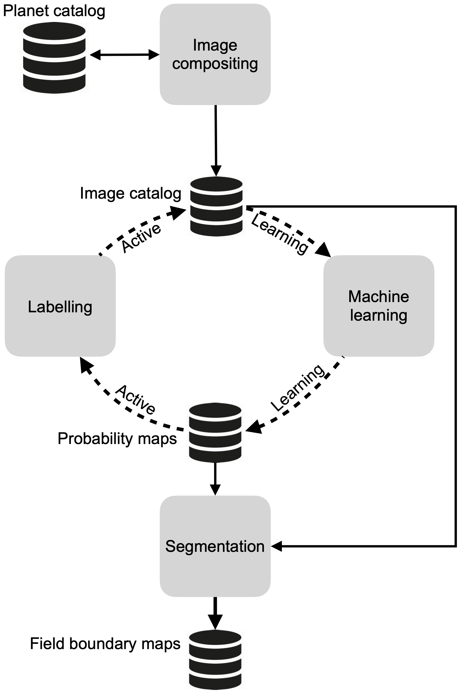

```{r setup, include=FALSE, cache=FALSE, message = FALSE}
library(knitr)
library(citr)
library(dplyr)
library(activemapper)
library(kableExtra)

fmt <- function(x) format(x, big.mark = ",")
#opts_knit$set(root.dir=normalizePath('../'))

### Chunk options: see http://yihui.name/knitr/options/ ###

## Text results
opts_chunk$set(echo = TRUE, warning = TRUE, message = TRUE, include = TRUE)

## Code decoration
opts_chunk$set(tidy = TRUE, comment = NA, highlight = TRUE)

## Cache
opts_chunk$set(cache = 2, cache.path = "output/cache/")

## Plots
opts_chunk$set(fig.path = "output/figures/")


```

```{r knitcitations, echo=FALSE, cache = FALSE}
library(knitcitations)
cleanbib()   
cite_options(citation_format = "pandoc")
```

<!-- \singlespace -->

<!-- \vspace{2mm}\hrule -->

<!-- \vspace{-20pt} -->

<!-- <!-- # Abstract -->

<!-- \vspace{3mm}\hrule -->

<!-- *Keywords*: rmarkdown, reproducible science -->

<!-- \singlespace -->

\bleft

# Introduction

Amidst all the challenges posed by global change, a particular concern is how agricultural systems will adapt to meet humanity's growing food demands, and the impacts that transforming and expanding food systems will have on societies, economies, and the environment [@searchingerCreatingSustainableFood2019]. A number of efforts are underway to address various aspects of this challenge, including work on diagnosing and closing yield gaps [e.g. @LickerMindgaphow2010; @lobellCropYieldGaps2009; @muellerClosingYieldGaps2012], expanding and commercializing production [@morrisAwakeningAfricaSleeping2009], and to understand [@davisTropicalForestLoss2020; @kehoeNatureRiskFuture2017; @RulliFoodappropriationlarge2014] and mitigate [@EstesReconcilingagriculturecarbon2016] agriculture's ecological impacts. The success of these efforts depends heavily on data that accurately describes the location and characteristics of croplands [@FritzMappingglobalcropland2015], and, given the rapid pace of agricultural change [@bullockThreeDecadesLand2021; @GibbsTropicalforestswere2010; @ZengHighlandcroplandexpansion2018], how these are changing from one year to the next. Unfortunately, for many regions, existing cropland datasets are inaccurate, and are usually created as once-off or infrequently update products. As such, estimates of global cropland area tend to vary widely, often disagree about where croplands are located [e.g. @FritzHighlightingcontinueduncertainty2011; @Fritzneedimprovedmaps2013], and become rapidly outdated. Errors in these maps can propagate in subsequent analyses that use cropland data as inputs, resulting in potentially misleading answers [@Esteslargeareaspatiallycontinuous2018]. Beyond distributions, few data are available on key cropland characteristics such as field size, an important variable needed to estimate yield and other key food security variables [@CarlettoGuesstimatesGPStimatesLand2015], and as an indicator of farm size [@SambergSubnationaldistributionaverage2016; @levinFarmSizeLandscape2006], a critical component of rural livelihoods given increasing population densities and longstanding debates about the relationship between farm size and productivity [@CarlettoFactartifactimpact2013; @desiereLandProductivityPlot2018; @federRelationFarmSize1985].

The deficit of information is due to the fact that in many regions the only source of cropland data are remotely sensed land cover maps, which are prone to error. This is particularly true in Africa [@Esteslargeareaspatiallycontinuous2018; @FritzComparisonglobalregional2010], where agricultural changes will be largest and the need for accurate baseline data is thus greatest [@EstesReconcilingagriculturecarbon2016; @SearchingerHighcarbonbiodiversity2015; @bullockThreeDecadesLand2021], and where the characteristics of croplands exacerbate the error inherent in remote sensing analyses. Half of all fields in Africa's smallholder-dominated agricultural systems are smaller than 1 ha [@lesivEstimatingGlobalDistribution2019]. This size is small relative to the 30-250 m resolution of the sensors typically used in many landcover mapping efforts [e.g. @ChenGloballandcover2015; @sulla-menasheHierarchicalMappingAnnual2019], which results in errors due to mixed pixels and aspects of the modifiable area unit problem [@Openshawmillioncorrelationcoefficients1979; @boschettiAnalysisConflictOmission2004], wherein the pixel's shape does not match that of crop fields, and is too coarse to aggregate into an approximation of that shape [@Darkmodifiablearealunit2007; @Esteslargeareaspatiallycontinuous2018]. On top of the matter of scale is the high variability within and between fields, their tendency to intergrade with surrounding vegetation [@Debatsgeneralizedcomputervision2016; @Estesplatformcrowdsourcingcreation2016], and the high temporal variability within croplands. These last three aspects pose challenges for the classification algorithms that are applied to the imagery.

Recent technological advances are helping to overcome these challenges. Chief among these are the growing numbers of satellites that collect high (\<5 m) to near-high (10 m) resolution imagery at sub-weekly intervals [@DruschSentinel2ESAOptical2012; @McCabefutureEarthobservation2017]. The spatial resolution of these imagery addresses the scale mismatch between sensor and field, and their high frequency captures the seasonal dynamics of cropland, which helps classifiers distinguish cropland from surrounding cover types [@Debatsgeneralizedcomputervision2016; @Defournyrealtimeagriculturemonitoring2019]. On top of this, the opening of satellite image archives [@WulderglobalLandsatarchive2016] and advances in cloud computing are placing large volumes of moderate to near-high resolution imagery together with the computational and algorithmic resources necessary to classify them at scale [@GorelickGoogleEarthEngine2017]. These capabilities have already been used to create a new generation of higher resolution (10-30 m) cropland and landcover maps for Africa and other regions [@ESAESACCILAND; @LesivEvaluationESACCI2017; @XiongNominal30mCropland2017; [@zhangGLCFCS30Global2021a]]. However, the potential of the highest resolution (\<5 m) imagery to map cropland over very large extents (e.g. country scales) has yet to be realized, presumably because these data are commercial and relatively expensive, and require significant computational resource to process. 

Beyond the imagery and computational gains, machine learning algorithms are rapidly advancing, providing large gains in classification performance [@maDeepLearningRemote2019; @MaxwellImplementationmachinelearningclassification2018]. However, the ability to take advantage of these gains is often limited by newer models' need for large training datasets, which are typically unavailable, hard to collect, or contain numerous errors [@ElmesAccountingtrainingdata2020; @maDeepLearningRemote2019; @burkeUsingSatelliteImagery2021]. To build sufficient training samples, as well as the reference data needed to objectively assess their performance (we refer collectively to both types as "labels", distinguishing between each as needed), map-makers rely heavily on visual interpretation of high resolution satellite or aerial imagery [e.g. @XiongNominal30mCropland2017; @ChenGloballandcover2015; @StehmanKeyissuesrigorous2019], as it is impractical and expensive to collect these data in the field over large areas, particularly on an ongoing basis. As such, a number of web-based platforms have been developed to collect such labels [e.g. @BeyCollectEarthLand2016; @Estesplatformcrowdsourcingcreation2016; @FritzGeoWikionlineplatform2012]. Image-drawn labels present two particular problems. The first is that they inevitably contain errors of interpretation, which can vary substantially according to the skill of the labeller, particularly over complex croplands with small field sizes [@Estesplatformcrowdsourcingcreation2016; @WaldnerConflationexpertcrowd2019]. The second problem is that visual interpretation depends on high resolution imagery (\<5 m), as fields are increasingly difficult to discern as image resolution decreases. Typically the only available source of high resolution imagery is "virtual globe" basemaps (e.g. Bing or Google Maps), which present mosaics of high resolution satellite and aerial images collected over a span of several years [@LesivCharacterizingspatialtemporal2018]. This within-mosaic temporal variation can create a temporal mismatch between the labels and the imagery being classified, which is usually from a different source (e.g. Landsat, Sentinel; @XiongNominal30mCropland2017). If a land change occurs in the interval between the two image sets (e.g. a new field was created), the label, even if accurately drawn, introduces error into the classifier. This source of error may be elevated in croplands where swidden agriculture is practiced [@vanvlietThereContinuingRationale2013], or in rapidly developing agricultural frontiers [@ZengHighlandcroplandexpansion2018].
Despite the high potential for it, label error is often not considered during model training and map accuracy assessment, resulting not only in the potential for maps to be misused or misinterpreted, but in missed opportunities to improve model performance [@ElmesAccountingtrainingdata2020; @Esteslargeareaspatiallycontinuous2018; @StehmanKeyissuesrigorous2019]. 

Taking into consideration the advances and remaining limitations described above, the ability to map smallholder-dominated croplands can be further improved by 1) more fully exploiting the profusion of high frequency, high resolution imagery provided by CubeSats [@McCabefutureEarthobservation2017], and 2) by implementing methods that improve the ability to collect and minimize errors in image-interpreted labels. We developed a mapping approach that focuses on these two sources of improvement. Our approach uses PlanetScope imagery collected by Planet's fleet of Dove satellite, which provides 3-4 m resolution imagery over large areas at near daily intervals [@McCabefutureEarthobservation2017; @planetteamPlanetApplicationProgram2018], at relatively low to no cost for academic research\footnote{www.planet.com/markets/education-and-research/} and non-commercial, sustainability-oriented applications\footnote{assets.planet.com/docs/Planet\_ParticipantLicenseAgreement\_NICFI.pdf}. Although these data are of lower spectral depth and, in some cases, quality, than Landsat, Sentinel, or Worldview imagery, their daily revisit enables country- to continent-scale image mosaics to be created for multiple periods during a single agricultural year, even over the cloudiest forest regions where it is hard to successfully construct cloud-free composites from optical imagery with return intervals (even by a few days). This ability to capture intra-annual variability can be more important for classifying cropland than spectral depth [@Debatsgeneralizedcomputervision2016]. Beyond the frequency, PlanetScope's 3.7 m resolution--although substantially coarser than the 0.5-1 m imagery available in most areas covered by virtual globes--is sufficiently resolved for humans to discern small fields under many conditions [e.g. see @Esteslargeareaspatiallycontinuous2018; @FourieBetterCropEstimates2009]. This allows labels to be made using the same imagery that is classified, which helps to minimize label error. To further reduce label noise, we developed a platform that includes rigorous label accuracy assessment protocols and a novel approach for creating consensus labels, which helps reduce mistakes made by individual labellers [@Estesplatformcrowdsourcingcreation2016; @ElmesAccountingtrainingdata2020]. We couple the labelling platform with a machine learning model inside an active learning [@cohnImprovingGeneralizationActive1994; @tuiaSurveyActiveLearning2011] framework, in which the model is trained interactively, using the model's prediction uncertainty over unlabelled areas to select new sites for additional labelling [@cohnImprovingGeneralizationActive1994; @tuiaSurveyActiveLearning2011]. This approach helps boost the performance of the classifier while reducing the overall number of labels required to achieve a given level of performance [e.g. @hamrouniLocalGlobalTransfer2021; @DebatsIntegratingactivelearning2017]. An unsupervised segmentation step is then applied to convert pixel-wise cropland predictions into vectorized maps of individual field boundaries.

Here we use this approach to create a high resolution, country-scale map of crop field boundaries in Ghana, a country where smallholder farming predominates across a broad mix of climate and agricultural systems, ranging from primarily grain and vegetable crop production in the northern savannas to tree crop-dominated systems in the forested southwest, including large areas where shifting agriculture is practiced [@KansangaTraditionalagriculturetransition2019; @SambergSubnationaldistributionaverage2016]. The map represents a single agricultural year (2018-2019), as opposed to a multi-year epoch, thereby demonstrating a capacity for annual, high resolution maps that can be used to monitor rapidly evolving small-scale agricultural systems, including key characteristics such as field size. In addition to providing valuable new data and insight into Ghana's agriculture, our study demonstrates one of the most spatially extensive agricultural applications of CubeSats to date, provides a new technique for converting daily imagery into seasonal composites, and shows how best practices for model training and label collection can be applied to improve map accuracy [@ElmesAccountingtrainingdata2020].   


# Materials and Methods
The mapping approach we developed is comprised of four open source components (Figure \ref{fig:systemoverview}) that are designed to run in a cloud computing environment. The first component collects daily PlanetScope imagery and converts them into cloud-free seasonal composites. The second is a custom-built platform that provides tools for labelling the composites, along with procedures to assess and minimize label error. This platform interacts with the third component, a machine learning process, within an active learning [@cohnImprovingGeneralizationActive1994; @tuiaSurveyActiveLearning2011] loop, to produce a map of predicted cropland probabilities for each image pixel. The fourth and final component is an algorithm that segments the image composites, then filters the resulting polygons using the pixel-wise cropland predictions produced by the active learning classifier, resulting in a final set of vectorized field boundaries. 

<!-- Each system component is available on an open repository (see data and software availability section for details). -->

```{r systemoverview, echo = FALSE, out.width="50%", fig.cap="An overview of the primary mapping components, the data stores that hold the inputs and outputs from each component, and the direction of connections between them. The dashed line indicates iterative interactions, while solid lines indicate one-time or irregular connections.", fig.align='center'}

```

We describe each component in further detail in the following section, and how we applied them to map Ghana's annual cropland boundaries, excluding tree crops.     

## Image compositing
```{r, echo=FALSE, message=FALSE, warning=FALSE}
data("image_quality")
data("tile_key")
tile_quality <- image_quality$img %>% filter(kml_type == "F") %>% 
  group_by(name, season, worker_id) %>% 
  summarize(tile = min(tile), Score = sum(score) / 12) %>% ungroup() 
tilen <- tile_quality %>% distinct(tile) %>% count() %>% pull(n)
```
The image processing component was designed for PlanetScope Analytic surface reflectance imagery [@planetteamPlanetApplicationProgram2018], which provides three visual (red, green, blue) and near-infrared bands at 3.7 m resolution at nominal daily frequency. The images are provided as ortho-rectified and converted to surface reflectance, although there are residual errors from inter-sensor differences and the radiometric normalization process [@HouborgDailyRetrievalNDVI2018], variation in the orientation of scene footprints, as well as a high frequency of cloud cover over the study region [@WilsonRemotelySensedHighResolution2016; @royGlobalAnalysisTemporal2021] that are not fully captured by the provided cloud masks. To minimize the effect of these residual errors, we developed a procedure for creating temporal composites of the primary growing and non-growing seasons within a single 12-month period. For Ghana, we defined the primary growing season as May through September, followed by the off (or dry) season from November or December through February.
We chose these two seasons because prior work shows that the contrast between them improves cropland classifications [@Debatsgeneralizedcomputervision2016], Furthermore, capturing the seasons in this sequence during the same year helps minimize differences caused by land change. The wide time intervals we used to define each season were necessary for collecting a sufficient number of images to make high quality composites, as Ghana's cloud cover renders many scenes unusable and therefore unavailable in Planet's catalog, thus the effective return interval can be substantially longer than 24 hours during the cloudiest months [@royGlobalAnalysisTemporal2021]. 

We collected all available scenes intersecting Ghana and falling within these two seasons during the 2018 agricultural year (defined here as March, 2018-February, 2019) via the Planet API [@planetteamPlanetApplicationProgram2018], and transferred these to cloud storage (Amazon Web Services [AWS] S3). We then converted each scene into analysis ready data [@DwyerAnalysisReadyData2018] by cropping each to the boundaries of a 0.05$^\circ$ grid that it intersected (see Figure S1 in Supplemental Information [SI]), which provided the dimensions for making composited image tiles. We chose this cell size for tiling because it is slightly narrower than the short axis of a PlanetScope scene, which increases the number of intersecting scenes that completely cover the tile, thereby helping to minimize edge artifacts in the composites.

To create a seasonal composite, we calculated two weights for the time series of each pixel within the ARD stack for a given season:

<!-- values. The first is based on a simplified formula of the Haze Optimized Transformation (HOT) index [√; @ZhuObjectbasedcloudcloud2012]:  -->

```{=tex}
\begin{equation} \label{eq:cloud}
\mathrm{W1_t} = \frac{1}{\mathrm{blue_t}^2}
\end{equation}
```
<!-- Equation solution from here: https://stackoverflow.com/questions/4027363/two-statements-next-to-curly-brace-in-an-equation -->

```{=tex}
\begin{equation} \label{eq:shadow}  
\mathrm{W2_t} =\begin{cases}
    \frac{1}{\mathrm{NIR_t}^4}, & \text{if $\mathrm{NIR_t}$ < median\{$\mathrm{NIR_{t1}}$, $\mathrm{NIR_{t2}}$, ..., $\mathrm{NIR_{ti}}$\}}.\\
    1, & \text{otherwise}.
  \end{cases}
\end{equation}
```
Where *t* is a particular date in the pixel time series, which begins at date 1 for the given compositing period and ends on date *i*, *blue* is the blue band, and *NIR* the near infrared band. Equation \ref{eq:cloud} assigns lower weights to hazy and clouded pixels as the blue band is sensitive to these atmospheric features [@Zhangimagetransformcharacterize2002], while Equation \ref{eq:shadow} assigns low weights to pixels in cloud shadow [@ZhuObjectbasedcloudcloud2012; @qiuCirrusCloudsThat2020]

After assigning these two weights, we calculated the final composited pixel value:

```{=tex}
\begin{equation}
\mathrm{\bar{B} = \frac{\sum_{t=1}^{T}B_t * W1_t * W2_t}{\sum_{t=1}^{T}W1_t * W2_t}}
\end{equation}
```
Which is the weighted mean for each pixel for each band *B* for the given season. 

Each composited seasonal tile was saved as a cloud-optimized geotiff, and a "slippy map\footnote{https://wiki.openstreetmap.org/wiki/Slippy\_Map}" rendering was created for each composite using Raster Foundry [@azaveaRasterFoundry2020], for display within the labelling platform (next section).

We generated a catalog of `r as.integer(nrow(tile_key) * 2)` composite tiles (hereafter simply "tiles") for Ghana, consisting of a seasonal pair for each of the `r nrow(tile_key)` 0.05$^\circ$ tile grid cells covering Ghana. To assess the quality of the resulting composites, `r tilen` tile grid cells were randomly selected, and two separate observers graded each corresponding seasonal composite using a four category that evaluated the degree of 1) residual cloud and 2) cloud shadow, 3) the number of visible scene boundary artifacts, and 4) the proportion of the image with resolution degraded below the 3.7 m PlanetScope resolution (e.g. because of between-date image mis-registrations). Each category was qualitatively ranked from 0-3, with 0 being the lowest quality, and 3 the highest (see SI for complete protocol), making the highest possible score 12. We rescaled scores to fall between 0 and 1.

## Mapping cropland probabilities with active learning 
The first step in creating a country-wide field boundary map of Ghana was to create a pixel-wise classification of cropland probabilities throughout the country. Given the high resolution of the imagery and the need to minimize the computational burden, we divided Ghana into 16 distinct mapping regions, or Areas of Interest (AOIs). We constructed the AOIs by grouping together tile grids into blocks representing the larger 1$^\circ$ cells used to assign tile identifiers (Figure S1A). We grouped tile cells from 1$^\circ$ degree cells that overlapped Ghana's boundaries together with those from the nearest 1$^\circ$ cell contained entirely within Ghana (with the exception of AOI 16, which was comprised of tile grids from the 1$^\circ$ cells along Ghana's southern coast. The average extent of the resulting AOIs was 15,457 km$^2$ (range 12,160-23,535 km$^2$). 

We used the active learning process to develop a separate cropland classification model for each of these AOIs, based on an approach described by Debats et al (2017). We initiated the process by training a starter model using labels from a set of randomly selected training sites drawn from a 0.005$^\circ$ grid that was nested within the tiling grid. This finer grid, which we refer to as the "primary grid" for simplicity, provided the target area for creating labels (section 2.2.1), as well as the unit for distributing computing jobs (section 2.2.2). We then assessed the performance of the starter model against a separate set of validation labels developed for each AOI, applied the model to predict cropland probabilities for pixels in unlabelled primary grid cells in each AOI, and calculated an uncertainty criterion [@DebatsIntegratingactivelearning2017]:

```{=tex}
\begin{equation}
\mathrm{Q_I = \sum_{I(x, y) \epsilon I} (p(x, y) - 0.5)^2}
\end{equation}
```
```{r, echo = FALSE, eval = FALSE}
uncertainty <- function(x) sum((x - 0.5)^2)
a <- runif(10, min = 0.4, max = 0.6)
b <- c(runif(5, min = 0, max = 0.2), runif(5, min = 0.8, max = 1))

# sum(a - 0.5)^2
# 1 - sum(a - 0.5)^2
# 1 - sum(b - 0.5)^2
# ass <- (a - 0.5)^2
# bss <- (b - 0.5)^2
# 1 - sum(ass)
# 1 - sum(bss)
# (1 - sum(b - 0.5)^2)
uncertainty(a)
uncertainty(b)
```

Where Q is the uncertainty for each unlabelled primary grid cell I, calculated from the predicted probability *p* of a randomly selected subset of pixels (x, y) drawn from it. Pixels with predicted probabilities closer to 0.5 are least certain as to their classification, thus the lowest values of $Q$ represent primary grid cells posing the most difficulty for the classifier. 

We ranked the unlabelled primary grid cells from least to most certain, randomly selected a subset of cells from the top 30% of the ranking (to minimize the risk of spatial autocorrelation), and sent these back to the labelling platform. After these new sites were labelled, they were added to the starter pool of labels, the model was retrained with the larger training set, its performance and prediction uncertainty was reassessed, and a new sample of the most uncertain primary grid cells was again sent for labelling. This loop repeated until model performance gains saturated or reached a pre-defined threshold, after which a final map of cropland probabilities was made for the AOI.

In the next two sections, we describe the labelling and machine learning components of the active learning process in more detail. 

### Labelling
To collect the initial randomized samples for model training, we grouped the AOIs (Figure S1A) into three clusters based on approximate agro-ecological similarity: the 6 northernmost savanna-zone AOIs (Cluster 1), a central to southeastern cluster (Cluster 2) consisting of the 3 middle (AOIs 7-9) and 2 southeastern AOIs (12 and 15), and a southwestern cluster (Cluster 3) made up of the forest zone AOIs (10, 11, 13, 14, 16). Within each cluster, we randomly selected and labelled 500 primary grid cells, which provided relatively large initial training samples for these agro-ecologically similar regions, while helping to minimize the overall amount of labelling effort. To create validation samples, we randomly selected and labelled 100 primary grid cells per AOI, and a further 100 cells were labelled in each AOI during each active learning iteration.  

In addition to training and validation labels, we also collected training reference labels and map reference labels [@ElmesAccountingtrainingdata2020]. The former were a set of 98 primary grid cells selected to represent the range of cropland types and densities in Ghana, which were labelled by expert analysts (the lead researchers on this project). We used these to assess the performance of the individual labellers collecting training and validation labels. Map reference labels were collected and used to assess the accuracy of the final map (see Section 2.4).       

We collected all labels using a custom-built platform that we adapted from an earlier prototype we developed for crowdsourced labelling [@Estesplatformcrowdsourcingcreation2016]. We enhanced this platform by making several major additions, including an independent backend that allowed us to recruit and manage our own labelling teams, improved procedures for assessing and improving label accuracy, and processes for automating the machine learning component. The platform runs on a cloud-hosted Linux virtual server (AWS EC2) and is comprised of a database (PostGIS/Postgres), a mapping interface (OpenLayers 3), an image server (Raster Foundry), and a set of utilities for managing, assessing, and converting digitized field boundaries into rasterized labels. 

We created a separate labelling instance for each AOI. To create training and validation labels, labellers (the co-authors of this paper) logged into the website (built with Flask) for a particular AOI and navigated to the mapping interface (Figure \ref{fig:labeller}), where they were presented with a white target box representing a primary grid cell to label, a set of digitizing tools, and several different sources of imagery. These included true and false color renderings of the growing season and dry season PlanetScope composites, and several virtual globe basemaps. They then used the polygon drawing tool to digitize the boundaries of all crop fields visible within the PlanetScope overlays that intersect the target grid cell. For this project, labellers were instructed to digitize active or recently active crop fields, avoiding tree crops, and fallow or potentially abandoned fields (see SI for digitizing rules) To aid with interpretation, labellers toggled between the PlanetScope renderings and the basemaps to help form a judgement about what constitutes a field. The labeller assigned each digitized polygon a class category (e.g. annual cropland), saved all completed fields to the database, and were then presented with the next target to label. If the target grid cell did not contain any fields, labellers simply pressed save to go to the next cell.  

```{r labeller, echo = FALSE, out.width="95%", fig.cap="An overview of the labelling platform's interface", fig.align='center'}

```

The flow of labelling targets presented to each worker was determined by the platform's built-in scheduler. Each primary grid cell selected for labeling was placed into a queue within the platform's database, and converted into a labelling *task* with a specified number of *assignments* (the boundaries drawn by an individual labeller) that had to be completed in order to finish the task. There were two types of tasks, accuracy assessment or model training/validation, with the assignments for each indistinguishable to labellers. Upon completing an accuracy assessment assignment, the platform invoked a scoring algorithm that compared the labeller's digitized boundaries against a set of training reference polygons, resulting in a label quality score:

```{=tex}
\begin{equation} \label{eq:qaqc}
\mathrm{score_i}=\beta_0\mathrm{I}+\beta_1\mathrm{O}+\beta_2\mathrm{F}+\beta_3\mathrm{E}+\beta_4\mathrm{C}
\end{equation}
```
Where *i* indicates the particular assignment, and $\beta_{0-4}$ represent varying weights that sum to 1. *I* refers to "inside the box" accuracy, *O* is the accuracy of those portions of the labeller's polygons extending beyond the target grid boundaries, *F* is fragmentation accuracy, a measure of how many individual polygons the labeller delineated relative to the reference, *E* measures how closely each polygon's boundary matched its corresponding reference polygon boundary, and *C* assesses the accuracy of the labeller's thematic labels (see SI for individual formulae). Equation \ref{eq:qaqc} is an extension of the approach described by Estes et al. (2016).

We configured the platform's scheduler to present workers with accuracy assessment assignments at a rate of 1 for every 5 assignments mapped. This generated a history of accuracy assessment scores that we used to assess label quality and minimize label error. 

For training and validation, where there was no reference data to assess label accuracy, we set each task to have four assignments, i.e. each was completed by four separate labellers. When all four assignments were complete, a Bayesian merging routine was invoked to combine the four sets of labels into a single consensus label:

```{=tex}
\begin{equation}
P(\theta|\mathrm{D})=\sum_{i=1}^{n}\mathrm{P}(\mathrm{W_i}|\mathrm{D})\mathrm{P}(\mathrm{\theta}|\mathrm{D}, \mathrm{W_i})
\end{equation}
```
Where $\theta$ represents the true cover type of a pixel (field or not field), *D* is the label assigned to that pixel by a labeller, and $W_i$ is an individual labeller. P($\theta$\|D) is the probability that the actual cover type is what the labellers who mapped it says it is, while P(W$_i$\|D) is the average score (ranging between 0 and 1) of the accuracy assessment assignments an individual labeller completed within the AOI, and P(W$\theta$\|D, *W*$_i$) is the labeller's label for that pixel. This approach therefore used the average assignment quality score for to weight each labeller's label for a given pixel (see SI for further details). Each pixel in the target grid cell was merged using this approach (n = 40000), which helps to minimize individual labellers' errors. We estimated a confidence measure for each consensus label by  calculating its Bayesian Risk (see SI), which ranges between 0 and 1, with 0 indicating full agreement between labellers for all pixels, and 1 indicating complete disagreement.

### Cropland classification model
Upon completing each batch of labels, the platform automatically launched a machine learning cluster (Elastic Map Reduce\footnote{https://docs.aws.amazon.com/emr/latest/APIReference/emr-api.pdf}) comprised of several hundred to a thousand CPUs, depending on the size of the AOI.

The first step in the process was to derive a set of features from the image composites. Previous work showed that a large number of simple features summarizing image reflectance and vegetation indices within local neighborhoods were highly effective for classifying smallholder croplands [@Debatsgeneralizedcomputervision2016]. We followed that logic in this study, but used a smaller feature set because the storage and memory required for our mapping geographies were several orders of magnitude larger. For each seasonal composite, we calculated the mean and standard deviation of each band within an 11X11 and 5X5 moving window, respectively (initial tests revealed these two window sizes to be most effective). This provided an overall set of 24 features, including the unmodified bands of both composites (Table 1).

\begin{center}Table 1. List of image features.\end{center}

| Feature            | Window Size | N Features |
|:-------------------|:------------|:-----------|
| RGB-NIR            | 1X1         | 8          |
| Mean               | 11X11       | 8          |
| Standard deviation | 5X5         | 8          |

We used a combination of `GeoTrellis`\footnote{https://github.com/locationtech/geotrellis}, `rasterio`\footnote{https://rasterio.readthedocs.io/en/latest/}, and `RasterFrames`\footnote{https://rasterframes.io/} to derive the features on the fly (which was enabled by converting the composites to Cloud-optimized Geotiffs\footnote{https://www.cogeo.org/}) and convert them into Apache Spark DataFrames.
The extracted features were combined with their corresponding training and validation labels and passed to the machine learning classifier, a `SparkMLlib` implementation of Random Forests [@BreimanRandomForests2001]. We trained the model with a balanced sample and a tree depth of 15 and total tree number of 60, which initial testing showed to provide a reasonable balance between computational time and performance. 

### Model performance
To assess performance of the Random Forests classifier, we used the validation sample to calculate binary accuracy, the F1 score (the geometric mean of precision and recall), and the area under the curve of the Receiver Operating Characteristic [@Pontiustotaloperatingcharacteristic2014], as well as the false positive rate. We calculated these measures each time the model was retrained for a given AOI, in order to assess the change in classifier performance with each active learning iteration. 

To evaluate whether active learning improved model performance relative to randomized label selection, we ran an additional test within three AOIs (1, 8, and 15), in which we retrained the model with 100 randomly selected labels for each iteration. We then compared the differences in accuracy, AUC, and F1 between the actively and randomly trained models  [@DebatsIntegratingactivelearning2017].

To quantify the potential impact of label error on classification results, we conducted two further analyses. We evaluated the performance differences between models trained with three different sets of labels: 1) those from the lowest scoring labeller to map each training site, 2) those from the highest scoring labeller, and 3) the consensus labels.  We also calculated the correlations between the mean Bayesian Risk of labels in each AOI and the corresponding model performance metrics (Table S3). 

## Segmentation
Upon completion of the active learning process, we deployed a five-step algorithm to create a segmented map of field boundaries. In the first step, we identified edge features within the imagery. To do this, we applied the meanshift algorithm [@YizongChengMeanshiftmode1995a] to each dry-season composite tile, and then passed a Sobel filter over the mean-shifted green, red, and near-infrared bands, and the corresponding map of predicted cropland probabilities. We then summed the four resulting edge images to produce a combined edge image. 

In the second step, we used a compact watershed algorithm [@neubertCompactWatershedPreemptive2014] to segment the edge image, specifying a high number of segments (6,400) segments per tile, so that the mean segment size (<0.5 ha) was finer than the expected mean field size (>1 ha).  

In the third step, we hierarchically merged the resulting polygons. We first constructed a region adjacency graph for each tile, with each node representing all image pixels within each polygon. The edge between two adjacent regions (polygons) was calculated as the difference between the means of the normalized colors of all bands. We then merged the most similar pairs of adjacent nodes until there were no edges remaining below the predetermined threshold of 0.05.

In the fourth step, we overlaid the merged polygons with the cropland probability images, and polygons in which the mean probability was greater than 0.5 were retained as crop fields.

In the fifth and final step, we refined the crop field polygons, by removing holes and smoothing boundaries using the Visvalingam algorithm [@visvalingamLineGeneralisationRepeated1993]. We then merged neighboring polygons that overlapped along tile boundaries. 

The resulting map represents dry season crop field boundaries, as we did not segment growing season images. We made this choice because labels were primarily drawn on dry season composites, when boundaries were typically more visible.  

```{r, echo=FALSE}
load(system.file("extdata/", "instance_tbls.rda", package = "activemapper"))
kml_types <- instance_tbls$kml_data %>% filter(aoi == "labeller8v2") %>% 
  group_by(kml_type) %>% count() %>% filter(kml_type == "Q") %>% pull(n)
```

## Map assessment
```{r, echo=FALSE, message=FALSE, warning=FALSE}
# reference labels, for total count and uncertainty of class categories
ref_labels <- st_read(
  system.file("extdata/map_reference_labels.geojson", 
              package = "activemapper"), quiet = TRUE
)
class_ct <- as_tibble(ref_labels) %>% group_by(category) %>% count()
ref_ct <- as_tibble(ref_labels) %>% group_by(worker_id) %>% count() %>% pull(n)

crp_ct <- class_ct %>% filter(category %in% c("annualcropland", "unsure1"))
noncrp_ct <- class_ct %>% filter(category %in% c("noncropland", "unsure2"))

# observer agreement/correlation
ref_labels_joint <- st_read(
  system.file("extdata/map_reference_labels_joint.geojson", 
              package = "activemapper"), quiet = TRUE
)
joint_classes <- ref_labels_joint %>% as_tibble() %>% 
  select(name, category, worker_id) %>% 
  arrange(name) %>% 
  mutate(class = case_when(
    category == "annualcropland" | category == "unsure1" ~ 1, 
    category == "noncropland" | category == "unsure2" ~ 0 
  ))
class_mat <- joint_classes %>% dplyr::select(name, class, worker_id) %>% 
  tidyr::pivot_wider(names_from = worker_id, values_from = class) %>% 
  dplyr::select(-name) %>% as.matrix()

usertab <- table("User1" = class_mat[, 1], "User2" = class_mat[, 2])

agreement <- round(sum(diag(usertab)) / sum(usertab) * 100, 1)
observer_r <- cor.test(class_mat[, 1], class_mat[, 2], method = "spearman")

```

We followed recommended guidelines [@StehmanKeyissuesrigorous2019] to conduct an independent assessment of the categorical accuracy of the final maps, using a set of `r sum(ref_ct)` (`r sum(crp_ct$n)` cropland; `r sum(noncrp_ct$n)` non-cropland) point-based, map reference labels, which were placed across Ghana using a stratified random sample design, and collected through the labelling platform by two expert supervisors (see SI for full details on sample design and collection). For efficiency, the supervisors labelled separate portions of the sample, but overlapped on a small subset (n = `r sum(usertab)`). We calculated the label agreement (`r agreement`%) on this subset to estimate uncertainty in the map reference sample [@StehmanKeyissuesrigorous2019]. In addition to this, the sample was labelled with four classes: cropland; non-cropland; unsure but likely cropland; unsure but likely non-cropland. The last two classes, which constituted `r round(sum(crp_ct$n[2], noncrp_ct$n[2]) / sum(ref_ct) * 100, 1)`% of the sample, provided a further measure of uncertainty in the map reference sample 

We used the sample to calculate the overall accuracy for each map, the class-wise User's and Producer's accuracy, and the 95% confidence intervals for each accuracy measure [@OlofssonGoodpracticesestimating2014; @OlofssonMakingbetteruse2013; @StehmanKeyissuesrigorous2019]. We calculated these measures across the entire country, as well as several different zones, to evaluate regional difference in accuracy. We defined two sets of zonations (Figure S4), each containing four zones, the first created by grouping 1) the three northern AOIs (1-3), 2) the six central AOIs (4-9), 3) the four southwestern AOIs (10, 11, 13, 14, 16), and 4) the two southeastern zones (13, 15). This grouping differs from the three clusters used to collect initial model training samples, as we designed these to divide the country more finely, and to isolate the less forested southeastern third of Ghana from the more forest northwest. The second zonation was developed by grouping the country's eight agro-ecological zones into four broader clusters (Figure S4B). We applied this zonation only to the per-pixel classification, to better understand patterns of error in the model. 

To assess how effectively the segmentations captured field characteristics, we compared the size class distributions of the segmented field boundaries against the field boundaries digitized by the labellers' over the 100 validation sites in each AOI. We chose this approach because of existing uncertainties in polygon-based accuracy assessment methods [@yeReviewAccuracyAssessment2018], and because the map's ability to represent field sizes was of greatest interest. To undertake this comparison, we selected the polygons from the most accurate labeller to digitize the 100 validation grids in each AOI, and calculated the average area and number of polygons in each cell. We then calculated the same statistics from the segmented boundaries that intersected each validation grid, and compared the two sets of statistics. 

We used the final maps to evaluate the characteristics of Ghana's croplands. We calculated the estimated area of cropland in Ghana, as well as the average size and total number of fields in the different AOIs. We used the map reference sample to calculate adjusted area estimates and confidence intervals for each map class, and used the differences between labellers' polygons and segmented boundaries at validation sites to calculate bias-adjusted estimates of mean field sizes and the total number of fields.

# Results

```{r, echo=FALSE, message=FALSE, warning=FALSE}
tiles <- sf::read_sf(system.file("extdata/ghana_tiles.geojson", 
                                 package = "activemapper"))
km2 <- round(as.numeric(units::set_units(sum(sf::st_area(tiles)), "km2")))
km2 <- fmt(km2)
```

Our results produced two separate maps of Ghana's annual croplands, over a total area of `r km2` km$^2$ that included portions of the neighboring countries overlapped by image tiles. 

## Image quality

```{r, echo=FALSE, message=FALSE, warning=FALSE}
data("image_quality")
tqual_mu <- image_quality$tile %>%
  group_by(season, tile) %>% 
  summarize(score = mean(Score)) %>% 
  ungroup()
tqual_sum <- tqual_mu %>% 
  group_by(season) %>% 
  summarize(mu = mean(score), sd = sd(score))
tqmu <- tqual_sum %>% pull(mu) %>% round(2)
names(tqmu) <- tqual_sum %>% pull(season)

tqual_ct <- tqual_mu %>% group_by(season) %>% 
  mutate(gt85 = ifelse(score > 0.85, 1, 0)) %>% 
  summarize(n = n(), n85 = sum(gt85)) %>% 
  mutate(prop = n85 / n)
tqct <- tqual_ct %>% pull(prop) * 100
names(tqct) <- tqual_ct %>% pull(season)

nt <- fmt(nrow(tiles))
```
The assessment of image composites found that their quality in both seasons was highest in the northern half of the country and lowest in the southwest, (Figure \ref{fig:imqual}A), where the substantially greater cloud cover resulted in a much lower density of available PlanetScope imagery for each time period (Figure S5). The average quality score of growing season composites was `r tqmu["Growing"]`, with `r tqct["Growing"]` percent having scores $\geq$ 0.85 (out of 1; Figure \ref{fig:imqual}B), while the mean score of dry season composites was `r tqmu["Dry"]` (`r tqct["Dry"]` percent $\geq$ 0.85). 

<!-- Overall, the available image density and quality of composites were closely related (see SI for full details).   -->

```{r imqual, echo = FALSE, out.width="70%", fig.cap="The location and quality scores of 100 randomly selected tiles for the growing (A) and off-growing season (B), and the corresponding distributions of the quality scores for each season, respectively (C and D).", fig.align='center'}
knitr::include_graphics('figures/figure3.png')
```

## Cropland probabilities
```{r, echo=FALSE, message=FALSE, warning=FALSE}
initial <- train_val_sites$initial %>% as_tibble %>% group_by(Cluster) %>%
  count()
active <- train_val_sites$active %>% as_tibble %>% filter(usage == "train") %>% 
  group_by(aoi) %>% count()
typicaln <- raster::modal(initial$n) + raster::modal(active$n)
aoi10n <- (initial %>% filter(Cluster %in% 3) %>% pull(n)) + 
  (active %>% filter(aoi == "labeller10") %>% pull(n))
aoi14n <- (initial %>% filter(Cluster %in% 3) %>% pull(n)) + 
  (active %>% filter(aoi == "labeller14") %>% pull(n))
aoi15n <- (initial %>% filter(Cluster %in% 2) %>% pull(n)) + 
  (active %>% filter(aoi == "labeller15") %>% pull(n))
aoi3init <- initial %>% filter(!Cluster %in% 1:3) %>% pull(n)
aoi3n <- aoi3init + (active %>% filter(aoi == "labeller3") %>% pull(n))

initial_total <- train_val_sites$initial %>% as_tibble() %>% distinct(name) %>% 
  count() %>% pull()
active_total <- sum(active$n)
validate_total <- train_val_sites$active %>% as_tibble() %>% 
  filter(usage == "validate") %>% distinct(name) %>% count()

ttrain <- fmt(initial_total + active_total)
tval <- fmt(validate_total$n)
```

To make the initial maps of cropland probabilities, the active learning process ran for 3 iterations in 12 of 16 AOIs, varying from as little as 1 to as many as 4 iterations across the other 4 AOIs, with the number of iterations varying according to the performance of the starter models (i.e. AOIs with higher starting performance stopped after fewer iterations, see SI). Each AOI's model was trained by 300-500 randomly selected labels (Figure S6A), plus an additional `r aoi10n` - `r aoi15n` (typically `r typicaln`) within each the AOI that were selected by active learning. Actively selected labels showed distinctive patterns in several AOIs (Figure S6B), such as concentrating along ecotones or the boundaries of agro-ecological zones. A total of `r ttrain` training and `r tval` validation labels were collected by 20 labellers to develop and assess model performance (Figure S7).

### Performance gains during active learning

```{r, echo=FALSE, warning=FALSE, message=FALSE}
data("iteration_metrics")
delta_func <- function(x, rnd = 4) round((x - lag(x)) / lag(x), rnd)

V1 <- c("Accuracy", "AUC", "F1")

# Difference iteration 0 to 3
imet_mu03 <- iteration_metrics %>% 
  filter(AOI == "All") %>%
  filter(Iteration %in% c(0, 3)) %>%
  filter(!grepl("_change", Metric)) %>% 
  group_by(Metric) %>% 
  mutate(dscore = delta_func(Score)) %>% 
  ungroup() %>% 
  mutate(dscore = round(dscore * 100, 1))

imet_mu0 <- imet_mu03 %>% filter(Iteration == 0) %>% 
  mutate(Score = round(Score, 3))
imet_mu3 <- imet_mu03 %>% filter(Iteration == 3) %>% 
  mutate(Score = round(Score, 3))

# differences per iteration
imet_dmu <- iteration_metrics %>% 
  filter(AOI == "All" & Iteration > 0) %>%
  filter(grepl("_change", Metric)) %>% 
  mutate(Metric = gsub("_change", "", Metric)) %>% 
  mutate(Score = round(Score * 100, 1)) %>% 
  filter(Metric %in% V1)

imet_dmu1 <- imet_dmu %>% filter(Iteration == 1) %>% 
  mutate(dscore = round(Score, 3))
imet_dmu2 <- imet_dmu %>% filter(Iteration == 2) %>% 
  mutate(dscore = round(Score, 3))
imet_dmu3 <- imet_dmu %>% filter(Iteration == 3) %>% 
  mutate(dscore = round(Score, 3))

# AOI score ranges
imin <- iteration_metrics %>% 
  filter(AOI %in% paste0("labeller", 1:16)) %>% group_by(AOI) %>%
  filter(Iteration == max(Iteration) & !grepl("change", Metric)) %>%
  filter(Metric %in% V1) %>% 
  ungroup() %>% 
  group_by(Metric) %>% 
  filter(Score == min(Score)) %>% 
  mutate(AOI = gsub("labeller", "", AOI), Score = round(Score, 3))

imax <- iteration_metrics %>% 
  filter(AOI %in% paste0("labeller", 1:16)) %>% group_by(AOI) %>%
  filter(Iteration == max(Iteration) & !grepl("change", Metric)) %>%
  filter(Metric %in% V1) %>% 
  ungroup() %>% 
  group_by(Metric) %>% 
  filter(Score == max(Score)) %>% 
  mutate(AOI = gsub("labeller", "", AOI), Score = round(Score, 3))

# summarize and condense for easier in line extraction
# iteration 0 and 0-3 metrics
imu0 <- lapply(V1, function(x) {
  imu <- round(imet_mu0 %>% filter(Metric == x) %>% pull(Score), 3)
  idf <- round(imet_mu0 %>% filter(Metric == x) %>% pull(dscore), 3)
  ix <- list("score" = imu, "diff" = idf)
  ix
})
names(imu0) <- V1

imu3 <- lapply(V1, function(x) {
  imu <- round(imet_mu3 %>% filter(Metric == x) %>% pull(Score), 3)
  idf <- round(imet_mu3 %>% filter(Metric == x) %>% pull(dscore), 3)
  ix <- list("score" = imu, "diff" = idf)
  ix
})
names(imu3) <- V1

# iteration-wise diffs
idmu <- lapply(list(imet_dmu1, imet_dmu2, imet_dmu3), function(x) {
  l <- lapply(V1, function(y) {
    imu <- round(x %>% filter(Metric == y) %>% pull(Score), 3)
    idf <- round(x %>% filter(Metric == y) %>% pull(dscore), 3)
    ix <- list("score" = imu, "diff" = idf)
    ix
  })
  names(l) <- V1
  l
})
names(idmu) <- paste0("I", 1:3)
```

The performance of the Random Forest classifier typically improved with each active learning iteration. The average accuracy, AUC, and F1 at iteration 0 were `r imu0$Accuracy$score`, `r imu0$AUC$score`, and `r imu0$F1$score`, respectively, increasing to `r imu3$Accuracy$score`, `r imu3$AUC$score`, and `r imu3$F1$score` by iteration 3 (Figure \ref{fig:alperformance}). These differences represent respective gains of `r imu3$Accuracy$diff`, `r imu3$AUC$diff`, and `r imu3$F1$diff` percent for the three metrics. The largest gains for each metric occurred on iteration 1, averaging `r idmu$I1$Accuracy$score`, `r idmu$I1$AUC$score`, and `r idmu$I1$F1$score` percent for accuracy, AUC, and F1, while the lowest gains were realized on iteration 3, with accuracy, F1, and AUC respectively increasing by just `r idmu$I3$Accuracy$score`%, `r idmu$I3$F1$score`%, and `r idmu$I2$AUC$score`%. The scores achieved on the final iteration varied substantially across AOIs and metrics. Accuracy ranged between `r imin[imin$Metric == "Accuracy", ]$Score` (AOI `r imin[imin$Metric == "Accuracy", ]$AOI`) and `r imax[imax$Metric == "Accuracy", ]$Score` (AOI `r imax[imax$Metric == "Accuracy", ]$AOI`), while AUC varied from `r imin[imin$Metric == "AUC", ]$Score` (AOI `r imin[imin$Metric == "AUC", ]$AOI`) and `r imax[imax$Metric == "AUC", ]$Score` (AOI `r imax[imax$Metric == "AUC", ]$AOI`), and F1 from `r imin[imin$Metric == "F1", ]$Score` (AOI `r imin[imin$Metric == "F1", ]$AOI`) and `r imax[imax$Metric == "F1", ]$Score` (AOI `r imax[imax$Metric == "F1", ]$AOI`).

```{r alperformance, echo = FALSE, out.width="100%", fig.cap="Scores for overall accuracy, area under the curve of the Receiver Operating Characteristic, and the F1 scores for the Random Forests model results after each iteration of the active learning loop for each AOI (gray lines), as well as the mean score per iteration across all AOIs (black lines).", fig.align='center', message=FALSE}
knitr::include_graphics('figures/figure4.png')
```


```{r, echo=FALSE, message=FALSE, warning=FALSE}
# random versus active data
data("iteration_metrics")

# process data: remove labeller from AOI and select AOIs 1-16
V1 <- c("Accuracy", "AUC", "F1")
aois <- c(paste0("labeller", c(1, 8, 15, "1r", "8r", "15r")))
imetrics <- iteration_metrics %>% 
  filter(Metric %in% V1 & AOI %in% aois) %>% 
  mutate(AOI = gsub("labeller", "", AOI)) %>% 
  mutate(type = case_when(
    AOI %in% c(1, 8, 15) ~ "active", 
    AOI %in% c("1r", "8r", "15r") ~ "random"
  )) %>% 
  mutate(AOI = gsub("r", "", AOI)) %>% 
  tidyr::pivot_wider(names_from = "type", values_from = "Score") %>% 
  mutate(delta = (active - random) / random * 100) 
imetrics_all <- imetrics %>% 
  filter(Iteration < 4) %>% 
  group_by(Iteration, Metric) %>% 
  summarize(active = mean(active), random = mean(random), 
            delta = mean(delta)) %>%
  ungroup() %>% mutate(AOI = "All") %>% 
  select(AOI, Iteration, Metric, active, random, delta)

ixl <- lapply(1:3, function(x) {
  ix <- imetrics_all %>% filter(Iteration == x) %>% pull(delta)
  ix <- round(ix, 1)
  names(ix) <- V1
  ix
})
names(ixl) <- as.roman(1:3)

i1acc <- imetrics %>% 
  filter(Iteration == 1 & Metric == "Accuracy") %>% 
  pull(delta) %>% round(2)
names(i1acc) <- imetrics %>% distinct(AOI) %>% pull()

u <- function(x) unname(x)
```

The experiment conducted in three AOIs (in AOIs 1, 8, and 15) showed that training models with active learning improved performance compared to randomized approaches to label selection. After three iterations, the accuracy, AUC, and F1 scores for the actively trained models were respectively `r u(ixl$III["Accuracy"])`, `r u(ixl$III["AUC"])`, and `r u(ixl$III["F1"])` percent higher than those for randomly trained models (Figure S8). However, there was more variability in earlier iterations, with average score differences of `r u(ixl$I["Accuracy"])` (accuracy), `r u(ixl$I["AUC"])` (AUC), and `r u(ixl$I["F1"])` percent (F1) after iteration 1, and `r u(ixl$II["Accuracy"])` (accuracy), `r u(ixl$II["AUC"])` (AUC), and `r u(ixl$II["F1"])` (F1) percent after iteration 2 (see SI for more details). 

```{r, echo=FALSE, message=FALSE, warning=FALSE}
data("label_summary")  
# toofew <- label_summary$nlabels %>% filter(n < 10) %>% pull(ID)
# tsites <- label_summary$nlabels %>% filter(!ID %in% toofew) %>% 
#   group_by(kml_type) %>% 
#   summarize(tot = sum(n), mu = round(mean(n)), med = round(median(n)), 
#             stdev = round(sd(n)), lower = min(n), upper = max(n))
# 
# # training rate
# train_rate <- label_summary$nlabels %>% 
#   tidyr::pivot_wider(names_from = kml_type, values_from = n) %>% 
#   rename_all(funs(c("ID", "tr", "tref"))) %>% 
#   mutate(trate = tref / tr) %>% filter(tr > 10)
# 
# tsitesc <- tsites %>% mutate(across(where(is.numeric), fmt))
# # nvecs <- tsites$tot[1])
# # muvecs <- fmt(tsites$mu[1])

data("label_risk")
murisk <- label_risk$stats %>% #group_by(usage) %>% 
  summarize(Risk = round(mean(Risk), 3)) #%>% 
  # tidyr::pivot_wider(names_from = usage, values_from = Risk)

# label clusters
cl1 <- label_risk$stats %>% filter(aoi %in% 1:6) %>% #group_by(usage) %>% 
  summarize(Risk = round(mean(Risk), 3))
cl2 <- label_risk$stats %>% filter(aoi %in% c(7:9, 12, 15)) %>% 
  # group_by(usage) %>% 
  summarize(Risk = round(mean(Risk), 3))
cl3 <- label_risk$stats %>% filter(aoi %in% c(10:11, 13:14, 16)) %>% 
  # group_by(usage) %>% 
  summarize(Risk = round(mean(Risk), 3))
```

### The impact of label error and uncertainty on model performance
We used the two measures of label quality calculated by the platform, the average quality score of each labeller and Bayesian Risk (or simply "label risk"), to assess the potential impacts of label error on model performance. The average of each labeller's AOI-specific accuracy score was `r round(mean(label_summary$score_stats$Mean), 2)` (range `r round(min(label_summary$score_stats$Mean), 2)` to `r round(max(label_summary$score_stats$Mean), 2)`; see Figures S4 and S5 for details on label scores and number of assignments per labeller). The average Bayesian Risk was `r murisk$Risk`, with highest label risk (`r cl1$Risk`) in the northern AOIs (AOIs 1-6; Figures S6-7), lowest (`r cl1$Risk`) in the southwestern AOIs (AOIs 10, 11, 13, 14, 16), and intermediate (`r cl2$Risk`) in the central-southeastern AOIs (AOIs 7-9, 12, 15). 

```{r, echo=FALSE, message=FALSE, warning=FALSE}
data("consensus_high_low")
V1 <- c("Accuracy", "AUC", "F1")
delta_func <- function(x, y, rnd = 1) round((x - y) / y * 100, rnd)

# calculate mean across AOIs and join. Convert to factor and reorder for
# plotting
consensus_high_low_mu <- consensus_high_low %>% 
  group_by(Strategy, Metric) %>% 
  summarize(Score = mean(Score)) %>% 
  ungroup()

metdiffs <- lapply(V1, function(x) {  # x <- "F1"
  cn <- consensus_high_low_mu %>% 
    filter(Strategy == "Consensus" & Metric == x) %>% pull(Score)
  h <- consensus_high_low_mu %>% filter(Strategy == "High" & Metric == x) %>% 
    pull(Score)
  l <- consensus_high_low_mu %>% filter(Strategy == "Low" & Metric == x) %>% 
    pull(Score)
  cnh <- delta_func(cn, h)
  cnl <- delta_func(cn, l)
  hl <- delta_func(h, l)
  list(cons = round(cn, 3), high = round(h, 3), low = round(l, 3), 
       chdelt = cnh, cldelt = cnl, hldelt = hl) 
})
names(metdiffs) <- V1
```

Treating each labeller's average label quality scores (Figure S9) as a proxy for error, we used these scores to develop training sets to test the impact of label error on model performance. The results of these tests, which were conducted in AOIs 1, 2, 8, and 15, showed that the average accuracy, AUC, and F1 scores for models trained with the consensus labels were respectively `r metdiffs$Accuracy$cons`, `r metdiffs$AUC$cons`, and `r metdiffs$F1$cons` (Figure \ref{fig:trainingimpact}). Performance metrics from consensus-trained models were just `r metdiffs$AUC$chdelt` - `r metdiffs$Accuracy$chdelt` percent higher than those models trained with the most accurate individuals' labels (accuracy = `r metdiffs$Accuracy$high`; AUC = `r metdiffs$AUC$high`; F1 = `r metdiffs$F1$high`), but were `r metdiffs$AUC$cldelt` - `r metdiffs$Accuracy$cldelt` higher than models trained with the least accurate individual labels (accuracy = `r metdiffs$Accuracy$low`; AUC = `r metdiffs$AUC$low`; F1 = `r metdiffs$F1$low`).

```{r trainingimpact, echo = FALSE, out.width="100%", fig.cap="Scores for overall accuracy, area under the curve of the Receiver Operating Characteristic, and the F1 score resulting from models trained with consensus labels, and labels made by the most and least accurate labellers to map each site. Comparisons were made for AOIs 1, 2, 8, and 15, denoted by grey symbols, while the mean scores across these AOIs are shown for each metric.", fig.align='center', message=FALSE}
knitr::include_graphics('figures/figure5.png')
```

```{r, echo=FALSE, message=FALSE, warning=FALSE}
data("label_risk_metrics")

cor_fun <- function(df) {
  cor.test(df$Risk, df$Score, method = "spearman") %>% broom::tidy()
}

lr_mets <- unique(label_risk_metrics$Metric)
risk_corr <- lapply(lr_mets[lr_mets != "TSS"], function(x) {
  dat <- label_risk_metrics %>% filter(Metric == x)
  cor_fun(dat) %>% mutate(Metric = x)
}) %>% do.call(rbind, .) %>% 
  select(estimate, Metric) %>% 
  rename(r = estimate)
nms <- risk_corr$Metric
risk_corr <- round(t(risk_corr[, 1]), 3)
colnames(risk_corr) <- nms
```

Correlations (Table S3) between the mean label risk per AOI (Figures S10-11) and model performance metrics showed strong (Spearman's Rank Correlation = `r risk_corr[, "Accuracy"]`) to moderate (r = `r risk_corr[, "AUC"]`) negative correlations between label risk and accuracy and AUC, respectively, while F1 had a weaker but moderate positive association (r = `r risk_corr[, "F1"]`). The positive sign of the latter relationship is counter-intuitive, but is explained by risk's association with precision, one of two inputs to F1, which was moderately positive (r = `r risk_corr[, "Precision"]`), whereas risk had a negligible correlation with recall (r = `r risk_corr[, "Recall"]`), F1's other component. The correlation between risk and the false positive rate (r = `r risk_corr[, "FPR"]`), another important performance metric, shows that labelling uncertainty may increase model commission error.

## Map accuracy
### Categorical accuracy
We used the map reference sample to evaluate the accuracy of the cropland probability map (after classifying it using a threshold probability of 0.5) and the map of segmented field boundary maps. We found that the overall accuracy of the pixel-wise classifications was 88% against this map reference sample (Table \ref{tab:mapaccuracy}). Confining the map reference sample to four distinct zones (Figure S4A) shows that overall accuracy ranged from 83.3% in Zone 1 (AOIs 1-3) to 93.6% in Zone 3 (AOIs 10, 11, 13, 15, and 16). The Producer's accuracy of the cropland class was 61.7% across Ghana, ranging from 45.6% in Zone 3 to 67.9% in Zone 1, while the User's accuracy was 67.3% overall, ranging from 59.8% in Zone 4 to 71.2% in Zone 1. Both measures of accuracy were substantially higher for the non-cropland class across all zones, typically exceeding 90%. The lowest accuracies for the non-cropland class was in Zone 1 (Producer's = 89.3%; User's = 87.7%).

The overall accuracies obtained from the segmented maps were generally 1-2 percentage points lower than those of the per-pixel maps, while User's accuracies tended to be 8-10 percentage points less (Table \ref{tab:mapaccuracy}). In contrast, Producer's accuracies were 15-20 points higher than in the per-pixel map. The segmentation step therefore helped to reduce omission error while substantially increasing commission error.

<!-- and an accuracy surface interpolated from the average cell-wise accuracies calculated between the predicted map and validation labels.  -->

<!-- ```{r, echo = FALSE, out.width="80%", fig.cap="The overall, user's, and producer's accuracies (indicated by fill color) for each of the 16 mapping zones (zones numbers are shown on maps) [This a hypothetical placeholder figure].", fig.align='center'} -->

<!-- knitr::include_graphics('figures/si_mapping_blocks.png') -->

<!-- ``` -->

```{=tex}
\begin{table}
\caption{Map accuracies and adjusted area estimates for the ~3 m pixel-wise classifications (based on Random Forests predictions; top 5 rows) and the segmented map (bottom 5 rows). Results are provided for 4 zones (Zone 1 = AOIs 1-3; Zone 2 = AOIs 4-9; Zone 3 = AOIs 10, 11, 13, 14, 16; Zone 4 = AOIs 12, 15) plus the entire country. The error matrix (with reference values in columns) provides the areal percentage for each cell, and the Producer's (P), User's (U), and overall (O) map accuracies and their margins of error (in parenthesis) are provided, as well as the sample-adjusted area estimates (in km$^{2}$) and margins of error. }
\includegraphics[width = 18cm]{figures/table2.png}
\label{tab:mapaccuracy}
\end{table}
```
### Segmentation quality

```{r, echo=FALSE}
# validation statistics
data("segment_quality_stats")

datnms <- c("top_label_data", "field_validation_stats")#,
            # "tile_aoi_validation_stats")
for(i in datnms) {
  load(system.file(glue::glue("extdata/{i}.rda"), package = "activemapper"))
}

# extract distributions
human <- top_label_data$stats %>%
  mutate(mu_prop = NA, type = "Validation") %>%
  select(-contains("id"))
machine <- field_validation_stats %>%
  mutate(type = "Segmentation")

# calculate SDs
humac_sds <- bind_rows(
  human %>% summarize(value = sd(Mean)) %>% 
    mutate(type = "v", stat = "sd_ha_mu"), 
  human %>% summarize(value = sd(Median)) %>% 
    mutate(type = "v", stat = "sd_ha_med"), 
  human %>% summarize(value = sd(n)) %>% 
    mutate(type = "v", stat = "sd_n_mu"), 
  machine %>% summarize(value = sd(Mean)) %>% 
    mutate(type = "s", stat = "sd_ha_mu"), 
  machine %>% summarize(value = sd(Median)) %>% 
    mutate(type = "s", stat = "sd_ha_med"), 
  machine %>% summarize(value = sd(n)) %>% 
    mutate(type = "s", stat = "sd_n_mu") 
)

# extract distributions

# human <- top_label_data$stats %>%
#   mutate(mu_prop = NA, type = "val") %>%
#   select(-contains("id"))
# machine <- field_validation_stats %>%
#   mutate(type = "seg")
# humachine <- bind_rows(human, machine) %>% 
#   mutate(aoi = as.numeric(gsub("labeller", "", aoi))) %>% 
#   arrange(aoi)

# huma_aois <- humachine %>% group_by(aoi, type) %>% 
#   summarize(med = median(Mean), mu = mean(Mean)) %>% 
#   ungroup()
# lrgst <- huma_aois %>% select(-med) %>% filter(aoi %in% c(2, 3, 7, 15)) %>% 
#   tidyr::pivot_wider(names_from = type, values_from = "mu") %>% 
#   filter(seg %in% range(seg))
seg_stats_grid <- segment_quality_stats %>% filter(scale == "grid")
lrgst <- seg_stats_grid %>% 
  filter(aoi %in% c(2, 3, 7, 15)) %>% 
  tidyr::pivot_wider(names_from = type, values_from = value) %>%
  filter(Stat == "Mean" & measure == "area")

lrgst_seg <- lrgst %>% summarize(rng = range(Segmentation))
lrgst_val <- lrgst %>% summarize(rng = range(Validation))

# # overall stats
# huma_sum <- humachine %>% group_by(type) %>% 
#   summarize(med = median(Mean), sd = sd(Mean), min = min(Mean), 
#             max = max(Mean), mu = mean(Mean)) %>% 
#   select(type, mu, med, sd, min, max)

segha <- seg_stats_grid %>% 
  filter(aoi == "All" & measure == "area") %>% 
  filter(type == "Segmentation" & Stat == "Mean") %>% pull(value) %>% round(2)
# segha <- huma_sum %>% filter(type == "seg") %>% pull(mu) %>% round(2)
valha <- seg_stats_grid %>% 
  filter(aoi == "All" & measure == "area") %>% 
  filter(type == "Validation" & Stat == "Mean") %>% pull(value) %>% round(2)
# valha <- huma_sum %>% filter(type == "val") %>% pull(mu) %>% round(2)

# seghamed <- huma_sum %>% filter(type == "seg") %>% pull(med) %>% round(2)
# valhamed <- huma_sum %>% filter(type == "val") %>% pull(med) %>% round(2)
seghamed <- seg_stats_grid %>% 
  filter(aoi == "All" & measure == "area") %>% 
  filter(type == "Segmentation" & Stat == "Median") %>% pull(value) %>% round(2)
# segha <- huma_sum %>% filter(type == "seg") %>% pull(mu) %>% round(2)
valhamed <- seg_stats_grid %>% 
  filter(aoi == "All" & measure == "area") %>% 
  filter(type == "Validation" & Stat == "Median") %>% pull(value) %>% round(2)


# seghasd <- huma_sum %>% filter(type == "seg") %>% pull(sd) %>% round(2)
seghasd <- humac_sds %>% filter(type == "s" & stat == "sd_ha_mu") %>% 
  pull(value) %>% round(2)
# valhasd <- huma_sum %>% filter(type == "val") %>% pull(sd) %>% round(2)
valhasd <- humac_sds %>% filter(type == "v" & stat == "sd_ha_mu") %>% 
  pull(value) %>% round(2)

segnsd <- humac_sds %>% filter(type == "s" & stat == "sd_n_mu") %>% 
  pull(value) %>% round(2)
valnsd <- humac_sds %>% filter(type == "v" & stat == "sd_n_mu") %>% 
  pull(value) %>% round(2)

# huma_sumn <- humachine %>% group_by(type) %>% 
#   summarize(med = median(n), sd = sd(n), min = min(n), max = max(n), 
#             mu = mean(n)) %>% 
#   select(type, mu, med, sd, min, max)
# segn <- huma_sumn %>% filter(type == "seg") %>% pull(mu) %>% round(2)
# valn <- huma_sumn %>% filter(type == "val") %>% pull(mu) %>% round(2)
# segnmed <- huma_sumn %>% filter(type == "seg") %>% pull(med) %>% round(2)
# valnmed <- huma_sumn %>% filter(type == "val") %>% pull(med) %>% round(2)
# segnsd <- huma_sumn %>% filter(type == "seg") %>% pull(sd) %>% round(2)
# valnsd <- huma_sumn %>% filter(type == "val") %>% pull(sd) %>% round(2)

segn <- seg_stats_grid %>% 
  filter(aoi == "All" & measure == "n") %>% 
  filter(type == "Segmentation" & Stat == "Mean") %>% pull(value) %>% round(2)
valn <- seg_stats_grid %>% 
  filter(aoi == "All" & measure == "n") %>% 
  filter(type == "Validation" & Stat == "Mean") %>% pull(value) %>% round(2)

segnmed <- seg_stats_grid %>% 
  filter(aoi == "All" & measure == "n") %>% 
  filter(type == "Segmentation" & Stat == "Median") %>% pull(value) %>% round(2)
valnmed <- seg_stats_grid %>% 
  filter(aoi == "All" & measure == "n") %>% 
  filter(type == "Validation" & Stat == "Median") %>% pull(value) %>% round(2)


```

The comparisons of digitized versus segmented field boundaries showed that the mean field size across all validation sites averaged `r round(segha, 2)` ha (Median = `r round(seghamed, 2)`; StDev = `r round(seghasd, 2)`), which was `r round((segha - valha) / valha * 100) / 100` times larger than the `r round(valha, 2)` ha (Median = `r round(valhamed, 2)`; StDev = `r round(valhasd, 2)`) mean area of labeller-digitized polygons. This discrepancy was primarily caused by results in four AOIs (2, 3, 7, and 15; Figure S13), where segments averaged between `r round(lrgst_seg$rng[1], 2)` and `r round(lrgst_seg$rng[2], 2)` ha, compared to `r round(lrgst_val$rng[1], 2)` - `r round(lrgst_val$rng[2], 2)` ha for the corresponding hand-digitized polygons. The number of segmented fields per validation site averaged `r segn` (median = `r segnmed`; StDev = `r segnsd`) compared to `r valn` (median = `r valnmed`; StDev = `r valnsd`) for digitized polygons (Figure S14).


## Ghana's croplands
Two separate maps of cropland were produced for each AOI, a per-pixel map derived from the cropland probabilities, and the vectorized map of field boundaries (Figure \ref{fig:mainmap}). The former provides the more accurate picture of cropland distributions in Ghana, which are most concentrated in the Southeastern corner (AOI 15), the central-western region (AOI 7, the northeastern and northwestern corners of AOIs 10 and 11, and the south of AOI 8), and the northeastern quadrant stretching from AOI 9 through AOIs 5 and 6 and up to AOIs 2 and 3. The northern third of AOI 1 also has noticeable densities of cropland. Several prominent areas of low cropland density indicate the presence of large protected areas, such as Mole National Park in the southeastern corner of AOI 1 and Digya National Park in the northwestern corner of AOI 12. The relative absence of cropland in AOIs 13, 14, and 16 does not reflect the scarcity of agriculture in these areas, but rather the predominance of tree crops, which we did not map.

```{r mainmap, echo = FALSE, out.width="90%", fig.cap="The distribution of croplands in Ghana. The main map shows the percentage of croplands in each 0.005 degree grid cell, derived from the predicted cropland probabilities. The insets  on the margins illustrate predicted probabilities (top map in each couplet) at original image resolution (0.000025 degrees) and segmented field boundaries overlaid on the dry season PlanetScope composite, for four separate tiles. Each tile's position is shown on the main map, and is color-coded to the boundary lines around its corresponding inset.", fig.align='center', message=FALSE}
knitr::include_graphics('figures/figure6.png')
```

```{r, echo=FALSE}
data("accuracy_reports")

# Adjusted areas
rfa <- accuracy_reports$ghana$rf[, "Area"]
rfa <- rfa[nchar(rfa) > 0]
rfas <- as.numeric(gsub("\\(.*", "", rfa[nchar(rfa) > 0]))
rfma <- as.numeric(stringr::str_match(rfa[1], "\\(\\s*(.*?)\\s*\\)")[, 2])
cipct <- function(x, moe) {
  apct <- x[2] / sum(x)
  moepct <- moe / sum(x)
  round(c(apct, apct - moepct, apct + moepct) * 100, 1)
}
sega <- accuracy_reports$ghana$seg[, "Area"]
sega <- sega[nchar(sega) > 0]
segas <- as.numeric(gsub("\\(.*", "", sega[nchar(sega) > 0]))
segma <- as.numeric(stringr::str_match(sega[1], "\\(\\s*(.*?)\\s*\\)")[, 2])

rfcipct <- cipct(rfas, rfma)
segcipct <- cipct(segas, segma)

```

Using the map reference sample and each map, we made two separate estimates of the total cropland area in Ghana in 2018. The cropland extent estimated from the field boundary map was `r fmt(segas[2])` km$^2$ (with a margin of error of `r fmt(segma[1])` km$^2$), or `r segcipct[1]` (`r paste(segcipct[2:3], collapse = "-")`%) of the mapped area. The estimate from the per pixel map was `r fmt(rfas[2])` km$^2$% (margin of error = `r fmt(rfma[1])` km$^2$), or `r rfcipct[1]` (`r paste(rfcipct[2:3], collapse = "-")`%) of area.

The field boundary map provides additional information on how the characteristics of croplands vary across Ghana, ranging from narrow, strip-like fields in parts of AOI 15 (Figure \ref{fig:mainmap}'s lower right inset) to more densely packed, less distinctly shaped fields in AOI 5 (upper right inset in Figure \ref{fig:mainmap}). To explore how field characteristics varied geographically, we mapped the average size and total number of fields within each 0.05 degree tile grid (Figure S15). These patterns generally correspond to those seen in the cropland density map (Figure \ref{fig:mainmap}), with larger sizes and field counts occurring where field densities are higher, although the biases (relative to the validation labels) in both measures (Figures S13-14) complicate interpretations of those variations. To minimize this complication, we used the calculated biases to develop adjusted estimates of field size and count (Table \ref{tab:sizentab}). These adjusted estimates show that the typical field size in Ghana is 1.73 ha, ranging from 0.96 in AOI 4 to 2.82 ha in AOI 4, with fields in the forest zone AOIs (10, 11, 13, 14, 16) generally smaller than those in the northern half of the country (Table \ref{tab:sizentab}). The estimated total number of fields is 1,662,281, or 205 fields per tile grid cells, varying from 108 fields/tile cell in AOI 4 to 399 in AOI 6.

```{r sizentab, echo=FALSE, warning=FALSE, message=FALSE}
fsizes_n_05 <- st_read(
  system.file("extdata/field_size_n_05.geojson", package = "activemapper"),
  quiet = TRUE
) %>% mutate(
  muarea = ifelse(is.na(muarea), 0, muarea),
  nflds = ifelse(is.na(nflds), 0, nflds),
  aoi = as.character(aoi)
)

# calculate bias factors for adjustment
data("segment_quality_stats")
# segment_quality_stats %>% filter(measure == "n")
biases <- segment_quality_stats %>%
  filter(Stat == "Mean" & scale == "grid") %>% 
  pivot_wider(names_from = type, values_from = value) %>% 
  mutate(biasfactor = Validation / Segmentation)
biases <- tile_key %>% group_by(aoi) %>% 
  count() %>% ungroup() %>% rename(ntiles = n) %>% 
  mutate(aoi = as.character(aoi)) %>% 
  left_join(biases, .) %>% 
  select(-scale, -Stat)

fsizes_05_adj <- biases %>% filter(measure == "area" & aoi != "All") %>% 
  select(aoi, biasfactor) %>% 
  rename(fbias = biasfactor) %>% 
  left_join(as_tibble(fsizes_n_05), .) %>% 
  mutate(muarea_adj = muarea * fbias) %>% select(-geometry) %>% 
  group_by(aoi) %>% 
  summarize(fsize = mean(muarea), fsizeadj = mean(muarea_adj))

# then field count
n_05_adj <- biases %>% filter(measure == "n" & aoi != "All") %>% 
  select(aoi, biasfactor, ntiles) %>% 
  rename(nbias = biasfactor) %>% 
  left_join(as_tibble(fsizes_n_05), .) %>% 
  mutate(nfldsadj = nflds * nbias) %>%
  group_by(aoi) %>% 
  summarize(N = sum(nflds), Nadj = sum(nfldsadj))

aoi_sizes_n <- left_join(fsizes_05_adj, n_05_adj) %>% 
  left_join(., biases %>% filter(measure == "area") %>% select(aoi, ntiles))

ghana_sizes_n <- aoi_sizes_n %>% 
  summarize(fsize = weighted.mean(fsize, ntiles), 
            fsizeadj = weighted.mean(fsizeadj, ntiles), 
            N = sum(N), Nadj = sum(Nadj), 
            ntiles = round(sum(ntiles)))

size_n_tab <- bind_rows(aoi_sizes_n, ghana_sizes_n) %>% 
  mutate(aoi = as.numeric(ifelse(is.na(aoi), 17, aoi))) %>% 
  arrange(aoi) %>% mutate(aoi = as.character(aoi)) %>% 
  mutate(aoi = ifelse(aoi == "17", "Ghana", aoi), 
         N_tile = round(N / ntiles),
         Nadj_tile = round(Nadj / ntiles)) %>% 
  select(aoi, ntiles, fsize, fsizeadj, N, N_tile, Nadj, Nadj_tile) %>% 
  mutate(
    ntiles = scales::number(
      round(ntiles), accuracy = 1, big.mark = ",", trim = FALSE
    ), 
    fsize = round(fsize, 2), fsizeadj = round(fsizeadj, 2), 
    N = scales::number(N, big.mark = ",", trim = FALSE), 
    N_tile = scales::number(N_tile, big.mark = ",", accuracy = 1, trim = FALSE), 
    Nadj = scales::number(round(Nadj), big.mark = ",", trim = FALSE),
    Nadj_tile = scales::number(
      round(Nadj_tile), accuracy = 1, big.mark = ",", trim = FALSE
    )
  ) %>% 
  rename(AOI = aoi, `N tiles` = ntiles, Size = fsize, `Size (adj)` = fsizeadj, 
         `N / tile` = N_tile, `N (adj)` = Nadj, 
         `N (adj) / tile` = Nadj_tile)
# size_n_tab %>% select(`N (adj) / tile`)

cap <- glue::glue("The average size and total number of crop fields for each ", 
                  "AOI and for Ghana overall. The original and bias-adjusted", 
                  " values for each measure are provided, as well as the total", 
                  " number of 0.05$^\\circ$ degree tiles in each AOI.")
knitr::kable(size_n_tab, format = "latex", booktabs = "T", caption = cap, 
             align = rep("r", 8)) %>% 
  kableExtra::kable_styling(latex_options = c("hold_position")) %>%
  kableExtra::column_spec(1:3, width = "0.45in") %>%
  kableExtra::column_spec(4:8, width = "0.85in")
```

# Discussion

```{r, echo=FALSE}
# from lesiv et al (2019) SI field sizes for Ghana
lesiv_fsizes <- tibble(n = c(6, 7, 25, 71, 154), 
                       sz = c(100, mean(c(100, 16)), mean(c(2.56, 16)), 
                              mean(c(0.64, 2.56)), 0.32))
lesiv_est <- sum(with(lesiv_fsizes, (n / sum(n))  * sz))

aoi_nofor <- aoi_sizes_n %>% filter(aoi %in% c(1:9, 12, 15)) %>% 
  summarize(weighted.mean(fsize, ntiles)) %>% pull() %>% round(., 2)
aoi_nofor_adj <- aoi_sizes_n %>% filter(aoi %in% c(1:9, 12, 15)) %>% 
  summarize(weighted.mean(fsizeadj, ntiles)) %>% pull() %>% round(., 2)

```

These results demonstrate a capability to map the characteristics of smallholder-dominated cropping systems at high spatial resolution, annual time steps, and national scales. The resulting maps provide an updated and more granular view of the distribution and extent of croplands in Ghana, complementing existing national to regional land cover maps derived from moderate resolution imagery [@ESAESACCILAND; @hackmanNewLandcoverMaps2017; @XiongNominal30mCropland2017]. Those prior studies estimated that cropland covers `r round(4.62 / 23.86 * 100, 1)` [@XiongNominal30mCropland2017] to 32% [@hackmanNewLandcoverMaps2017] of Ghana in 2015. In contrast, our 2018 maps provide a raw estimate of 16.1-23.2% cover (Table \ref{tab:mapaccuracy}), and our map reference sample-based estimate was `r segcipct[1]`-`r rfcipct[1]`%. Our results thus suggest that Ghana's croplands are less extensive than those previous estimates. However, this difference may arise from our use of a cropland definition that excludes longer fallows and abandoned fields, which in some regions may comprise over half of total cropland area [@Tongforgottenlanduse2020].

In addition to this updated information on Ghana's cropland extent and distribution, our results provide new insights into field size and number at a national scale (Figures \ref{fig:mainmap}, S11-12). Previous efforts to map smallholder field boundaries have either used *in situ* data collection [@CarlettoFactartifactimpact2013; @CarlettoGuesstimatesGPStimatesLand2015] or remote sensing studies over relatively small [e.g. @forkuorIntegrationOpticalSynthetic2014; @perselloDelineationAgriculturalFields2019] or discontiguous [@Estesplatformcrowdsourcingcreation2016] areas. The most extensive studies to date enlisted crowdsourced volunteers to classify fields visible within high resolution imagery sampled from virtual globes into broad size categories [@lesivEstimatingGlobalDistribution2019; @FritzMappingglobalcropland2015]. Those efforts included country-specific results for Ghana (n = 263), which yield an average field size estimate of `r round(lesiv_est, 2)` ha\footnote{Obtained by calculating the weighted mean from the count of the five size classes and the mean of the hectare range provided for the four smallest size classes, and the lower bound of the size range provided for the largest size class. Data sourced from Table S3 in Lesiv et al. 2019.}. This estimate exceeds our Ghana-wide average segment size (3.92 ha; Table \ref{tab:sizentab}), but is closer to the mean (`r aoi_nofor` ha) within AOIs 1-9, 12, and 15, which is where most of the crowdsourced sample appears to have been collected. However, our bias-adjusted estimates of 1.73 (Ghana-wide) and `r aoi_nofor_adj` (AOIs 1-9, 12, and 15) ha were much smaller.

## Map accuracy and key sources of error
Although these maps provide valuable new information, they nevertheless contain substantial errors. The overall accuracies (86.7-88%, Table \ref{tab:mapaccuracy}) are near the boundary of what might be considered *achievable* map accuracy [@ElmesAccountingtrainingdata2020], given that we only have ~85% confidence in our map reference sample, which is our best estimate of the "truth". However, accuracies for the cropland class were much lower, falling between 62 (producer's) to 67 (user's) percent country-wide for the per-pixel map (Table \ref{tab:mapaccuracy}), meaning the model produced substantial commission and omission errors for this class. The segmented boundary maps had fewer omission errors (producer's accuracy = 79%), but higher false positives (user's accuracy = 58.2%). These accuracies are near the middle to upper ranges of those reported for the cropland class in other large-area mapping studies [@hackmanNewLandcoverMaps2017; @LesivEvaluationESACCI2017; @XiongNominal30mCropland2017].

The patterns of accuracies within the cropland class varied by zone. These zones largely align, albeit with some discrepancies, with the country's agro-ecological zones (AEZs), thus the accuracy patterns may be in part because some regions are simply more difficult to map. Producer's accuracy for both maps was highest in the two northern zones (1 and 2), which are primarily savannas (Figure S4), and lowest in zones 3 and 4, which are comprised of forest or coastal savannas. User's accuracy followed a similar pattern, with the exception of Zone 3, which had the highest user's accuracy, albeit from a very small sample. Aligning the reference samples more precisely with agroecozone boundaries (Figure S4B) provides further insight into error patterns within the per-pixel map's cropland class (Table S4). Coastal savannas in the southeast had the highest producer's and lowest user's accuracy, perhaps because this region has high density cropland inter-mixed with uncultivated areas that have low woody cover, which could help promote commission error. Maps in the northern savannas had the best balance between omission and commission error, and had the highest overall user's accuracy. The transitional zone between forest and savanna had a very low Producer's accuracy (21%), which likely reflects the fact that it was divided between several AOIs for mapping (Figure S4), and thus was under-represented in the training samples, particularly in AOIs 10 and 11 (Figure S6B).

Beyond the errors linked to regional differences, several other important factors contributed to map error. The first of these related to the large mapping extent and image resolution. Given the goal of developing a high resolution, country-scale map, the large data volume constrained us to use a relatively small feature set and less than the recommended tree number and depth [@MaxwellImplementationmachinelearningclassification2018] in our Random Forests models, in order to limit computational costs. Previous work found that Random Forests achieves much better performance on small-scale croplands when trained on a much larger number of features [@Debatsgeneralizedcomputervision2016;@lebourgeoisCombinedRandomForest2017]. However, applying such a large feature set within the extent of our AOIs was not possible, as the computing time and costs would have been several times larger\footnote{Each active learning iteration ran for $\sim$4-8 hours on 800 CPUs, followed by a final $\sim$10-14 hours for prediction}. This reduced the skill of the model, particularly when it came to differentiating cropland from bare or sparsely vegetated patches, which were common in many AOIs.

The inherent difficulty of the labelling task was another major limiting factor. Our platform was designed to minimize label errors, but determining croplands from non-croplands in these agricultural systems can be difficult. Labellers had to evaluate multiple image sources and to rely heavily on their judgment, which inevitably led to errors. Interpretation was particularly hard where croplands and surrounding landscapes had similar dry season reflectances, which was a particular problem in the northernmost savannas. Smaller field sizes also complicated labelling, as these become increasingly indistinct in the \~4 m PlanetScope composites. The difficulty of labelling is reflected in the magnitude of the Bayesian Risk metrics (Figures S10-11), and by the average assignment quality scores of each labeller (71%; Figure S9). Although prior work [@mellorExploringIssuesTraining2015; @rodriguez-galianoAssessmentEffectivenessRandom2012] found that Random Forests are robust to label error, we found that it has substantial impact (Figure \ref{fig:trainingimpact}), which suggests that improving label quality is one of the most important factors in increasing model accuracy. Newer models, such as convolutional neural networks, may be less sensitive to label error, provided the error is random and the map reference samples are of high quality [@burkeUsingSatelliteImagery2021]. However, over many smallholder systems training label errors will likely be biased in a particular direction (e.g. towards omission when fields are not easily distinguished from the background), and our results show that reference labels can have substantial uncertainty. 

Image quality was another issue, although primarily in the forested AOIs, where frequent cloud cover and the corresponding lower number of available images resulted in lower quality composites (Figure \ref{fig:imqual}), with more brightness artifacts and blur. This impacted labellers' abilities to discern fields, and doubtless affected model predictions. Little can be done to mitigate these errors, short of confining imagery to the less cloudy dry season, which could reduce model performance by removing the temporal contrast [@Debatsgeneralizedcomputervision2016; @Defournyrealtimeagriculturemonitoring2019], or by adding radar data to the predictor set, which would reduce map resolution. Composite quality could be improved by using imagery from the same seasons over multiple years, but this would undermine the goal of developing annual maps, while the dynamism of the croplands would blur field boundaries within the imagery.

The final major source of error arose from the segmentation process. The vectorized maps had high commission errors caused by uncertainties in the Random Forests predictions. Model uncertainty meant that many pixels in non-cropland areas had probabilities with values near 0.5. Segments in these areas were retained if the average probability of intersected pixels exceeded the 0.5 classification threshold. A more accurate classifier would reduce such errors, as would a locally varying classification threshold [e.g. @waldnerDeepLearningEdge2020]. Over-merging was another source of error in the segmentation algorithm, which led to overestimated field sizes and unrealistic shapes in some areas, particularly in high density croplands (e.g. in AOIs 2 and 8; Figure \ref{fig:mainmap}) where boundaries between adjacent fields were indistinct in the imagery. Preventing merging could help in such cases, but potentially lead to over-segmentation, thereby underestimating field sizes.

## Error mitigation features
Despite these numerous source of errors, our approach was effective in mitigating several of these error sources. Label quality assessment and consensus labelling were the most effective error mitigation tools. Label quality scores allowed us to quantify the impact of label error on model performance (Figure \ref{fig:trainingimpact}), while consensus labels produced maps that were more accurate than they would have been if we had relied on individually generated labels. The quality scores also helped to improve the overall accuracy of consensus labels, by placing higher weight on the work of more accurate labellers. In addition to these benefits, label quality scores (Figure S9) also allowed us to select the labels most likely to accurately capture field sizes and numbers, which we used to estimated and correct the biases in these two measures derived from the segmented field boundaries. 

```{r, message = FALSE, warning = FALSE, echo=FALSE}
prdelta <- iteration_metrics %>% 
  filter(Metric %in% c("FPR", "TPR")) %>% 
  group_by(Iteration, Metric) %>% 
  summarize(Score = mean(Score)) %>% 
  filter(Iteration %in% c(0, 3)) %>% 
  tidyr::pivot_wider(names_from = Iteration, values_from = Score) %>% 
  mutate(rate = round((`0` - `3`) / `0` * 100, 1))
```

Active learning improved overall model performance relative to randomized training site selection, in line with findings from two recent efforts [@DebatsIntegratingactivelearning2017; @hamrouniLocalGlobalTransfer2021]. Although the relative performance gains that we observed were smaller (e.g. @DebatsIntegratingactivelearning2017 `r round((0.45-0.35) / 0.35 * 100)`% higher model performance after one iteration, and `r round((0.69-0.64) / 0.64 * 100)`% higher on the final iterations), those comparisons were made by starting with a training sample that was <1/10 the size of ours. Our large starter sample meant that the models were substantially trained before they were exposed to actively selected labels, thereby diluting their impact on performance. Nevertheless, we found higher performance from active learning, most notably in the F1 score (Figure S8), a balanced performance metric, which further demonstrates its effectiveness. 

The detail, temporal precision, and large extent of our maps was enabled by the ability to process PlanetScope data, which is currently the only source of sub-5 meter imagery with daily coverage [@McCabefutureEarthobservation2017]. Daily revisits are important for creating seasonal composites within a single year over cloudy areas. The compositing technique we developed allowed us to develop a complete image catalog for the country representing the two seasons for 2018 agricultural year. Although Sentinel-2 is free, has better radiometric quality, and has sufficient spatial resolution (10 m) to accurately classify small-scale agricultural systems [e.g. @Defournyrealtimeagriculturemonitoring2019; @kernerRapidResponseCrop2020], its 5-day interval may be too infrequent to generate cloud-free composites during the growing season over southern Ghana. Sentinel-1 is not affected by the same problem, but labeling fields in radar images is more challenging.

## Lingering questions
Several potential issues not addressed in our assessment merit further exploration. One of these was the degree of correspondence between image- and ground-collected labels. However, such comparisons may reveal unresolvable discrepancies between the two perspectives. The highly dynamic nature of these agricultural systems means that relatively narrow differences between the dates of ground- and image-based label collection can lead to substantial disagreement, simply because the fields themselves may have shifted during the interval [@ElmesAccountingtrainingdata2020]. These discrepancies can be exacerbated by the definition used to determine what constitutes a field, which might vary on the ground depending on who is being asked, or who is doing the collecting. These factors suggest that difference between ground- and image-collected labels would not necessarily indicate how far image labellers were from the "truth". Nevertheless, a comparison against ground data would help to assess how accurately image-collected labels capture the typical size of fields, and thus merits further investigation.

The temporal discrepancies mentioned above [and discussed in @ElmesAccountingtrainingdata2020] are another reason why we chose not to label on basemap imagery (in addition to restrictive usage terms), which is typically several years old [@LesivCharacterizingspatialtemporal2018]. However, we did not assess whether the higher label accuracy one might achieve by digitizing on a \<1-2 m resolution basemap would offset model errors caused by temporal mismatches.

Another potential issue is the degree to which our assessment of label error on model performance (Figure \ref{fig:trainingimpact}) was influenced by the validation dataset we used, which was based on consensus labels. This could have confounded the analysis, particularly when comparing the consensus label-trained models with those trained with the most accurate individual labels. However, a visual assessment of the resulting probability maps confirms that models trained with the consensus and most accurate individual labels were more precise than the model trained with lower quality labels (Figure S12).

## Broader applications
This work demonstrates a proof of concept for developing high resolution, annual maps of smallholder-dominated croplands at national to regional scales, using an approach that follows recommended best practices for training and assessing machine learning models [@ElmesAccountingtrainingdata2020]. This approach can be readily updated to integrate improvements, such as newer machine learning models. Beyond providing valuable insights into field characteristics, field boundary maps can help improve remote estimation of crop areas and yield [e.g. @EstesProjectedclimateimpacts2013], and provide deeper insights into important socioeconomic aspects of agricultural systems, such as the relationships between agricultural productivity and farm size [@CarlettoFactartifactimpact2013; @desiereLandProductivityPlot2018; @federRelationFarmSize1985]. Such maps will be important for developing an understanding of the rapid agricultural change that is currently unfolding throughout much of Africa.

## Data availability and usage
The maps presented here are a version 1 product that is freely available to use, along with its underlying code (see SI). In their current form, they may be useful for a variety of research applications. For example, analyzing the distributions of values in the probability maps may provide additional insight into the relative extents of active versus fallow croplands [@Tongforgottenlanduse2020]. However, use of these data, particularly for decision-making processes (e.g. cropped area estimates), should be careful to account for the reported errors [@OlofssonGoodpracticesestimating2014; @StehmanKeyissuesrigorous2019].


# Acknowledgements
The primary support for this work was provided by Omidyar Network's Property Rights Initiative, now PLACE. Additional support was provided by NASA (80NSSC18K0158), the National Science Foundation (SES-1801251; SES-1832393), and Princeton University. Computing support was provided by the AWS Cloud Credits for Research program and the Amazon Sustainability Data Initiative. Azavea provided significant contributions in engineering the machine learning pipeline. We thank Meridia for providing information about local cropping systems and the characteristics of fields, and Radiant Earth Foundation for advice and guidance regarding machine learning best practices. We thank Manushi Trivedi, Sitian Xiong, and Tammy Woodard for their contributions to the underlying datasets and methods, and Michelle Gathigi, Omar Shehe, and Primoz Kovacic for support and management of the labelling efforts.

# References

\singlespace

<!-- ```{r write_citations, cache=FALSE, include=FALSE} -->

<!-- write.bibtex(file="knitcitations.bib") -->

<!-- ``` -->

::: {#refs}
:::

\eleft

\clearpage

<!-- \listoftables -->

\newpage

```{r sessioninfo, echo = FALSE, eval = FALSE}
# set eval = FALSE if you don't want this info (useful for reproducibility) to appear 
sessionInfo()
```
